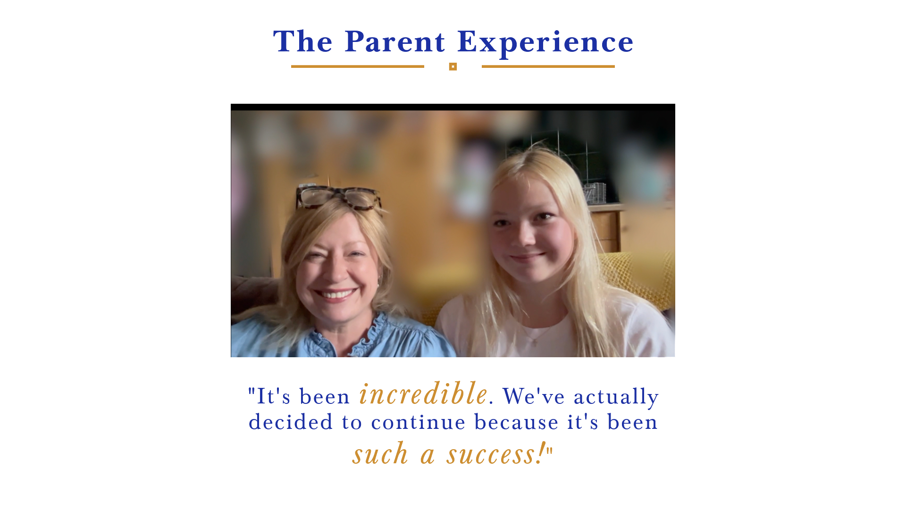
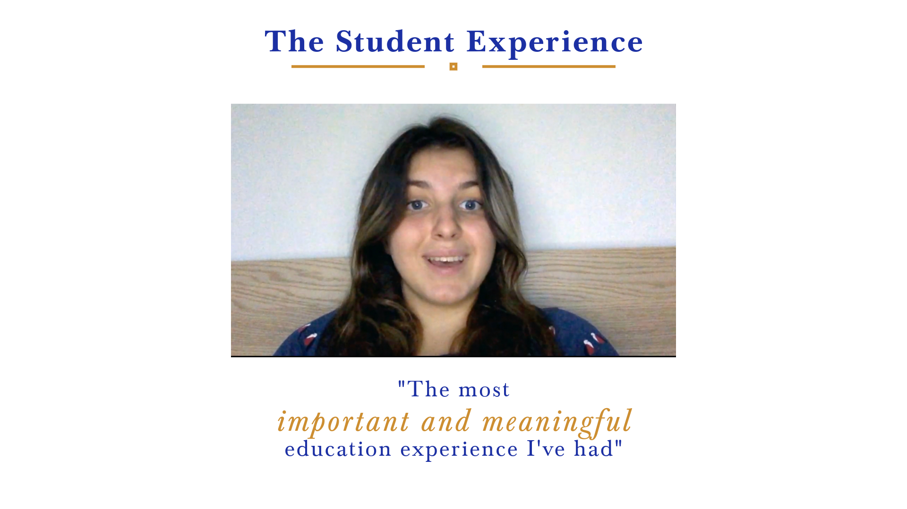

**Legend**:
- Thumbnail = Small preview of the image
- Actual Image Aspect Ratio = Ratio of the source image
- Desktop Site Requires x Aspect Ratio = Approximate ratio of the desktop container
- Mobile Site Requires x Aspect Ratio = Approximate ratio of the mobile container
- Does Desktop/Mobile require different images? = Indicates if separate images are likely needed
- Real URL to check = Original image URL on the website
- Rectangles visualise the aspect ratio of the images and containers

## Summary of Images Needing Attention

| Thumbnail | Display Diff | Real URL | Actual Rect | Desktop Rect | Mobile Rect |
| --------- | ------------ | -------- | ----------- | ------------ | ----------- |
|  | Yes | [Open Image](https://myprivatetutoronline.com/http://localhost:3000/images/video-thumbnails/top-10-tips-thumbnail.png) | 

 | 

 | 

 |
|  | Yes | [Open Image](https://myprivatetutoronline.com/images/team/founder-elizabeth-burrows-portrait.jpg) | 

 | 

 | 

 |
|  | Yes | [Open Image](https://myprivatetutoronline.com/images/about/cambridge-university.jpg) | 

 | 

 | 

 |
|  | Yes | [Open Image](https://myprivatetutoronline.com/images/team/founder-elizabeth-burrows-professional.jpg) | 

 | 

 | 

 |
|  | Yes | [Open Image](https://myprivatetutoronline.com/images/video-thumbnails/thumbnail-11-plus-expert-intro-video-mpto.png) | 

 | 

 | 

 |
|  | Yes | [Open Image](https://myprivatetutoronline.com/images/progress-tracking.jpg) | 

 | 

 | 

 |
|  | Yes | [Open Image](https://myprivatetutoronline.com/images/expert-tutor-matching.jpg) | 

 | 

 | 

 |
|  | Yes | [Open Image](https://myprivatetutoronline.com/images/flexible-scheduling.jpg) | 

 | 

 | 

 |
|  | Yes | [Open Image](https://myprivatetutoronline.com/images/personalised-learning-plan.jpg) | 

 | 

 | 

 |
|  | Yes | [Open Image](https://myprivatetutoronline.com/images/initial-consultation.jpg) | 

 | 

 | 

 |
|  | Yes | [Open Image](https://myprivatetutoronline.com/images/programmes/programme-homeschooling-offer.jpg) | 

 | 

 | 

 |
|  | Yes | [Open Image](https://myprivatetutoronline.com/images/logos/logo-with-name.png) | 

 | 

 | 

 |
|  | Yes | [Open Image](https://myprivatetutoronline.com/images/logos/logo-with-name-white.png) | 

 | 

 | 

 |
|  | Yes | [Open Image](https://myprivatetutoronline.com/images/students/primary-school-support.jpg) | 

 | 

 | 

 |
|  | Yes | [Open Image](https://myprivatetutoronline.com/images/students/secondary-school-support.jpg) | 

 | 

 | 

 |
|  | Yes | [Open Image](https://myprivatetutoronline.com/images/students/entrance-exam-preparation-new.jpg) | 

 | 

 | 

 |
|  | Yes | [Open Image](https://myprivatetutoronline.com/images/graphics/feature-oxbridge-success.jpg) | 

 | 

 | 

 |
|  | Yes | [Open Image](https://myprivatetutoronline.com/images/students/online-homeschooling.jpg) | 

 | 

 | 

 |
|  | Yes | [Open Image](https://myprivatetutoronline.com/images/students/sen-support.jpg) | 

 | 

 | 

 |
|  | Yes | [Open Image](https://myprivatetutoronline.com/images/logos/logo-with-name.png) | 

 | 

 | 

 |
|  | Yes | [Open Image](https://myprivatetutoronline.com/images/team/elizabeth-burrows-signature.png) | 

 | 

 | 

 |
|  | Yes | [Open Image](https://myprivatetutoronline.com/images/logos/oxford-university-logo.jpeg) | 

 | 

 | 

 |
|  | Yes | [Open Image](https://myprivatetutoronline.com/images/logos/cambridge-university-logo.png) | 

 | 

 | 

 |
|  | Yes | [Open Image](https://myprivatetutoronline.com/images/logos/lse-logo.png) | 

 | 

 | 

 |
|  | Yes | [Open Image](https://myprivatetutoronline.com/images/logos/kings-college-logo.jpeg) | 

 | 

 | 

 |
|  | Yes | [Open Image](https://myprivatetutoronline.com/images/logos/durham-university-logo.png) | 

 | 

 | 

 |
|  | Yes | [Open Image](https://myprivatetutoronline.com/images/logos/edinburgh-university-logo.png) | 

 | 

 | 

 |
|  | Yes | [Open Image](https://myprivatetutoronline.com/images/logos/st-andrews-university-logo.png) | 

 | 

 | 

 |
|  | Yes | [Open Image](https://myprivatetutoronline.com/images/logos/warwick-university-logo.gif) | 

 | 

 | 

 |
|  | Yes | [Open Image](https://myprivatetutoronline.com/images/logos/westminster-school-logo-new.png) | 

 | 

 | 

 |
|  | Yes | [Open Image](https://myprivatetutoronline.com/images/logos/harrow-school-logo.avif) | 

 | 

 | 

 |
|  | Yes | [Open Image](https://myprivatetutoronline.com/images/logos/brighton-college-logo.png) | 

 | 

 | 

 |
|  | Yes | [Open Image](https://myprivatetutoronline.com/images/logos/highgate-school-logo.png) | 

 | 

 | 

 |
|  | Yes | [Open Image](https://myprivatetutoronline.com/images/logos/lerosey-school-logo.avif) | 

 | 

 | 

 |
|  | Yes | [Open Image](https://myprivatetutoronline.com/images/logos/school-henrietta-barnett.png) | 

 | 

 | 

 |
|  | Yes | [Open Image](https://myprivatetutoronline.com/images/logos/school-latymer-shield.svg) | 

 | 

 | 

 |
|  | Yes | [Open Image](https://myprivatetutoronline.com/images/logos/school-queen-elizabeths.png) | 

 | 

 | 

 |
|  | Yes | [Open Image](https://myprivatetutoronline.com/images/logos/school-tiffins-shield.jpeg) | 

 | 

 | 

 |
|  | Yes | [Open Image](https://myprivatetutoronline.com/icons/royal-crown.svg) | N/A | N/A | N/A |

# Landing Page

## Images Needing Attention

### Image 1

**Source:** public/images/logos/logo-with-name.png

**Open Image:** [Link](https://myprivatetutoronline.com/images/logos/logo-with-name.png)

**Raw Image Width x Height:** 1440 x 823

**Container Width x Height (Desktop):** 1424 x 189

**Container Width x Height (Mobile):** 359 x 189

**Current Orientation:** landscape

**Preferential Orientation (Desktop):** Landscape

**Preferential Orientation (Mobile):** Landscape

**Display Difference:** Yes

**Actual Image Rectangle:** 

**Desktop Container Rectangle:** 

**Mobile Container Rectangle:** 

### Image 2

**Source:** public/images/logos/westminster-school-logo-new.png

**Open Image:** [Link](https://myprivatetutoronline.com/images/logos/westminster-school-logo-new.png)

**Raw Image Width x Height:** 119 x 119

**Container Width x Height (Desktop):** 100 x 80

**Container Width x Height (Mobile):** 100 x 80

**Current Orientation:** landscape

**Preferential Orientation (Desktop):** Landscape

**Preferential Orientation (Mobile):** Landscape

**Display Difference:** Yes

**Actual Image Rectangle:** 

**Desktop Container Rectangle:** 

**Mobile Container Rectangle:** 

### Image 3

**Source:** public/images/logos/harrow-school-logo.avif

**Open Image:** [Link](https://myprivatetutoronline.com/images/logos/harrow-school-logo.avif)

**Raw Image Width x Height:** 119 x 119

**Container Width x Height (Desktop):** 100 x 80

**Container Width x Height (Mobile):** 100 x 80

**Current Orientation:** landscape

**Preferential Orientation (Desktop):** Landscape

**Preferential Orientation (Mobile):** Landscape

**Display Difference:** Yes

**Actual Image Rectangle:** 

**Desktop Container Rectangle:** 

**Mobile Container Rectangle:** 

### Image 4

**Source:** public/images/logos/oxford-university-logo.jpeg

**Open Image:** [Link](https://myprivatetutoronline.com/images/logos/oxford-university-logo.jpeg)

**Raw Image Width x Height:** 119 x 144

**Container Width x Height (Desktop):** 120 x 80

**Container Width x Height (Mobile):** 120 x 80

**Current Orientation:** landscape

**Preferential Orientation (Desktop):** Portrait

**Preferential Orientation (Mobile):** Landscape

**Display Difference:** Yes

**Actual Image Rectangle:** 

**Desktop Container Rectangle:** 

**Mobile Container Rectangle:** 

### Image 5

**Source:** public/images/logos/cambridge-university-logo.png

**Open Image:** [Link](https://myprivatetutoronline.com/images/logos/cambridge-university-logo.png)

**Raw Image Width x Height:** 119 x 119

**Container Width x Height (Desktop):** 120 x 80

**Container Width x Height (Mobile):** 120 x 80

**Current Orientation:** landscape

**Preferential Orientation (Desktop):** Landscape

**Preferential Orientation (Mobile):** Landscape

**Display Difference:** Yes

**Actual Image Rectangle:** 

**Desktop Container Rectangle:** 

**Mobile Container Rectangle:** 

### Image 6

**Source:** public/images/logos/lse-logo.png

**Open Image:** [Link](https://myprivatetutoronline.com/images/logos/lse-logo.png)

**Raw Image Width x Height:** 119 x 43

**Container Width x Height (Desktop):** 120 x 80

**Container Width x Height (Mobile):** 120 x 80

**Current Orientation:** landscape

**Preferential Orientation (Desktop):** Landscape

**Preferential Orientation (Mobile):** Landscape

**Display Difference:** Yes

**Actual Image Rectangle:** 

**Desktop Container Rectangle:** 

**Mobile Container Rectangle:** 

### Image 7

**Source:** public/images/logos/kings-college-logo.jpeg

**Open Image:** [Link](https://myprivatetutoronline.com/images/logos/kings-college-logo.jpeg)

**Raw Image Width x Height:** 119 x 67

**Container Width x Height (Desktop):** 120 x 80

**Container Width x Height (Mobile):** 120 x 80

**Current Orientation:** landscape

**Preferential Orientation (Desktop):** Landscape

**Preferential Orientation (Mobile):** Landscape

**Display Difference:** Yes

**Actual Image Rectangle:** 

**Desktop Container Rectangle:** 

**Mobile Container Rectangle:** 

### Image 8

**Source:** public/images/logos/brighton-college-logo.png

**Open Image:** [Link](https://myprivatetutoronline.com/images/logos/brighton-college-logo.png)

**Raw Image Width x Height:** 119 x 119

**Container Width x Height (Desktop):** 100 x 80

**Container Width x Height (Mobile):** 100 x 80

**Current Orientation:** landscape

**Preferential Orientation (Desktop):** Landscape

**Preferential Orientation (Mobile):** Landscape

**Display Difference:** Yes

**Actual Image Rectangle:** 

**Desktop Container Rectangle:** 

**Mobile Container Rectangle:** 

### Image 9

**Source:** public/images/logos/durham-university-logo.png

**Open Image:** [Link](https://myprivatetutoronline.com/images/logos/durham-university-logo.png)

**Raw Image Width x Height:** 119 x 51

**Container Width x Height (Desktop):** 120 x 80

**Container Width x Height (Mobile):** 120 x 80

**Current Orientation:** landscape

**Preferential Orientation (Desktop):** Landscape

**Preferential Orientation (Mobile):** Landscape

**Display Difference:** Yes

**Actual Image Rectangle:** 

**Desktop Container Rectangle:** 

**Mobile Container Rectangle:** 

### Image 10

**Source:** public/images/logos/edinburgh-university-logo.png

**Open Image:** [Link](https://myprivatetutoronline.com/images/logos/edinburgh-university-logo.png)

**Raw Image Width x Height:** 119 x 96

**Container Width x Height (Desktop):** 120 x 80

**Container Width x Height (Mobile):** 120 x 80

**Current Orientation:** landscape

**Preferential Orientation (Desktop):** Landscape

**Preferential Orientation (Mobile):** Landscape

**Display Difference:** Yes

**Actual Image Rectangle:** 

**Desktop Container Rectangle:** 

**Mobile Container Rectangle:** 

### Image 11

**Source:** public/images/logos/highgate-school-logo.png

**Open Image:** [Link](https://myprivatetutoronline.com/images/logos/highgate-school-logo.png)

**Raw Image Width x Height:** 119 x 24

**Container Width x Height (Desktop):** 100 x 80

**Container Width x Height (Mobile):** 100 x 80

**Current Orientation:** landscape

**Preferential Orientation (Desktop):** Landscape

**Preferential Orientation (Mobile):** Landscape

**Display Difference:** Yes

**Actual Image Rectangle:** 

**Desktop Container Rectangle:** 

**Mobile Container Rectangle:** 

### Image 12

**Source:** public/images/logos/lerosey-school-logo.avif

**Open Image:** [Link](https://myprivatetutoronline.com/images/logos/lerosey-school-logo.avif)

**Raw Image Width x Height:** 119 x 61

**Container Width x Height (Desktop):** 100 x 80

**Container Width x Height (Mobile):** 100 x 80

**Current Orientation:** landscape

**Preferential Orientation (Desktop):** Landscape

**Preferential Orientation (Mobile):** Landscape

**Display Difference:** Yes

**Actual Image Rectangle:** 

**Desktop Container Rectangle:** 

**Mobile Container Rectangle:** 

### Image 13

**Source:** public/images/logos/st-andrews-university-logo.png

**Open Image:** [Link](https://myprivatetutoronline.com/images/logos/st-andrews-university-logo.png)

**Raw Image Width x Height:** 119 x 52

**Container Width x Height (Desktop):** 120 x 80

**Container Width x Height (Mobile):** 120 x 80

**Current Orientation:** landscape

**Preferential Orientation (Desktop):** Landscape

**Preferential Orientation (Mobile):** Landscape

**Display Difference:** Yes

**Actual Image Rectangle:** 

**Desktop Container Rectangle:** 

**Mobile Container Rectangle:** 

### Image 14

**Source:** public/images/logos/warwick-university-logo.gif

**Open Image:** [Link](https://myprivatetutoronline.com/images/logos/warwick-university-logo.gif)

**Raw Image Width x Height:** 119 x 119

**Container Width x Height (Desktop):** 120 x 80

**Container Width x Height (Mobile):** 120 x 80

**Current Orientation:** landscape

**Preferential Orientation (Desktop):** Landscape

**Preferential Orientation (Mobile):** Landscape

**Display Difference:** Yes

**Actual Image Rectangle:** 

**Desktop Container Rectangle:** 

**Mobile Container Rectangle:** 

### Image 15

**Source:** public/images/logos/school-henrietta-barnett.png

**Open Image:** [Link](https://myprivatetutoronline.com/images/logos/school-henrietta-barnett.png)

**Raw Image Width x Height:** 119 x 41

**Container Width x Height (Desktop):** 100 x 80

**Container Width x Height (Mobile):** 100 x 80

**Current Orientation:** landscape

**Preferential Orientation (Desktop):** Landscape

**Preferential Orientation (Mobile):** Landscape

**Display Difference:** Yes

**Actual Image Rectangle:** 

**Desktop Container Rectangle:** 

**Mobile Container Rectangle:** 

### Image 16

**Source:** public/images/logos/school-latymer-shield.svg

**Open Image:** [Link](https://myprivatetutoronline.com/images/logos/school-latymer-shield.svg)

**Raw Image Width x Height:** 764 x 818

**Container Width x Height (Desktop):** 100 x 80

**Container Width x Height (Mobile):** 100 x 80

**Current Orientation:** landscape

**Preferential Orientation (Desktop):** Portrait

**Preferential Orientation (Mobile):** Landscape

**Display Difference:** Yes

**Actual Image Rectangle:** 

**Desktop Container Rectangle:** 

**Mobile Container Rectangle:** 

### Image 17

**Source:** public/images/logos/school-queen-elizabeths.png

**Open Image:** [Link](https://myprivatetutoronline.com/images/logos/school-queen-elizabeths.png)

**Raw Image Width x Height:** 119 x 59

**Container Width x Height (Desktop):** 100 x 80

**Container Width x Height (Mobile):** 100 x 80

**Current Orientation:** landscape

**Preferential Orientation (Desktop):** Landscape

**Preferential Orientation (Mobile):** Landscape

**Display Difference:** Yes

**Actual Image Rectangle:** 

**Desktop Container Rectangle:** 

**Mobile Container Rectangle:** 

### Image 18

**Source:** public/images/logos/school-tiffins-shield.jpeg

**Open Image:** [Link](https://myprivatetutoronline.com/images/logos/school-tiffins-shield.jpeg)

**Raw Image Width x Height:** 119 x 119

**Container Width x Height (Desktop):** 100 x 80

**Container Width x Height (Mobile):** 100 x 80

**Current Orientation:** landscape

**Preferential Orientation (Desktop):** Landscape

**Preferential Orientation (Mobile):** Landscape

**Display Difference:** Yes

**Actual Image Rectangle:** 

**Desktop Container Rectangle:** 

**Mobile Container Rectangle:** 

### Image 19

**Source:** public/images/logos/westminster-school-logo-new.png

**Open Image:** [Link](https://myprivatetutoronline.com/images/logos/westminster-school-logo-new.png)

**Raw Image Width x Height:** 119 x 119

**Container Width x Height (Desktop):** 100 x 80

**Container Width x Height (Mobile):** 100 x 80

**Current Orientation:** landscape

**Preferential Orientation (Desktop):** Landscape

**Preferential Orientation (Mobile):** Landscape

**Display Difference:** Yes

**Actual Image Rectangle:** 

**Desktop Container Rectangle:** 

**Mobile Container Rectangle:** 

### Image 20

**Source:** public/images/logos/harrow-school-logo.avif

**Open Image:** [Link](https://myprivatetutoronline.com/images/logos/harrow-school-logo.avif)

**Raw Image Width x Height:** 119 x 119

**Container Width x Height (Desktop):** 100 x 80

**Container Width x Height (Mobile):** 100 x 80

**Current Orientation:** landscape

**Preferential Orientation (Desktop):** Landscape

**Preferential Orientation (Mobile):** Landscape

**Display Difference:** Yes

**Actual Image Rectangle:** 

**Desktop Container Rectangle:** 

**Mobile Container Rectangle:** 

### Image 21

**Source:** public/images/logos/oxford-university-logo.jpeg

**Open Image:** [Link](https://myprivatetutoronline.com/images/logos/oxford-university-logo.jpeg)

**Raw Image Width x Height:** 119 x 144

**Container Width x Height (Desktop):** 120 x 80

**Container Width x Height (Mobile):** 120 x 80

**Current Orientation:** landscape

**Preferential Orientation (Desktop):** Portrait

**Preferential Orientation (Mobile):** Landscape

**Display Difference:** Yes

**Actual Image Rectangle:** 

**Desktop Container Rectangle:** 

**Mobile Container Rectangle:** 

### Image 22

**Source:** public/images/logos/cambridge-university-logo.png

**Open Image:** [Link](https://myprivatetutoronline.com/images/logos/cambridge-university-logo.png)

**Raw Image Width x Height:** 119 x 119

**Container Width x Height (Desktop):** 120 x 80

**Container Width x Height (Mobile):** 120 x 80

**Current Orientation:** landscape

**Preferential Orientation (Desktop):** Landscape

**Preferential Orientation (Mobile):** Landscape

**Display Difference:** Yes

**Actual Image Rectangle:** 

**Desktop Container Rectangle:** 

**Mobile Container Rectangle:** 

### Image 23

**Source:** public/images/logos/lse-logo.png

**Open Image:** [Link](https://myprivatetutoronline.com/images/logos/lse-logo.png)

**Raw Image Width x Height:** 119 x 43

**Container Width x Height (Desktop):** 120 x 80

**Container Width x Height (Mobile):** 120 x 80

**Current Orientation:** landscape

**Preferential Orientation (Desktop):** Landscape

**Preferential Orientation (Mobile):** Landscape

**Display Difference:** Yes

**Actual Image Rectangle:** 

**Desktop Container Rectangle:** 

**Mobile Container Rectangle:** 

### Image 24

**Source:** public/images/logos/kings-college-logo.jpeg

**Open Image:** [Link](https://myprivatetutoronline.com/images/logos/kings-college-logo.jpeg)

**Raw Image Width x Height:** 119 x 67

**Container Width x Height (Desktop):** 120 x 80

**Container Width x Height (Mobile):** 120 x 80

**Current Orientation:** landscape

**Preferential Orientation (Desktop):** Landscape

**Preferential Orientation (Mobile):** Landscape

**Display Difference:** Yes

**Actual Image Rectangle:** 

**Desktop Container Rectangle:** 

**Mobile Container Rectangle:** 

### Image 25

**Source:** public/images/logos/brighton-college-logo.png

**Open Image:** [Link](https://myprivatetutoronline.com/images/logos/brighton-college-logo.png)

**Raw Image Width x Height:** 119 x 119

**Container Width x Height (Desktop):** 100 x 80

**Container Width x Height (Mobile):** 100 x 80

**Current Orientation:** landscape

**Preferential Orientation (Desktop):** Landscape

**Preferential Orientation (Mobile):** Landscape

**Display Difference:** Yes

**Actual Image Rectangle:** 

**Desktop Container Rectangle:** 

**Mobile Container Rectangle:** 

### Image 26

**Source:** public/images/logos/durham-university-logo.png

**Open Image:** [Link](https://myprivatetutoronline.com/images/logos/durham-university-logo.png)

**Raw Image Width x Height:** 119 x 51

**Container Width x Height (Desktop):** 120 x 80

**Container Width x Height (Mobile):** 120 x 80

**Current Orientation:** landscape

**Preferential Orientation (Desktop):** Landscape

**Preferential Orientation (Mobile):** Landscape

**Display Difference:** Yes

**Actual Image Rectangle:** 

**Desktop Container Rectangle:** 

**Mobile Container Rectangle:** 

### Image 27

**Source:** public/images/logos/edinburgh-university-logo.png

**Open Image:** [Link](https://myprivatetutoronline.com/images/logos/edinburgh-university-logo.png)

**Raw Image Width x Height:** 119 x 96

**Container Width x Height (Desktop):** 120 x 80

**Container Width x Height (Mobile):** 120 x 80

**Current Orientation:** landscape

**Preferential Orientation (Desktop):** Landscape

**Preferential Orientation (Mobile):** Landscape

**Display Difference:** Yes

**Actual Image Rectangle:** 

**Desktop Container Rectangle:** 

**Mobile Container Rectangle:** 

### Image 28

**Source:** public/images/logos/highgate-school-logo.png

**Open Image:** [Link](https://myprivatetutoronline.com/images/logos/highgate-school-logo.png)

**Raw Image Width x Height:** 119 x 24

**Container Width x Height (Desktop):** 100 x 80

**Container Width x Height (Mobile):** 100 x 80

**Current Orientation:** landscape

**Preferential Orientation (Desktop):** Landscape

**Preferential Orientation (Mobile):** Landscape

**Display Difference:** Yes

**Actual Image Rectangle:** 

**Desktop Container Rectangle:** 

**Mobile Container Rectangle:** 

### Image 29

**Source:** public/images/logos/lerosey-school-logo.avif

**Open Image:** [Link](https://myprivatetutoronline.com/images/logos/lerosey-school-logo.avif)

**Raw Image Width x Height:** 119 x 61

**Container Width x Height (Desktop):** 100 x 80

**Container Width x Height (Mobile):** 100 x 80

**Current Orientation:** landscape

**Preferential Orientation (Desktop):** Landscape

**Preferential Orientation (Mobile):** Landscape

**Display Difference:** Yes

**Actual Image Rectangle:** 

**Desktop Container Rectangle:** 

**Mobile Container Rectangle:** 

### Image 30

**Source:** public/images/logos/st-andrews-university-logo.png

**Open Image:** [Link](https://myprivatetutoronline.com/images/logos/st-andrews-university-logo.png)

**Raw Image Width x Height:** 119 x 52

**Container Width x Height (Desktop):** 120 x 80

**Container Width x Height (Mobile):** 120 x 80

**Current Orientation:** landscape

**Preferential Orientation (Desktop):** Landscape

**Preferential Orientation (Mobile):** Landscape

**Display Difference:** Yes

**Actual Image Rectangle:** 

**Desktop Container Rectangle:** 

**Mobile Container Rectangle:** 

### Image 31

**Source:** public/images/logos/warwick-university-logo.gif

**Open Image:** [Link](https://myprivatetutoronline.com/images/logos/warwick-university-logo.gif)

**Raw Image Width x Height:** 119 x 119

**Container Width x Height (Desktop):** 120 x 80

**Container Width x Height (Mobile):** 120 x 80

**Current Orientation:** landscape

**Preferential Orientation (Desktop):** Landscape

**Preferential Orientation (Mobile):** Landscape

**Display Difference:** Yes

**Actual Image Rectangle:** 

**Desktop Container Rectangle:** 

**Mobile Container Rectangle:** 

### Image 32

**Source:** public/images/logos/school-henrietta-barnett.png

**Open Image:** [Link](https://myprivatetutoronline.com/images/logos/school-henrietta-barnett.png)

**Raw Image Width x Height:** 119 x 41

**Container Width x Height (Desktop):** 100 x 80

**Container Width x Height (Mobile):** 100 x 80

**Current Orientation:** landscape

**Preferential Orientation (Desktop):** Landscape

**Preferential Orientation (Mobile):** Landscape

**Display Difference:** Yes

**Actual Image Rectangle:** 

**Desktop Container Rectangle:** 

**Mobile Container Rectangle:** 

### Image 33

**Source:** public/images/logos/school-latymer-shield.svg

**Open Image:** [Link](https://myprivatetutoronline.com/images/logos/school-latymer-shield.svg)

**Raw Image Width x Height:** 764 x 818

**Container Width x Height (Desktop):** 100 x 80

**Container Width x Height (Mobile):** 100 x 80

**Current Orientation:** landscape

**Preferential Orientation (Desktop):** Portrait

**Preferential Orientation (Mobile):** Landscape

**Display Difference:** Yes

**Actual Image Rectangle:** 

**Desktop Container Rectangle:** 

**Mobile Container Rectangle:** 

### Image 34

**Source:** public/images/logos/school-queen-elizabeths.png

**Open Image:** [Link](https://myprivatetutoronline.com/images/logos/school-queen-elizabeths.png)

**Raw Image Width x Height:** 119 x 59

**Container Width x Height (Desktop):** 100 x 80

**Container Width x Height (Mobile):** 100 x 80

**Current Orientation:** landscape

**Preferential Orientation (Desktop):** Landscape

**Preferential Orientation (Mobile):** Landscape

**Display Difference:** Yes

**Actual Image Rectangle:** 

**Desktop Container Rectangle:** 

**Mobile Container Rectangle:** 

### Image 35

**Source:** public/images/logos/school-tiffins-shield.jpeg

**Open Image:** [Link](https://myprivatetutoronline.com/images/logos/school-tiffins-shield.jpeg)

**Raw Image Width x Height:** 119 x 119

**Container Width x Height (Desktop):** 100 x 80

**Container Width x Height (Mobile):** 100 x 80

**Current Orientation:** landscape

**Preferential Orientation (Desktop):** Landscape

**Preferential Orientation (Mobile):** Landscape

**Display Difference:** Yes

**Actual Image Rectangle:** 

**Desktop Container Rectangle:** 

**Mobile Container Rectangle:** 

### Image 36

**Source:** public/icons/royal-crown.svg

**Open Image:** [Link](https://myprivatetutoronline.com/icons/royal-crown.svg)

**Raw Image Width x Height:** 0 x 0

**Container Width x Height (Desktop):** 98 x 0

**Container Width x Height (Mobile):** 98 x 0

**Current Orientation:** landscape

**Preferential Orientation (Desktop):** Landscape

**Preferential Orientation (Mobile):** Landscape

**Display Difference:** No

**Actual Image Rectangle:** N/A

**Desktop Container Rectangle:** N/A

**Mobile Container Rectangle:** N/A

### Image 37

**Source:** public/images/students/primary-school-support.jpg

**Open Image:** [Link](https://myprivatetutoronline.com/images/students/primary-school-support.jpg)

**Raw Image Width x Height:** 475 x 711

**Container Width x Height (Desktop):** 600 x 400

**Container Width x Height (Mobile):** 600 x 400

**Current Orientation:** landscape

**Preferential Orientation (Desktop):** Portrait

**Preferential Orientation (Mobile):** Landscape

**Display Difference:** Yes

**Actual Image Rectangle:** 

**Desktop Container Rectangle:** 

**Mobile Container Rectangle:** 

### Image 38

**Source:** public/images/students/secondary-school-support.jpg

**Open Image:** [Link](https://myprivatetutoronline.com/images/students/secondary-school-support.jpg)

**Raw Image Width x Height:** 475 x 316

**Container Width x Height (Desktop):** 600 x 400

**Container Width x Height (Mobile):** 600 x 400

**Current Orientation:** landscape

**Preferential Orientation (Desktop):** Landscape

**Preferential Orientation (Mobile):** Landscape

**Display Difference:** No

**Actual Image Rectangle:** 

**Desktop Container Rectangle:** 

**Mobile Container Rectangle:** 

### Image 39

**Source:** public/images/students/entrance-exam-preparation-new.jpg

**Open Image:** [Link](https://myprivatetutoronline.com/images/students/entrance-exam-preparation-new.jpg)

**Raw Image Width x Height:** 475 x 257

**Container Width x Height (Desktop):** 600 x 400

**Container Width x Height (Mobile):** 600 x 400

**Current Orientation:** landscape

**Preferential Orientation (Desktop):** Landscape

**Preferential Orientation (Mobile):** Landscape

**Display Difference:** Yes

**Actual Image Rectangle:** 

**Desktop Container Rectangle:** 

**Mobile Container Rectangle:** 

### Image 40

**Source:** public/images/graphics/feature-oxbridge-success.jpg

**Open Image:** [Link](https://myprivatetutoronline.com/images/graphics/feature-oxbridge-success.jpg)

**Raw Image Width x Height:** 475 x 285

**Container Width x Height (Desktop):** 600 x 400

**Container Width x Height (Mobile):** 600 x 400

**Current Orientation:** landscape

**Preferential Orientation (Desktop):** Landscape

**Preferential Orientation (Mobile):** Landscape

**Display Difference:** No

**Actual Image Rectangle:** 

**Desktop Container Rectangle:** 

**Mobile Container Rectangle:** 

### Image 41

**Source:** public/images/students/online-homeschooling.jpg

**Open Image:** [Link](https://myprivatetutoronline.com/images/students/online-homeschooling.jpg)

**Raw Image Width x Height:** 475 x 316

**Container Width x Height (Desktop):** 600 x 400

**Container Width x Height (Mobile):** 600 x 400

**Current Orientation:** landscape

**Preferential Orientation (Desktop):** Landscape

**Preferential Orientation (Mobile):** Landscape

**Display Difference:** No

**Actual Image Rectangle:** 

**Desktop Container Rectangle:** 

**Mobile Container Rectangle:** 

### Image 42

**Source:** public/images/students/sen-support.jpg

**Open Image:** [Link](https://myprivatetutoronline.com/images/students/sen-support.jpg)

**Raw Image Width x Height:** 475 x 316

**Container Width x Height (Desktop):** 600 x 400

**Container Width x Height (Mobile):** 600 x 400

**Current Orientation:** landscape

**Preferential Orientation (Desktop):** Landscape

**Preferential Orientation (Mobile):** Landscape

**Display Difference:** No

**Actual Image Rectangle:** 

**Desktop Container Rectangle:** 

**Mobile Container Rectangle:** 

### Image 43

**Source:** public/images/logos/logo-with-name.png

**Open Image:** [Link](https://myprivatetutoronline.com/images/logos/logo-with-name.png)

**Raw Image Width x Height:** 480 x 274

**Container Width x Height (Desktop):** 400 x 400

**Container Width x Height (Mobile):** 400 x 400

**Current Orientation:** square

**Preferential Orientation (Desktop):** Landscape

**Preferential Orientation (Mobile):** Landscape

**Display Difference:** Yes

**Actual Image Rectangle:** 

**Desktop Container Rectangle:** 

**Mobile Container Rectangle:** 

## Images Displaying Correctly

### Image 1

**Source:** public/images/logos/eton-college-logo-new.webp

**Open Image:** [Link](https://myprivatetutoronline.com/images/logos/eton-college-logo-new.webp)

**Raw Image Width x Height:** 119 x 84

**Container Width x Height (Desktop):** 100 x 80

**Container Width x Height (Mobile):** 100 x 80

**Current Orientation:** landscape

**Preferential Orientation (Desktop):** Landscape

**Preferential Orientation (Mobile):** Landscape

**Display Difference:** No

**Actual Image Rectangle:** 

**Desktop Container Rectangle:** 

**Mobile Container Rectangle:** 

### Image 2

**Source:** public/images/logos/st-pauls-school-logo-new.jpg

**Open Image:** [Link](https://myprivatetutoronline.com/images/logos/st-pauls-school-logo-new.jpg)

**Raw Image Width x Height:** 119 x 104

**Container Width x Height (Desktop):** 100 x 80

**Container Width x Height (Mobile):** 100 x 80

**Current Orientation:** landscape

**Preferential Orientation (Desktop):** Landscape

**Preferential Orientation (Mobile):** Landscape

**Display Difference:** No

**Actual Image Rectangle:** 

**Desktop Container Rectangle:** 

**Mobile Container Rectangle:** 

### Image 3

**Source:** public/images/logos/eton-college-logo-new.webp

**Open Image:** [Link](https://myprivatetutoronline.com/images/logos/eton-college-logo-new.webp)

**Raw Image Width x Height:** 119 x 84

**Container Width x Height (Desktop):** 100 x 80

**Container Width x Height (Mobile):** 100 x 80

**Current Orientation:** landscape

**Preferential Orientation (Desktop):** Landscape

**Preferential Orientation (Mobile):** Landscape

**Display Difference:** No

**Actual Image Rectangle:** 

**Desktop Container Rectangle:** 

**Mobile Container Rectangle:** 

### Image 4

**Source:** public/images/logos/st-pauls-school-logo-new.jpg

**Open Image:** [Link](https://myprivatetutoronline.com/images/logos/st-pauls-school-logo-new.jpg)

**Raw Image Width x Height:** 119 x 104

**Container Width x Height (Desktop):** 100 x 80

**Container Width x Height (Mobile):** 100 x 80

**Current Orientation:** landscape

**Preferential Orientation (Desktop):** Landscape

**Preferential Orientation (Mobile):** Landscape

**Display Difference:** No

**Actual Image Rectangle:** 

**Desktop Container Rectangle:** 

**Mobile Container Rectangle:** 

### Image 5

**Source:** public/images/video-thumbnails/introduction-video-thumbnail-2025.png

**Open Image:** [Link](https://myprivatetutoronline.com/images/video-thumbnails/introduction-video-thumbnail-2025.png)

**Raw Image Width x Height:** 475 x 308

**Container Width x Height (Desktop):** 1368 x 770

**Container Width x Height (Mobile):** 303 x 171

**Current Orientation:** landscape

**Preferential Orientation (Desktop):** Landscape

**Preferential Orientation (Mobile):** Landscape

**Display Difference:** No

**Actual Image Rectangle:** 

**Desktop Container Rectangle:** 

**Mobile Container Rectangle:** 

### Image 6

**Source:** http://localhost:3000/images/media/tatler-logo-alt.png

**Open Image:** [Link](https://myprivatetutoronline.com/http://localhost:3000/images/media/tatler-logo-alt.png)

**Raw Image Width x Height:** 2000 x 561

**Container Width x Height (Desktop):** 2000 x 561

**Container Width x Height (Mobile):** 2000 x 561

**Current Orientation:** landscape

**Preferential Orientation (Desktop):** Landscape

**Preferential Orientation (Mobile):** Landscape

**Display Difference:** No

**Actual Image Rectangle:** 

**Desktop Container Rectangle:** 

**Mobile Container Rectangle:** 

### Image 7

**Source:** http://localhost:3000/images/media/schools-guide-uk-logo.png

**Open Image:** [Link](https://myprivatetutoronline.com/http://localhost:3000/images/media/schools-guide-uk-logo.png)

**Raw Image Width x Height:** 267 x 189

**Container Width x Height (Desktop):** 267 x 189

**Container Width x Height (Mobile):** 267 x 189

**Current Orientation:** landscape

**Preferential Orientation (Desktop):** Landscape

**Preferential Orientation (Mobile):** Landscape

**Display Difference:** No

**Actual Image Rectangle:** 

**Desktop Container Rectangle:** 

**Mobile Container Rectangle:** 

### Image 8

**Source:** public/images/graphics/feature-royal-endorsement.jpg

**Open Image:** [Link](https://myprivatetutoronline.com/images/graphics/feature-royal-endorsement.jpg)

**Raw Image Width x Height:** 720 x 1080

**Container Width x Height (Desktop):** 1424 x 0

**Container Width x Height (Mobile):** 359 x 0

**Current Orientation:** landscape

**Preferential Orientation (Desktop):** Portrait

**Preferential Orientation (Mobile):** Landscape

**Display Difference:** No

**Actual Image Rectangle:** 

**Desktop Container Rectangle:** N/A

**Mobile Container Rectangle:** N/A

### Image 9

**Source:** public/images/graphics/feature-exam-insight.jpeg

**Open Image:** [Link](https://myprivatetutoronline.com/images/graphics/feature-exam-insight.jpeg)

**Raw Image Width x Height:** 720 x 403

**Container Width x Height (Desktop):** 1424 x 0

**Container Width x Height (Mobile):** 359 x 0

**Current Orientation:** landscape

**Preferential Orientation (Desktop):** Landscape

**Preferential Orientation (Mobile):** Landscape

**Display Difference:** No

**Actual Image Rectangle:** 

**Desktop Container Rectangle:** N/A

**Mobile Container Rectangle:** N/A

### Image 10

**Source:** public/images/graphics/feature-built-on-trust.jpeg

**Open Image:** [Link](https://myprivatetutoronline.com/images/graphics/feature-built-on-trust.jpeg)

**Raw Image Width x Height:** 720 x 480

**Container Width x Height (Desktop):** 1424 x 0

**Container Width x Height (Mobile):** 359 x 0

**Current Orientation:** landscape

**Preferential Orientation (Desktop):** Landscape

**Preferential Orientation (Mobile):** Landscape

**Display Difference:** No

**Actual Image Rectangle:** 

**Desktop Container Rectangle:** N/A

**Mobile Container Rectangle:** N/A

### Image 11

**Source:** public/images/graphics/feature-british-heritage.jpeg

**Open Image:** [Link](https://myprivatetutoronline.com/images/graphics/feature-british-heritage.jpeg)

**Raw Image Width x Height:** 720 x 403

**Container Width x Height (Desktop):** 1424 x 0

**Container Width x Height (Mobile):** 359 x 0

**Current Orientation:** landscape

**Preferential Orientation (Desktop):** Landscape

**Preferential Orientation (Mobile):** Landscape

**Display Difference:** No

**Actual Image Rectangle:** 

**Desktop Container Rectangle:** N/A

**Mobile Container Rectangle:** N/A

### Image 12

**Source:** public/images/students/student-teacher-inside-comfortable.jpg

**Open Image:** [Link](https://myprivatetutoronline.com/images/students/student-teacher-inside-comfortable.jpg)

**Raw Image Width x Height:** 475 x 398

**Container Width x Height (Desktop):** 400 x 300

**Container Width x Height (Mobile):** 400 x 300

**Current Orientation:** landscape

**Preferential Orientation (Desktop):** Landscape

**Preferential Orientation (Mobile):** Landscape

**Display Difference:** No

**Actual Image Rectangle:** 

**Desktop Container Rectangle:** 

**Mobile Container Rectangle:** 

### Image 13

**Source:** http://localhost:3000/images/graphics/bizstim-form-preview.png

**Open Image:** [Link](https://myprivatetutoronline.com/http://localhost:3000/images/graphics/bizstim-form-preview.png)

**Raw Image Width x Height:** 1612 x 856

**Container Width x Height (Desktop):** 1612 x 856

**Container Width x Height (Mobile):** 1612 x 856

**Current Orientation:** landscape

**Preferential Orientation (Desktop):** Landscape

**Preferential Orientation (Mobile):** Landscape

**Display Difference:** No

**Actual Image Rectangle:** 

**Desktop Container Rectangle:** 

**Mobile Container Rectangle:** 

# http://localhost:3000/legal/terms-of-service

## Images Needing Attention

### Image 1

**Source:** public/images/logos/logo-with-name.png

**Open Image:** [Link](https://myprivatetutoronline.com/images/logos/logo-with-name.png)

**Raw Image Width x Height:** 480 x 274

**Container Width x Height (Desktop):** 400 x 400

**Container Width x Height (Mobile):** 400 x 400

**Current Orientation:** square

**Preferential Orientation (Desktop):** Landscape

**Preferential Orientation (Mobile):** Landscape

**Display Difference:** Yes

**Actual Image Rectangle:** 

**Desktop Container Rectangle:** 

**Mobile Container Rectangle:** 

# http://localhost:3000/legal/privacy-policy

## Images Needing Attention

### Image 1

**Source:** public/images/logos/logo-with-name.png

**Open Image:** [Link](https://myprivatetutoronline.com/images/logos/logo-with-name.png)

**Raw Image Width x Height:** 480 x 274

**Container Width x Height (Desktop):** 400 x 400

**Container Width x Height (Mobile):** 400 x 400

**Current Orientation:** square

**Preferential Orientation (Desktop):** Landscape

**Preferential Orientation (Mobile):** Landscape

**Display Difference:** Yes

**Actual Image Rectangle:** 

**Desktop Container Rectangle:** 

**Mobile Container Rectangle:** 

# http://localhost:3000/contact
_No images found on this page_

# http://localhost:3000/faq

## Images Needing Attention

### Image 1

**Source:** public/images/logos/logo-with-name-white.png

**Open Image:** [Link](https://myprivatetutoronline.com/images/logos/logo-with-name-white.png)

**Raw Image Width x Height:** 1440 x 823

**Container Width x Height (Desktop):** 1424 x 189

**Container Width x Height (Mobile):** 359 x 189

**Current Orientation:** landscape

**Preferential Orientation (Desktop):** Landscape

**Preferential Orientation (Mobile):** Landscape

**Display Difference:** Yes

**Actual Image Rectangle:** 

**Desktop Container Rectangle:** 

**Mobile Container Rectangle:** 

### Image 2

**Source:** public/images/logos/logo-with-name.png

**Open Image:** [Link](https://myprivatetutoronline.com/images/logos/logo-with-name.png)

**Raw Image Width x Height:** 480 x 274

**Container Width x Height (Desktop):** 400 x 400

**Container Width x Height (Mobile):** 400 x 400

**Current Orientation:** square

**Preferential Orientation (Desktop):** Landscape

**Preferential Orientation (Mobile):** Landscape

**Display Difference:** Yes

**Actual Image Rectangle:** 

**Desktop Container Rectangle:** 

**Mobile Container Rectangle:** 

# http://localhost:3000/blog
_No images found on this page_

# http://localhost:3000/about

## Images Needing Attention

### Image 1

**Source:** public/images/logos/logo-with-name-white.png

**Open Image:** [Link](https://myprivatetutoronline.com/images/logos/logo-with-name-white.png)

**Raw Image Width x Height:** 1440 x 823

**Container Width x Height (Desktop):** 1424 x 189

**Container Width x Height (Mobile):** 359 x 189

**Current Orientation:** landscape

**Preferential Orientation (Desktop):** Landscape

**Preferential Orientation (Mobile):** Landscape

**Display Difference:** Yes

**Actual Image Rectangle:** 

**Desktop Container Rectangle:** 

**Mobile Container Rectangle:** 

### Image 2

**Source:** public/images/team/founder-elizabeth-burrows-portrait.jpg

**Open Image:** [Link](https://myprivatetutoronline.com/images/team/founder-elizabeth-burrows-portrait.jpg)

**Raw Image Width x Height:** 720 x 900

**Container Width x Height (Desktop):** 1440 x 900

**Container Width x Height (Mobile):** 375 x 667

**Current Orientation:** landscape

**Preferential Orientation (Desktop):** Portrait

**Preferential Orientation (Mobile):** Portrait

**Display Difference:** Yes

**Actual Image Rectangle:** 

**Desktop Container Rectangle:** 

**Mobile Container Rectangle:** 

### Image 3

**Source:** public/images/about/cambridge-university.jpg

**Open Image:** [Link](https://myprivatetutoronline.com/images/about/cambridge-university.jpg)

**Raw Image Width x Height:** 720 x 360

**Container Width x Height (Desktop):** 1440 x 900

**Container Width x Height (Mobile):** 375 x 667

**Current Orientation:** landscape

**Preferential Orientation (Desktop):** Landscape

**Preferential Orientation (Mobile):** Portrait

**Display Difference:** Yes

**Actual Image Rectangle:** 

**Desktop Container Rectangle:** 

**Mobile Container Rectangle:** 

### Image 4

**Source:** public/images/team/founder-elizabeth-burrows-professional.jpg

**Open Image:** [Link](https://myprivatetutoronline.com/images/team/founder-elizabeth-burrows-professional.jpg)

**Raw Image Width x Height:** 1440 x 807

**Container Width x Height (Desktop):** 1440 x 900

**Container Width x Height (Mobile):** 375 x 667

**Current Orientation:** landscape

**Preferential Orientation (Desktop):** Landscape

**Preferential Orientation (Mobile):** Portrait

**Display Difference:** Yes

**Actual Image Rectangle:** 

**Desktop Container Rectangle:** 

**Mobile Container Rectangle:** 

### Image 5

**Source:** public/images/team/founder-elizabeth-burrows-professional.jpg

**Open Image:** [Link](https://myprivatetutoronline.com/images/team/founder-elizabeth-burrows-professional.jpg)

**Raw Image Width x Height:** 1440 x 807

**Container Width x Height (Desktop):** 1440 x 900

**Container Width x Height (Mobile):** 375 x 667

**Current Orientation:** landscape

**Preferential Orientation (Desktop):** Landscape

**Preferential Orientation (Mobile):** Portrait

**Display Difference:** Yes

**Actual Image Rectangle:** 

**Desktop Container Rectangle:** 

**Mobile Container Rectangle:** 

### Image 6

**Source:** public/images/team/elizabeth-burrows-signature.png

**Open Image:** [Link](https://myprivatetutoronline.com/images/team/elizabeth-burrows-signature.png)

**Raw Image Width x Height:** 480 x 74

**Container Width x Height (Desktop):** 400 x 120

**Container Width x Height (Mobile):** 400 x 120

**Current Orientation:** landscape

**Preferential Orientation (Desktop):** Landscape

**Preferential Orientation (Mobile):** Landscape

**Display Difference:** Yes

**Actual Image Rectangle:** 

**Desktop Container Rectangle:** 

**Mobile Container Rectangle:** 

### Image 7

**Source:** public/images/logos/logo-with-name.png

**Open Image:** [Link](https://myprivatetutoronline.com/images/logos/logo-with-name.png)

**Raw Image Width x Height:** 480 x 274

**Container Width x Height (Desktop):** 400 x 400

**Container Width x Height (Mobile):** 400 x 400

**Current Orientation:** square

**Preferential Orientation (Desktop):** Landscape

**Preferential Orientation (Mobile):** Landscape

**Display Difference:** Yes

**Actual Image Rectangle:** 

**Desktop Container Rectangle:** 

**Mobile Container Rectangle:** 

## Images Displaying Correctly

### Image 1

**Source:** public/images/testimonials/parent-testimonials-thumbnail.jpg

**Open Image:** [Link](https://myprivatetutoronline.com/images/testimonials/parent-testimonials-thumbnail.jpg)

**Raw Image Width x Height:** 475 x 267

**Container Width x Height (Desktop):** 1424 x 801

**Container Width x Height (Mobile):** 359 x 202

**Current Orientation:** landscape

**Preferential Orientation (Desktop):** Landscape

**Preferential Orientation (Mobile):** Landscape

**Display Difference:** No

**Actual Image Rectangle:** 

**Desktop Container Rectangle:** 

**Mobile Container Rectangle:** 

### Image 2

**Source:** public/images/testimonials/student-testimonials-thumbnail.jpg

**Open Image:** [Link](https://myprivatetutoronline.com/images/testimonials/student-testimonials-thumbnail.jpg)

**Raw Image Width x Height:** 475 x 267

**Container Width x Height (Desktop):** 1424 x 801

**Container Width x Height (Mobile):** 359 x 202

**Current Orientation:** landscape

**Preferential Orientation (Desktop):** Landscape

**Preferential Orientation (Mobile):** Landscape

**Display Difference:** No

**Actual Image Rectangle:** 

**Desktop Container Rectangle:** 

**Mobile Container Rectangle:** 

### Image 3

**Source:** http://localhost:3000/images/graphics/bizstim-form-preview.png

**Open Image:** [Link](https://myprivatetutoronline.com/http://localhost:3000/images/graphics/bizstim-form-preview.png)

**Raw Image Width x Height:** 1612 x 856

**Container Width x Height (Desktop):** 1612 x 856

**Container Width x Height (Mobile):** 1612 x 856

**Current Orientation:** landscape

**Preferential Orientation (Desktop):** Landscape

**Preferential Orientation (Mobile):** Landscape

**Display Difference:** No

**Actual Image Rectangle:** 

**Desktop Container Rectangle:** 

**Mobile Container Rectangle:** 

# http://localhost:3000/testimonials

## Images Needing Attention

### Image 1

**Source:** public/images/logos/logo-with-name-white.png

**Open Image:** [Link](https://myprivatetutoronline.com/images/logos/logo-with-name-white.png)

**Raw Image Width x Height:** 1440 x 823

**Container Width x Height (Desktop):** 1424 x 189

**Container Width x Height (Mobile):** 359 x 189

**Current Orientation:** landscape

**Preferential Orientation (Desktop):** Landscape

**Preferential Orientation (Mobile):** Landscape

**Display Difference:** Yes

**Actual Image Rectangle:** 

**Desktop Container Rectangle:** 

**Mobile Container Rectangle:** 

### Image 2

**Source:** public/images/logos/logo-with-name.png

**Open Image:** [Link](https://myprivatetutoronline.com/images/logos/logo-with-name.png)

**Raw Image Width x Height:** 480 x 274

**Container Width x Height (Desktop):** 400 x 400

**Container Width x Height (Mobile):** 400 x 400

**Current Orientation:** square

**Preferential Orientation (Desktop):** Landscape

**Preferential Orientation (Mobile):** Landscape

**Display Difference:** Yes

**Actual Image Rectangle:** 

**Desktop Container Rectangle:** 

**Mobile Container Rectangle:** 

## Images Displaying Correctly

### Image 1

**Source:** public/images/testimonials/parent-testimonials-thumbnail.jpg

**Open Image:** [Link](https://myprivatetutoronline.com/images/testimonials/parent-testimonials-thumbnail.jpg)

**Raw Image Width x Height:** 475 x 267

**Container Width x Height (Desktop):** 1424 x 801

**Container Width x Height (Mobile):** 359 x 202

**Current Orientation:** landscape

**Preferential Orientation (Desktop):** Landscape

**Preferential Orientation (Mobile):** Landscape

**Display Difference:** No

**Actual Image Rectangle:** 

**Desktop Container Rectangle:** 

**Mobile Container Rectangle:** 

### Image 2

**Source:** public/images/testimonials/student-testimonials-thumbnail.jpg

**Open Image:** [Link](https://myprivatetutoronline.com/images/testimonials/student-testimonials-thumbnail.jpg)

**Raw Image Width x Height:** 475 x 267

**Container Width x Height (Desktop):** 1424 x 801

**Container Width x Height (Mobile):** 359 x 202

**Current Orientation:** landscape

**Preferential Orientation (Desktop):** Landscape

**Preferential Orientation (Mobile):** Landscape

**Display Difference:** No

**Actual Image Rectangle:** 

**Desktop Container Rectangle:** 

**Mobile Container Rectangle:** 

# http://localhost:3000/11-plus-bootcamps

## Images Needing Attention

### Image 1

**Source:** public/images/logos/westminster-school-logo-new.png

**Open Image:** [Link](https://myprivatetutoronline.com/images/logos/westminster-school-logo-new.png)

**Raw Image Width x Height:** 119 x 119

**Container Width x Height (Desktop):** 100 x 80

**Container Width x Height (Mobile):** 100 x 80

**Current Orientation:** landscape

**Preferential Orientation (Desktop):** Landscape

**Preferential Orientation (Mobile):** Landscape

**Display Difference:** Yes

**Actual Image Rectangle:** 

**Desktop Container Rectangle:** 

**Mobile Container Rectangle:** 

### Image 2

**Source:** public/images/logos/harrow-school-logo.avif

**Open Image:** [Link](https://myprivatetutoronline.com/images/logos/harrow-school-logo.avif)

**Raw Image Width x Height:** 119 x 119

**Container Width x Height (Desktop):** 100 x 80

**Container Width x Height (Mobile):** 100 x 80

**Current Orientation:** landscape

**Preferential Orientation (Desktop):** Landscape

**Preferential Orientation (Mobile):** Landscape

**Display Difference:** Yes

**Actual Image Rectangle:** 

**Desktop Container Rectangle:** 

**Mobile Container Rectangle:** 

### Image 3

**Source:** public/images/logos/brighton-college-logo.png

**Open Image:** [Link](https://myprivatetutoronline.com/images/logos/brighton-college-logo.png)

**Raw Image Width x Height:** 119 x 119

**Container Width x Height (Desktop):** 100 x 80

**Container Width x Height (Mobile):** 100 x 80

**Current Orientation:** landscape

**Preferential Orientation (Desktop):** Landscape

**Preferential Orientation (Mobile):** Landscape

**Display Difference:** Yes

**Actual Image Rectangle:** 

**Desktop Container Rectangle:** 

**Mobile Container Rectangle:** 

### Image 4

**Source:** public/images/logos/highgate-school-logo.png

**Open Image:** [Link](https://myprivatetutoronline.com/images/logos/highgate-school-logo.png)

**Raw Image Width x Height:** 119 x 24

**Container Width x Height (Desktop):** 100 x 80

**Container Width x Height (Mobile):** 100 x 80

**Current Orientation:** landscape

**Preferential Orientation (Desktop):** Landscape

**Preferential Orientation (Mobile):** Landscape

**Display Difference:** Yes

**Actual Image Rectangle:** 

**Desktop Container Rectangle:** 

**Mobile Container Rectangle:** 

### Image 5

**Source:** public/images/logos/lerosey-school-logo.avif

**Open Image:** [Link](https://myprivatetutoronline.com/images/logos/lerosey-school-logo.avif)

**Raw Image Width x Height:** 119 x 61

**Container Width x Height (Desktop):** 100 x 80

**Container Width x Height (Mobile):** 100 x 80

**Current Orientation:** landscape

**Preferential Orientation (Desktop):** Landscape

**Preferential Orientation (Mobile):** Landscape

**Display Difference:** Yes

**Actual Image Rectangle:** 

**Desktop Container Rectangle:** 

**Mobile Container Rectangle:** 

### Image 6

**Source:** public/images/logos/school-henrietta-barnett.png

**Open Image:** [Link](https://myprivatetutoronline.com/images/logos/school-henrietta-barnett.png)

**Raw Image Width x Height:** 119 x 41

**Container Width x Height (Desktop):** 100 x 80

**Container Width x Height (Mobile):** 100 x 80

**Current Orientation:** landscape

**Preferential Orientation (Desktop):** Landscape

**Preferential Orientation (Mobile):** Landscape

**Display Difference:** Yes

**Actual Image Rectangle:** 

**Desktop Container Rectangle:** 

**Mobile Container Rectangle:** 

### Image 7

**Source:** public/images/logos/school-latymer-shield.svg

**Open Image:** [Link](https://myprivatetutoronline.com/images/logos/school-latymer-shield.svg)

**Raw Image Width x Height:** 764 x 818

**Container Width x Height (Desktop):** 100 x 80

**Container Width x Height (Mobile):** 100 x 80

**Current Orientation:** landscape

**Preferential Orientation (Desktop):** Portrait

**Preferential Orientation (Mobile):** Landscape

**Display Difference:** Yes

**Actual Image Rectangle:** 

**Desktop Container Rectangle:** 

**Mobile Container Rectangle:** 

### Image 8

**Source:** public/images/logos/school-queen-elizabeths.png

**Open Image:** [Link](https://myprivatetutoronline.com/images/logos/school-queen-elizabeths.png)

**Raw Image Width x Height:** 119 x 59

**Container Width x Height (Desktop):** 100 x 80

**Container Width x Height (Mobile):** 100 x 80

**Current Orientation:** landscape

**Preferential Orientation (Desktop):** Landscape

**Preferential Orientation (Mobile):** Landscape

**Display Difference:** Yes

**Actual Image Rectangle:** 

**Desktop Container Rectangle:** 

**Mobile Container Rectangle:** 

### Image 9

**Source:** public/images/logos/school-tiffins-shield.jpeg

**Open Image:** [Link](https://myprivatetutoronline.com/images/logos/school-tiffins-shield.jpeg)

**Raw Image Width x Height:** 119 x 119

**Container Width x Height (Desktop):** 100 x 80

**Container Width x Height (Mobile):** 100 x 80

**Current Orientation:** landscape

**Preferential Orientation (Desktop):** Landscape

**Preferential Orientation (Mobile):** Landscape

**Display Difference:** Yes

**Actual Image Rectangle:** 

**Desktop Container Rectangle:** 

**Mobile Container Rectangle:** 

### Image 10

**Source:** public/images/logos/westminster-school-logo-new.png

**Open Image:** [Link](https://myprivatetutoronline.com/images/logos/westminster-school-logo-new.png)

**Raw Image Width x Height:** 119 x 119

**Container Width x Height (Desktop):** 100 x 80

**Container Width x Height (Mobile):** 100 x 80

**Current Orientation:** landscape

**Preferential Orientation (Desktop):** Landscape

**Preferential Orientation (Mobile):** Landscape

**Display Difference:** Yes

**Actual Image Rectangle:** 

**Desktop Container Rectangle:** 

**Mobile Container Rectangle:** 

### Image 11

**Source:** public/images/logos/harrow-school-logo.avif

**Open Image:** [Link](https://myprivatetutoronline.com/images/logos/harrow-school-logo.avif)

**Raw Image Width x Height:** 119 x 119

**Container Width x Height (Desktop):** 100 x 80

**Container Width x Height (Mobile):** 100 x 80

**Current Orientation:** landscape

**Preferential Orientation (Desktop):** Landscape

**Preferential Orientation (Mobile):** Landscape

**Display Difference:** Yes

**Actual Image Rectangle:** 

**Desktop Container Rectangle:** 

**Mobile Container Rectangle:** 

### Image 12

**Source:** public/images/logos/brighton-college-logo.png

**Open Image:** [Link](https://myprivatetutoronline.com/images/logos/brighton-college-logo.png)

**Raw Image Width x Height:** 119 x 119

**Container Width x Height (Desktop):** 100 x 80

**Container Width x Height (Mobile):** 100 x 80

**Current Orientation:** landscape

**Preferential Orientation (Desktop):** Landscape

**Preferential Orientation (Mobile):** Landscape

**Display Difference:** Yes

**Actual Image Rectangle:** 

**Desktop Container Rectangle:** 

**Mobile Container Rectangle:** 

### Image 13

**Source:** public/images/logos/highgate-school-logo.png

**Open Image:** [Link](https://myprivatetutoronline.com/images/logos/highgate-school-logo.png)

**Raw Image Width x Height:** 119 x 24

**Container Width x Height (Desktop):** 100 x 80

**Container Width x Height (Mobile):** 100 x 80

**Current Orientation:** landscape

**Preferential Orientation (Desktop):** Landscape

**Preferential Orientation (Mobile):** Landscape

**Display Difference:** Yes

**Actual Image Rectangle:** 

**Desktop Container Rectangle:** 

**Mobile Container Rectangle:** 

### Image 14

**Source:** public/images/logos/lerosey-school-logo.avif

**Open Image:** [Link](https://myprivatetutoronline.com/images/logos/lerosey-school-logo.avif)

**Raw Image Width x Height:** 119 x 61

**Container Width x Height (Desktop):** 100 x 80

**Container Width x Height (Mobile):** 100 x 80

**Current Orientation:** landscape

**Preferential Orientation (Desktop):** Landscape

**Preferential Orientation (Mobile):** Landscape

**Display Difference:** Yes

**Actual Image Rectangle:** 

**Desktop Container Rectangle:** 

**Mobile Container Rectangle:** 

### Image 15

**Source:** public/images/logos/school-henrietta-barnett.png

**Open Image:** [Link](https://myprivatetutoronline.com/images/logos/school-henrietta-barnett.png)

**Raw Image Width x Height:** 119 x 41

**Container Width x Height (Desktop):** 100 x 80

**Container Width x Height (Mobile):** 100 x 80

**Current Orientation:** landscape

**Preferential Orientation (Desktop):** Landscape

**Preferential Orientation (Mobile):** Landscape

**Display Difference:** Yes

**Actual Image Rectangle:** 

**Desktop Container Rectangle:** 

**Mobile Container Rectangle:** 

### Image 16

**Source:** public/images/logos/school-latymer-shield.svg

**Open Image:** [Link](https://myprivatetutoronline.com/images/logos/school-latymer-shield.svg)

**Raw Image Width x Height:** 764 x 818

**Container Width x Height (Desktop):** 100 x 80

**Container Width x Height (Mobile):** 100 x 80

**Current Orientation:** landscape

**Preferential Orientation (Desktop):** Portrait

**Preferential Orientation (Mobile):** Landscape

**Display Difference:** Yes

**Actual Image Rectangle:** 

**Desktop Container Rectangle:** 

**Mobile Container Rectangle:** 

### Image 17

**Source:** public/images/logos/school-queen-elizabeths.png

**Open Image:** [Link](https://myprivatetutoronline.com/images/logos/school-queen-elizabeths.png)

**Raw Image Width x Height:** 119 x 59

**Container Width x Height (Desktop):** 100 x 80

**Container Width x Height (Mobile):** 100 x 80

**Current Orientation:** landscape

**Preferential Orientation (Desktop):** Landscape

**Preferential Orientation (Mobile):** Landscape

**Display Difference:** Yes

**Actual Image Rectangle:** 

**Desktop Container Rectangle:** 

**Mobile Container Rectangle:** 

### Image 18

**Source:** public/images/logos/school-tiffins-shield.jpeg

**Open Image:** [Link](https://myprivatetutoronline.com/images/logos/school-tiffins-shield.jpeg)

**Raw Image Width x Height:** 119 x 119

**Container Width x Height (Desktop):** 100 x 80

**Container Width x Height (Mobile):** 100 x 80

**Current Orientation:** landscape

**Preferential Orientation (Desktop):** Landscape

**Preferential Orientation (Mobile):** Landscape

**Display Difference:** Yes

**Actual Image Rectangle:** 

**Desktop Container Rectangle:** 

**Mobile Container Rectangle:** 

### Image 19

**Source:** public/images/logos/logo-with-name-white.png

**Open Image:** [Link](https://myprivatetutoronline.com/images/logos/logo-with-name-white.png)

**Raw Image Width x Height:** 1440 x 823

**Container Width x Height (Desktop):** 1424 x 189

**Container Width x Height (Mobile):** 359 x 189

**Current Orientation:** landscape

**Preferential Orientation (Desktop):** Landscape

**Preferential Orientation (Mobile):** Landscape

**Display Difference:** Yes

**Actual Image Rectangle:** 

**Desktop Container Rectangle:** 

**Mobile Container Rectangle:** 

### Image 20

**Source:** public/images/video-thumbnails/thumbnail-11-plus-expert-intro-video-mpto.png

**Open Image:** [Link](https://myprivatetutoronline.com/images/video-thumbnails/thumbnail-11-plus-expert-intro-video-mpto.png)

**Raw Image Width x Height:** 475 x 471

**Container Width x Height (Desktop):** 1344 x 756

**Container Width x Height (Mobile):** 279 x 157

**Current Orientation:** landscape

**Preferential Orientation (Desktop):** Landscape

**Preferential Orientation (Mobile):** Landscape

**Display Difference:** Yes

**Actual Image Rectangle:** 

**Desktop Container Rectangle:** 

**Mobile Container Rectangle:** 

### Image 21

**Source:** public/images/logos/logo-with-name.png

**Open Image:** [Link](https://myprivatetutoronline.com/images/logos/logo-with-name.png)

**Raw Image Width x Height:** 480 x 274

**Container Width x Height (Desktop):** 400 x 400

**Container Width x Height (Mobile):** 400 x 400

**Current Orientation:** square

**Preferential Orientation (Desktop):** Landscape

**Preferential Orientation (Mobile):** Landscape

**Display Difference:** Yes

**Actual Image Rectangle:** 

**Desktop Container Rectangle:** 

**Mobile Container Rectangle:** 

## Images Displaying Correctly

### Image 1

**Source:** public/images/logos/eton-college-logo-new.webp

**Open Image:** [Link](https://myprivatetutoronline.com/images/logos/eton-college-logo-new.webp)

**Raw Image Width x Height:** 119 x 84

**Container Width x Height (Desktop):** 100 x 80

**Container Width x Height (Mobile):** 100 x 80

**Current Orientation:** landscape

**Preferential Orientation (Desktop):** Landscape

**Preferential Orientation (Mobile):** Landscape

**Display Difference:** No

**Actual Image Rectangle:** 

**Desktop Container Rectangle:** 

**Mobile Container Rectangle:** 

### Image 2

**Source:** public/images/logos/st-pauls-school-logo-new.jpg

**Open Image:** [Link](https://myprivatetutoronline.com/images/logos/st-pauls-school-logo-new.jpg)

**Raw Image Width x Height:** 119 x 104

**Container Width x Height (Desktop):** 100 x 80

**Container Width x Height (Mobile):** 100 x 80

**Current Orientation:** landscape

**Preferential Orientation (Desktop):** Landscape

**Preferential Orientation (Mobile):** Landscape

**Display Difference:** No

**Actual Image Rectangle:** 

**Desktop Container Rectangle:** 

**Mobile Container Rectangle:** 

### Image 3

**Source:** public/images/logos/eton-college-logo-new.webp

**Open Image:** [Link](https://myprivatetutoronline.com/images/logos/eton-college-logo-new.webp)

**Raw Image Width x Height:** 119 x 84

**Container Width x Height (Desktop):** 100 x 80

**Container Width x Height (Mobile):** 100 x 80

**Current Orientation:** landscape

**Preferential Orientation (Desktop):** Landscape

**Preferential Orientation (Mobile):** Landscape

**Display Difference:** No

**Actual Image Rectangle:** 

**Desktop Container Rectangle:** 

**Mobile Container Rectangle:** 

### Image 4

**Source:** public/images/logos/st-pauls-school-logo-new.jpg

**Open Image:** [Link](https://myprivatetutoronline.com/images/logos/st-pauls-school-logo-new.jpg)

**Raw Image Width x Height:** 119 x 104

**Container Width x Height (Desktop):** 100 x 80

**Container Width x Height (Mobile):** 100 x 80

**Current Orientation:** landscape

**Preferential Orientation (Desktop):** Landscape

**Preferential Orientation (Mobile):** Landscape

**Display Difference:** No

**Actual Image Rectangle:** 

**Desktop Container Rectangle:** 

**Mobile Container Rectangle:** 

### Image 5

**Source:** http://localhost:3000/images/programmes/eleven-plus-intensive-exam-preparation.jpg

**Open Image:** [Link](https://myprivatetutoronline.com/http://localhost:3000/images/programmes/eleven-plus-intensive-exam-preparation.jpg)

**Raw Image Width x Height:** 5760 x 3840

**Container Width x Height (Desktop):** 5760 x 3240

**Container Width x Height (Mobile):** 5760 x 3240

**Current Orientation:** landscape

**Preferential Orientation (Desktop):** Landscape

**Preferential Orientation (Mobile):** Landscape

**Display Difference:** No

**Actual Image Rectangle:** 

**Desktop Container Rectangle:** 

**Mobile Container Rectangle:** 

### Image 6

**Source:** http://localhost:3000/images/programmes/eleven-plus-kickstarter-online-tutoring.jpg

**Open Image:** [Link](https://myprivatetutoronline.com/http://localhost:3000/images/programmes/eleven-plus-kickstarter-online-tutoring.jpg)

**Raw Image Width x Height:** 800 x 533

**Container Width x Height (Desktop):** 800 x 450

**Container Width x Height (Mobile):** 800 x 450

**Current Orientation:** landscape

**Preferential Orientation (Desktop):** Landscape

**Preferential Orientation (Mobile):** Landscape

**Display Difference:** No

**Actual Image Rectangle:** 

**Desktop Container Rectangle:** 

**Mobile Container Rectangle:** 

# http://localhost:3000/subject-tuition

## Images Needing Attention

### Image 1

**Source:** public/images/logos/logo-with-name-white.png

**Open Image:** [Link](https://myprivatetutoronline.com/images/logos/logo-with-name-white.png)

**Raw Image Width x Height:** 1440 x 823

**Container Width x Height (Desktop):** 1424 x 189

**Container Width x Height (Mobile):** 359 x 189

**Current Orientation:** landscape

**Preferential Orientation (Desktop):** Landscape

**Preferential Orientation (Mobile):** Landscape

**Display Difference:** Yes

**Actual Image Rectangle:** 

**Desktop Container Rectangle:** 

**Mobile Container Rectangle:** 

### Image 2

**Source:** public/images/programmes/programme-homeschooling-offer.jpg

**Open Image:** [Link](https://myprivatetutoronline.com/images/programmes/programme-homeschooling-offer.jpg)

**Raw Image Width x Height:** 599 x 400

**Container Width x Height (Desktop):** 600 x 450

**Container Width x Height (Mobile):** 600 x 450

**Current Orientation:** landscape

**Preferential Orientation (Desktop):** Landscape

**Preferential Orientation (Mobile):** Landscape

**Display Difference:** No

**Actual Image Rectangle:** 

**Desktop Container Rectangle:** 

**Mobile Container Rectangle:** 

### Image 3

**Source:** public/images/logos/logo-with-name.png

**Open Image:** [Link](https://myprivatetutoronline.com/images/logos/logo-with-name.png)

**Raw Image Width x Height:** 480 x 274

**Container Width x Height (Desktop):** 400 x 400

**Container Width x Height (Mobile):** 400 x 400

**Current Orientation:** square

**Preferential Orientation (Desktop):** Landscape

**Preferential Orientation (Mobile):** Landscape

**Display Difference:** Yes

**Actual Image Rectangle:** 

**Desktop Container Rectangle:** 

**Mobile Container Rectangle:** 

# Landing Page

## Images Needing Attention

### Image 1

**Source:** public/images/logos/logo-with-name.png

**Open Image:** [Link](https://myprivatetutoronline.com/images/logos/logo-with-name.png)

**Raw Image Width x Height:** 1440 x 823

**Container Width x Height (Desktop):** 1424 x 189

**Container Width x Height (Mobile):** 359 x 189

**Current Orientation:** landscape

**Preferential Orientation (Desktop):** Landscape

**Preferential Orientation (Mobile):** Landscape

**Display Difference:** Yes

**Actual Image Rectangle:** 

**Desktop Container Rectangle:** 

**Mobile Container Rectangle:** 

### Image 2

**Source:** public/images/logos/westminster-school-logo-new.png

**Open Image:** [Link](https://myprivatetutoronline.com/images/logos/westminster-school-logo-new.png)

**Raw Image Width x Height:** 119 x 119

**Container Width x Height (Desktop):** 100 x 80

**Container Width x Height (Mobile):** 100 x 80

**Current Orientation:** landscape

**Preferential Orientation (Desktop):** Landscape

**Preferential Orientation (Mobile):** Landscape

**Display Difference:** Yes

**Actual Image Rectangle:** 

**Desktop Container Rectangle:** 

**Mobile Container Rectangle:** 

### Image 3

**Source:** public/images/logos/harrow-school-logo.avif

**Open Image:** [Link](https://myprivatetutoronline.com/images/logos/harrow-school-logo.avif)

**Raw Image Width x Height:** 119 x 119

**Container Width x Height (Desktop):** 100 x 80

**Container Width x Height (Mobile):** 100 x 80

**Current Orientation:** landscape

**Preferential Orientation (Desktop):** Landscape

**Preferential Orientation (Mobile):** Landscape

**Display Difference:** Yes

**Actual Image Rectangle:** 

**Desktop Container Rectangle:** 

**Mobile Container Rectangle:** 

### Image 4

**Source:** public/images/logos/oxford-university-logo.jpeg

**Open Image:** [Link](https://myprivatetutoronline.com/images/logos/oxford-university-logo.jpeg)

**Raw Image Width x Height:** 119 x 144

**Container Width x Height (Desktop):** 120 x 80

**Container Width x Height (Mobile):** 120 x 80

**Current Orientation:** landscape

**Preferential Orientation (Desktop):** Portrait

**Preferential Orientation (Mobile):** Landscape

**Display Difference:** Yes

**Actual Image Rectangle:** 

**Desktop Container Rectangle:** 

**Mobile Container Rectangle:** 

### Image 5

**Source:** public/images/logos/cambridge-university-logo.png

**Open Image:** [Link](https://myprivatetutoronline.com/images/logos/cambridge-university-logo.png)

**Raw Image Width x Height:** 119 x 119

**Container Width x Height (Desktop):** 120 x 80

**Container Width x Height (Mobile):** 120 x 80

**Current Orientation:** landscape

**Preferential Orientation (Desktop):** Landscape

**Preferential Orientation (Mobile):** Landscape

**Display Difference:** Yes

**Actual Image Rectangle:** 

**Desktop Container Rectangle:** 

**Mobile Container Rectangle:** 

### Image 6

**Source:** public/images/logos/lse-logo.png

**Open Image:** [Link](https://myprivatetutoronline.com/images/logos/lse-logo.png)

**Raw Image Width x Height:** 119 x 43

**Container Width x Height (Desktop):** 120 x 80

**Container Width x Height (Mobile):** 120 x 80

**Current Orientation:** landscape

**Preferential Orientation (Desktop):** Landscape

**Preferential Orientation (Mobile):** Landscape

**Display Difference:** Yes

**Actual Image Rectangle:** 

**Desktop Container Rectangle:** 

**Mobile Container Rectangle:** 

### Image 7

**Source:** public/images/logos/kings-college-logo.jpeg

**Open Image:** [Link](https://myprivatetutoronline.com/images/logos/kings-college-logo.jpeg)

**Raw Image Width x Height:** 119 x 67

**Container Width x Height (Desktop):** 120 x 80

**Container Width x Height (Mobile):** 120 x 80

**Current Orientation:** landscape

**Preferential Orientation (Desktop):** Landscape

**Preferential Orientation (Mobile):** Landscape

**Display Difference:** Yes

**Actual Image Rectangle:** 

**Desktop Container Rectangle:** 

**Mobile Container Rectangle:** 

### Image 8

**Source:** public/images/logos/brighton-college-logo.png

**Open Image:** [Link](https://myprivatetutoronline.com/images/logos/brighton-college-logo.png)

**Raw Image Width x Height:** 119 x 119

**Container Width x Height (Desktop):** 100 x 80

**Container Width x Height (Mobile):** 100 x 80

**Current Orientation:** landscape

**Preferential Orientation (Desktop):** Landscape

**Preferential Orientation (Mobile):** Landscape

**Display Difference:** Yes

**Actual Image Rectangle:** 

**Desktop Container Rectangle:** 

**Mobile Container Rectangle:** 

### Image 9

**Source:** public/images/logos/durham-university-logo.png

**Open Image:** [Link](https://myprivatetutoronline.com/images/logos/durham-university-logo.png)

**Raw Image Width x Height:** 119 x 51

**Container Width x Height (Desktop):** 120 x 80

**Container Width x Height (Mobile):** 120 x 80

**Current Orientation:** landscape

**Preferential Orientation (Desktop):** Landscape

**Preferential Orientation (Mobile):** Landscape

**Display Difference:** Yes

**Actual Image Rectangle:** 

**Desktop Container Rectangle:** 

**Mobile Container Rectangle:** 

### Image 10

**Source:** public/images/logos/edinburgh-university-logo.png

**Open Image:** [Link](https://myprivatetutoronline.com/images/logos/edinburgh-university-logo.png)

**Raw Image Width x Height:** 119 x 96

**Container Width x Height (Desktop):** 120 x 80

**Container Width x Height (Mobile):** 120 x 80

**Current Orientation:** landscape

**Preferential Orientation (Desktop):** Landscape

**Preferential Orientation (Mobile):** Landscape

**Display Difference:** Yes

**Actual Image Rectangle:** 

**Desktop Container Rectangle:** 

**Mobile Container Rectangle:** 

### Image 11

**Source:** public/images/logos/highgate-school-logo.png

**Open Image:** [Link](https://myprivatetutoronline.com/images/logos/highgate-school-logo.png)

**Raw Image Width x Height:** 119 x 24

**Container Width x Height (Desktop):** 100 x 80

**Container Width x Height (Mobile):** 100 x 80

**Current Orientation:** landscape

**Preferential Orientation (Desktop):** Landscape

**Preferential Orientation (Mobile):** Landscape

**Display Difference:** Yes

**Actual Image Rectangle:** 

**Desktop Container Rectangle:** 

**Mobile Container Rectangle:** 

### Image 12

**Source:** public/images/logos/lerosey-school-logo.avif

**Open Image:** [Link](https://myprivatetutoronline.com/images/logos/lerosey-school-logo.avif)

**Raw Image Width x Height:** 119 x 61

**Container Width x Height (Desktop):** 100 x 80

**Container Width x Height (Mobile):** 100 x 80

**Current Orientation:** landscape

**Preferential Orientation (Desktop):** Landscape

**Preferential Orientation (Mobile):** Landscape

**Display Difference:** Yes

**Actual Image Rectangle:** 

**Desktop Container Rectangle:** 

**Mobile Container Rectangle:** 

### Image 13

**Source:** public/images/logos/st-andrews-university-logo.png

**Open Image:** [Link](https://myprivatetutoronline.com/images/logos/st-andrews-university-logo.png)

**Raw Image Width x Height:** 119 x 52

**Container Width x Height (Desktop):** 120 x 80

**Container Width x Height (Mobile):** 120 x 80

**Current Orientation:** landscape

**Preferential Orientation (Desktop):** Landscape

**Preferential Orientation (Mobile):** Landscape

**Display Difference:** Yes

**Actual Image Rectangle:** 

**Desktop Container Rectangle:** 

**Mobile Container Rectangle:** 

### Image 14

**Source:** public/images/logos/warwick-university-logo.gif

**Open Image:** [Link](https://myprivatetutoronline.com/images/logos/warwick-university-logo.gif)

**Raw Image Width x Height:** 119 x 119

**Container Width x Height (Desktop):** 120 x 80

**Container Width x Height (Mobile):** 120 x 80

**Current Orientation:** landscape

**Preferential Orientation (Desktop):** Landscape

**Preferential Orientation (Mobile):** Landscape

**Display Difference:** Yes

**Actual Image Rectangle:** 

**Desktop Container Rectangle:** 

**Mobile Container Rectangle:** 

### Image 15

**Source:** public/images/logos/school-henrietta-barnett.png

**Open Image:** [Link](https://myprivatetutoronline.com/images/logos/school-henrietta-barnett.png)

**Raw Image Width x Height:** 119 x 41

**Container Width x Height (Desktop):** 100 x 80

**Container Width x Height (Mobile):** 100 x 80

**Current Orientation:** landscape

**Preferential Orientation (Desktop):** Landscape

**Preferential Orientation (Mobile):** Landscape

**Display Difference:** Yes

**Actual Image Rectangle:** 

**Desktop Container Rectangle:** 

**Mobile Container Rectangle:** 

### Image 16

**Source:** public/images/logos/school-latymer-shield.svg

**Open Image:** [Link](https://myprivatetutoronline.com/images/logos/school-latymer-shield.svg)

**Raw Image Width x Height:** 764 x 818

**Container Width x Height (Desktop):** 100 x 80

**Container Width x Height (Mobile):** 100 x 80

**Current Orientation:** landscape

**Preferential Orientation (Desktop):** Portrait

**Preferential Orientation (Mobile):** Landscape

**Display Difference:** Yes

**Actual Image Rectangle:** 

**Desktop Container Rectangle:** 

**Mobile Container Rectangle:** 

### Image 17

**Source:** public/images/logos/school-queen-elizabeths.png

**Open Image:** [Link](https://myprivatetutoronline.com/images/logos/school-queen-elizabeths.png)

**Raw Image Width x Height:** 119 x 59

**Container Width x Height (Desktop):** 100 x 80

**Container Width x Height (Mobile):** 100 x 80

**Current Orientation:** landscape

**Preferential Orientation (Desktop):** Landscape

**Preferential Orientation (Mobile):** Landscape

**Display Difference:** Yes

**Actual Image Rectangle:** 

**Desktop Container Rectangle:** 

**Mobile Container Rectangle:** 

### Image 18

**Source:** public/images/logos/school-tiffins-shield.jpeg

**Open Image:** [Link](https://myprivatetutoronline.com/images/logos/school-tiffins-shield.jpeg)

**Raw Image Width x Height:** 119 x 119

**Container Width x Height (Desktop):** 100 x 80

**Container Width x Height (Mobile):** 100 x 80

**Current Orientation:** landscape

**Preferential Orientation (Desktop):** Landscape

**Preferential Orientation (Mobile):** Landscape

**Display Difference:** Yes

**Actual Image Rectangle:** 

**Desktop Container Rectangle:** 

**Mobile Container Rectangle:** 

### Image 19

**Source:** public/images/logos/westminster-school-logo-new.png

**Open Image:** [Link](https://myprivatetutoronline.com/images/logos/westminster-school-logo-new.png)

**Raw Image Width x Height:** 119 x 119

**Container Width x Height (Desktop):** 100 x 80

**Container Width x Height (Mobile):** 100 x 80

**Current Orientation:** landscape

**Preferential Orientation (Desktop):** Landscape

**Preferential Orientation (Mobile):** Landscape

**Display Difference:** Yes

**Actual Image Rectangle:** 

**Desktop Container Rectangle:** 

**Mobile Container Rectangle:** 

### Image 20

**Source:** public/images/logos/harrow-school-logo.avif

**Open Image:** [Link](https://myprivatetutoronline.com/images/logos/harrow-school-logo.avif)

**Raw Image Width x Height:** 119 x 119

**Container Width x Height (Desktop):** 100 x 80

**Container Width x Height (Mobile):** 100 x 80

**Current Orientation:** landscape

**Preferential Orientation (Desktop):** Landscape

**Preferential Orientation (Mobile):** Landscape

**Display Difference:** Yes

**Actual Image Rectangle:** 

**Desktop Container Rectangle:** 

**Mobile Container Rectangle:** 

### Image 21

**Source:** public/images/logos/oxford-university-logo.jpeg

**Open Image:** [Link](https://myprivatetutoronline.com/images/logos/oxford-university-logo.jpeg)

**Raw Image Width x Height:** 119 x 144

**Container Width x Height (Desktop):** 120 x 80

**Container Width x Height (Mobile):** 120 x 80

**Current Orientation:** landscape

**Preferential Orientation (Desktop):** Portrait

**Preferential Orientation (Mobile):** Landscape

**Display Difference:** Yes

**Actual Image Rectangle:** 

**Desktop Container Rectangle:** 

**Mobile Container Rectangle:** 

### Image 22

**Source:** public/images/logos/cambridge-university-logo.png

**Open Image:** [Link](https://myprivatetutoronline.com/images/logos/cambridge-university-logo.png)

**Raw Image Width x Height:** 119 x 119

**Container Width x Height (Desktop):** 120 x 80

**Container Width x Height (Mobile):** 120 x 80

**Current Orientation:** landscape

**Preferential Orientation (Desktop):** Landscape

**Preferential Orientation (Mobile):** Landscape

**Display Difference:** Yes

**Actual Image Rectangle:** 

**Desktop Container Rectangle:** 

**Mobile Container Rectangle:** 

### Image 23

**Source:** public/images/logos/lse-logo.png

**Open Image:** [Link](https://myprivatetutoronline.com/images/logos/lse-logo.png)

**Raw Image Width x Height:** 119 x 43

**Container Width x Height (Desktop):** 120 x 80

**Container Width x Height (Mobile):** 120 x 80

**Current Orientation:** landscape

**Preferential Orientation (Desktop):** Landscape

**Preferential Orientation (Mobile):** Landscape

**Display Difference:** Yes

**Actual Image Rectangle:** 

**Desktop Container Rectangle:** 

**Mobile Container Rectangle:** 

### Image 24

**Source:** public/images/logos/kings-college-logo.jpeg

**Open Image:** [Link](https://myprivatetutoronline.com/images/logos/kings-college-logo.jpeg)

**Raw Image Width x Height:** 119 x 67

**Container Width x Height (Desktop):** 120 x 80

**Container Width x Height (Mobile):** 120 x 80

**Current Orientation:** landscape

**Preferential Orientation (Desktop):** Landscape

**Preferential Orientation (Mobile):** Landscape

**Display Difference:** Yes

**Actual Image Rectangle:** 

**Desktop Container Rectangle:** 

**Mobile Container Rectangle:** 

### Image 25

**Source:** public/images/logos/brighton-college-logo.png

**Open Image:** [Link](https://myprivatetutoronline.com/images/logos/brighton-college-logo.png)

**Raw Image Width x Height:** 119 x 119

**Container Width x Height (Desktop):** 100 x 80

**Container Width x Height (Mobile):** 100 x 80

**Current Orientation:** landscape

**Preferential Orientation (Desktop):** Landscape

**Preferential Orientation (Mobile):** Landscape

**Display Difference:** Yes

**Actual Image Rectangle:** 

**Desktop Container Rectangle:** 

**Mobile Container Rectangle:** 

### Image 26

**Source:** public/images/logos/durham-university-logo.png

**Open Image:** [Link](https://myprivatetutoronline.com/images/logos/durham-university-logo.png)

**Raw Image Width x Height:** 119 x 51

**Container Width x Height (Desktop):** 120 x 80

**Container Width x Height (Mobile):** 120 x 80

**Current Orientation:** landscape

**Preferential Orientation (Desktop):** Landscape

**Preferential Orientation (Mobile):** Landscape

**Display Difference:** Yes

**Actual Image Rectangle:** 

**Desktop Container Rectangle:** 

**Mobile Container Rectangle:** 

### Image 27

**Source:** public/images/logos/edinburgh-university-logo.png

**Open Image:** [Link](https://myprivatetutoronline.com/images/logos/edinburgh-university-logo.png)

**Raw Image Width x Height:** 119 x 96

**Container Width x Height (Desktop):** 120 x 80

**Container Width x Height (Mobile):** 120 x 80

**Current Orientation:** landscape

**Preferential Orientation (Desktop):** Landscape

**Preferential Orientation (Mobile):** Landscape

**Display Difference:** Yes

**Actual Image Rectangle:** 

**Desktop Container Rectangle:** 

**Mobile Container Rectangle:** 

### Image 28

**Source:** public/images/logos/highgate-school-logo.png

**Open Image:** [Link](https://myprivatetutoronline.com/images/logos/highgate-school-logo.png)

**Raw Image Width x Height:** 119 x 24

**Container Width x Height (Desktop):** 100 x 80

**Container Width x Height (Mobile):** 100 x 80

**Current Orientation:** landscape

**Preferential Orientation (Desktop):** Landscape

**Preferential Orientation (Mobile):** Landscape

**Display Difference:** Yes

**Actual Image Rectangle:** 

**Desktop Container Rectangle:** 

**Mobile Container Rectangle:** 

### Image 29

**Source:** public/images/logos/lerosey-school-logo.avif

**Open Image:** [Link](https://myprivatetutoronline.com/images/logos/lerosey-school-logo.avif)

**Raw Image Width x Height:** 119 x 61

**Container Width x Height (Desktop):** 100 x 80

**Container Width x Height (Mobile):** 100 x 80

**Current Orientation:** landscape

**Preferential Orientation (Desktop):** Landscape

**Preferential Orientation (Mobile):** Landscape

**Display Difference:** Yes

**Actual Image Rectangle:** 

**Desktop Container Rectangle:** 

**Mobile Container Rectangle:** 

### Image 30

**Source:** public/images/logos/st-andrews-university-logo.png

**Open Image:** [Link](https://myprivatetutoronline.com/images/logos/st-andrews-university-logo.png)

**Raw Image Width x Height:** 119 x 52

**Container Width x Height (Desktop):** 120 x 80

**Container Width x Height (Mobile):** 120 x 80

**Current Orientation:** landscape

**Preferential Orientation (Desktop):** Landscape

**Preferential Orientation (Mobile):** Landscape

**Display Difference:** Yes

**Actual Image Rectangle:** 

**Desktop Container Rectangle:** 

**Mobile Container Rectangle:** 

### Image 31

**Source:** public/images/logos/warwick-university-logo.gif

**Open Image:** [Link](https://myprivatetutoronline.com/images/logos/warwick-university-logo.gif)

**Raw Image Width x Height:** 119 x 119

**Container Width x Height (Desktop):** 120 x 80

**Container Width x Height (Mobile):** 120 x 80

**Current Orientation:** landscape

**Preferential Orientation (Desktop):** Landscape

**Preferential Orientation (Mobile):** Landscape

**Display Difference:** Yes

**Actual Image Rectangle:** 

**Desktop Container Rectangle:** 

**Mobile Container Rectangle:** 

### Image 32

**Source:** public/images/logos/school-henrietta-barnett.png

**Open Image:** [Link](https://myprivatetutoronline.com/images/logos/school-henrietta-barnett.png)

**Raw Image Width x Height:** 119 x 41

**Container Width x Height (Desktop):** 100 x 80

**Container Width x Height (Mobile):** 100 x 80

**Current Orientation:** landscape

**Preferential Orientation (Desktop):** Landscape

**Preferential Orientation (Mobile):** Landscape

**Display Difference:** Yes

**Actual Image Rectangle:** 

**Desktop Container Rectangle:** 

**Mobile Container Rectangle:** 

### Image 33

**Source:** public/images/logos/school-latymer-shield.svg

**Open Image:** [Link](https://myprivatetutoronline.com/images/logos/school-latymer-shield.svg)

**Raw Image Width x Height:** 764 x 818

**Container Width x Height (Desktop):** 100 x 80

**Container Width x Height (Mobile):** 100 x 80

**Current Orientation:** landscape

**Preferential Orientation (Desktop):** Portrait

**Preferential Orientation (Mobile):** Landscape

**Display Difference:** Yes

**Actual Image Rectangle:** 

**Desktop Container Rectangle:** 

**Mobile Container Rectangle:** 

### Image 34

**Source:** public/images/logos/school-queen-elizabeths.png

**Open Image:** [Link](https://myprivatetutoronline.com/images/logos/school-queen-elizabeths.png)

**Raw Image Width x Height:** 119 x 59

**Container Width x Height (Desktop):** 100 x 80

**Container Width x Height (Mobile):** 100 x 80

**Current Orientation:** landscape

**Preferential Orientation (Desktop):** Landscape

**Preferential Orientation (Mobile):** Landscape

**Display Difference:** Yes

**Actual Image Rectangle:** 

**Desktop Container Rectangle:** 

**Mobile Container Rectangle:** 

### Image 35

**Source:** public/images/logos/school-tiffins-shield.jpeg

**Open Image:** [Link](https://myprivatetutoronline.com/images/logos/school-tiffins-shield.jpeg)

**Raw Image Width x Height:** 119 x 119

**Container Width x Height (Desktop):** 100 x 80

**Container Width x Height (Mobile):** 100 x 80

**Current Orientation:** landscape

**Preferential Orientation (Desktop):** Landscape

**Preferential Orientation (Mobile):** Landscape

**Display Difference:** Yes

**Actual Image Rectangle:** 

**Desktop Container Rectangle:** 

**Mobile Container Rectangle:** 

### Image 36

**Source:** public/icons/royal-crown.svg

**Open Image:** [Link](https://myprivatetutoronline.com/icons/royal-crown.svg)

**Raw Image Width x Height:** 0 x 0

**Container Width x Height (Desktop):** 98 x 0

**Container Width x Height (Mobile):** 98 x 0

**Current Orientation:** landscape

**Preferential Orientation (Desktop):** Landscape

**Preferential Orientation (Mobile):** Landscape

**Display Difference:** No

**Actual Image Rectangle:** N/A

**Desktop Container Rectangle:** N/A

**Mobile Container Rectangle:** N/A

### Image 37

**Source:** public/images/students/primary-school-support.jpg

**Open Image:** [Link](https://myprivatetutoronline.com/images/students/primary-school-support.jpg)

**Raw Image Width x Height:** 475 x 711

**Container Width x Height (Desktop):** 600 x 400

**Container Width x Height (Mobile):** 600 x 400

**Current Orientation:** landscape

**Preferential Orientation (Desktop):** Portrait

**Preferential Orientation (Mobile):** Landscape

**Display Difference:** Yes

**Actual Image Rectangle:** 

**Desktop Container Rectangle:** 

**Mobile Container Rectangle:** 

### Image 38

**Source:** public/images/students/secondary-school-support.jpg

**Open Image:** [Link](https://myprivatetutoronline.com/images/students/secondary-school-support.jpg)

**Raw Image Width x Height:** 475 x 316

**Container Width x Height (Desktop):** 600 x 400

**Container Width x Height (Mobile):** 600 x 400

**Current Orientation:** landscape

**Preferential Orientation (Desktop):** Landscape

**Preferential Orientation (Mobile):** Landscape

**Display Difference:** No

**Actual Image Rectangle:** 

**Desktop Container Rectangle:** 

**Mobile Container Rectangle:** 

### Image 39

**Source:** public/images/students/entrance-exam-preparation-new.jpg

**Open Image:** [Link](https://myprivatetutoronline.com/images/students/entrance-exam-preparation-new.jpg)

**Raw Image Width x Height:** 475 x 257

**Container Width x Height (Desktop):** 600 x 400

**Container Width x Height (Mobile):** 600 x 400

**Current Orientation:** landscape

**Preferential Orientation (Desktop):** Landscape

**Preferential Orientation (Mobile):** Landscape

**Display Difference:** Yes

**Actual Image Rectangle:** 

**Desktop Container Rectangle:** 

**Mobile Container Rectangle:** 

### Image 40

**Source:** public/images/graphics/feature-oxbridge-success.jpg

**Open Image:** [Link](https://myprivatetutoronline.com/images/graphics/feature-oxbridge-success.jpg)

**Raw Image Width x Height:** 475 x 285

**Container Width x Height (Desktop):** 600 x 400

**Container Width x Height (Mobile):** 600 x 400

**Current Orientation:** landscape

**Preferential Orientation (Desktop):** Landscape

**Preferential Orientation (Mobile):** Landscape

**Display Difference:** No

**Actual Image Rectangle:** 

**Desktop Container Rectangle:** 

**Mobile Container Rectangle:** 

### Image 41

**Source:** public/images/students/online-homeschooling.jpg

**Open Image:** [Link](https://myprivatetutoronline.com/images/students/online-homeschooling.jpg)

**Raw Image Width x Height:** 475 x 316

**Container Width x Height (Desktop):** 600 x 400

**Container Width x Height (Mobile):** 600 x 400

**Current Orientation:** landscape

**Preferential Orientation (Desktop):** Landscape

**Preferential Orientation (Mobile):** Landscape

**Display Difference:** No

**Actual Image Rectangle:** 

**Desktop Container Rectangle:** 

**Mobile Container Rectangle:** 

### Image 42

**Source:** public/images/students/sen-support.jpg

**Open Image:** [Link](https://myprivatetutoronline.com/images/students/sen-support.jpg)

**Raw Image Width x Height:** 475 x 316

**Container Width x Height (Desktop):** 600 x 400

**Container Width x Height (Mobile):** 600 x 400

**Current Orientation:** landscape

**Preferential Orientation (Desktop):** Landscape

**Preferential Orientation (Mobile):** Landscape

**Display Difference:** No

**Actual Image Rectangle:** 

**Desktop Container Rectangle:** 

**Mobile Container Rectangle:** 

### Image 43

**Source:** public/images/logos/logo-with-name.png

**Open Image:** [Link](https://myprivatetutoronline.com/images/logos/logo-with-name.png)

**Raw Image Width x Height:** 480 x 274

**Container Width x Height (Desktop):** 400 x 400

**Container Width x Height (Mobile):** 400 x 400

**Current Orientation:** square

**Preferential Orientation (Desktop):** Landscape

**Preferential Orientation (Mobile):** Landscape

**Display Difference:** Yes

**Actual Image Rectangle:** 

**Desktop Container Rectangle:** 

**Mobile Container Rectangle:** 

## Images Displaying Correctly

### Image 1

**Source:** public/images/logos/eton-college-logo-new.webp

**Open Image:** [Link](https://myprivatetutoronline.com/images/logos/eton-college-logo-new.webp)

**Raw Image Width x Height:** 119 x 84

**Container Width x Height (Desktop):** 100 x 80

**Container Width x Height (Mobile):** 100 x 80

**Current Orientation:** landscape

**Preferential Orientation (Desktop):** Landscape

**Preferential Orientation (Mobile):** Landscape

**Display Difference:** No

**Actual Image Rectangle:** 

**Desktop Container Rectangle:** 

**Mobile Container Rectangle:** 

### Image 2

**Source:** public/images/logos/st-pauls-school-logo-new.jpg

**Open Image:** [Link](https://myprivatetutoronline.com/images/logos/st-pauls-school-logo-new.jpg)

**Raw Image Width x Height:** 119 x 104

**Container Width x Height (Desktop):** 100 x 80

**Container Width x Height (Mobile):** 100 x 80

**Current Orientation:** landscape

**Preferential Orientation (Desktop):** Landscape

**Preferential Orientation (Mobile):** Landscape

**Display Difference:** No

**Actual Image Rectangle:** 

**Desktop Container Rectangle:** 

**Mobile Container Rectangle:** 

### Image 3

**Source:** public/images/logos/eton-college-logo-new.webp

**Open Image:** [Link](https://myprivatetutoronline.com/images/logos/eton-college-logo-new.webp)

**Raw Image Width x Height:** 119 x 84

**Container Width x Height (Desktop):** 100 x 80

**Container Width x Height (Mobile):** 100 x 80

**Current Orientation:** landscape

**Preferential Orientation (Desktop):** Landscape

**Preferential Orientation (Mobile):** Landscape

**Display Difference:** No

**Actual Image Rectangle:** 

**Desktop Container Rectangle:** 

**Mobile Container Rectangle:** 

### Image 4

**Source:** public/images/logos/st-pauls-school-logo-new.jpg

**Open Image:** [Link](https://myprivatetutoronline.com/images/logos/st-pauls-school-logo-new.jpg)

**Raw Image Width x Height:** 119 x 104

**Container Width x Height (Desktop):** 100 x 80

**Container Width x Height (Mobile):** 100 x 80

**Current Orientation:** landscape

**Preferential Orientation (Desktop):** Landscape

**Preferential Orientation (Mobile):** Landscape

**Display Difference:** No

**Actual Image Rectangle:** 

**Desktop Container Rectangle:** 

**Mobile Container Rectangle:** 

### Image 5

**Source:** public/images/video-thumbnails/introduction-video-thumbnail-2025.png

**Open Image:** [Link](https://myprivatetutoronline.com/images/video-thumbnails/introduction-video-thumbnail-2025.png)

**Raw Image Width x Height:** 475 x 308

**Container Width x Height (Desktop):** 1368 x 770

**Container Width x Height (Mobile):** 303 x 171

**Current Orientation:** landscape

**Preferential Orientation (Desktop):** Landscape

**Preferential Orientation (Mobile):** Landscape

**Display Difference:** No

**Actual Image Rectangle:** 

**Desktop Container Rectangle:** 

**Mobile Container Rectangle:** 

### Image 6

**Source:** http://localhost:3000/images/media/tatler-logo-alt.png

**Open Image:** [Link](https://myprivatetutoronline.com/http://localhost:3000/images/media/tatler-logo-alt.png)

**Raw Image Width x Height:** 2000 x 561

**Container Width x Height (Desktop):** 2000 x 561

**Container Width x Height (Mobile):** 2000 x 561

**Current Orientation:** landscape

**Preferential Orientation (Desktop):** Landscape

**Preferential Orientation (Mobile):** Landscape

**Display Difference:** No

**Actual Image Rectangle:** 

**Desktop Container Rectangle:** 

**Mobile Container Rectangle:** 

### Image 7

**Source:** http://localhost:3000/images/media/schools-guide-uk-logo.png

**Open Image:** [Link](https://myprivatetutoronline.com/http://localhost:3000/images/media/schools-guide-uk-logo.png)

**Raw Image Width x Height:** 267 x 189

**Container Width x Height (Desktop):** 267 x 189

**Container Width x Height (Mobile):** 267 x 189

**Current Orientation:** landscape

**Preferential Orientation (Desktop):** Landscape

**Preferential Orientation (Mobile):** Landscape

**Display Difference:** No

**Actual Image Rectangle:** 

**Desktop Container Rectangle:** 

**Mobile Container Rectangle:** 

### Image 8

**Source:** public/images/graphics/feature-royal-endorsement.jpg

**Open Image:** [Link](https://myprivatetutoronline.com/images/graphics/feature-royal-endorsement.jpg)

**Raw Image Width x Height:** 720 x 1080

**Container Width x Height (Desktop):** 1424 x 0

**Container Width x Height (Mobile):** 359 x 0

**Current Orientation:** landscape

**Preferential Orientation (Desktop):** Portrait

**Preferential Orientation (Mobile):** Landscape

**Display Difference:** No

**Actual Image Rectangle:** 

**Desktop Container Rectangle:** N/A

**Mobile Container Rectangle:** N/A

### Image 9

**Source:** public/images/graphics/feature-exam-insight.jpeg

**Open Image:** [Link](https://myprivatetutoronline.com/images/graphics/feature-exam-insight.jpeg)

**Raw Image Width x Height:** 720 x 403

**Container Width x Height (Desktop):** 1424 x 0

**Container Width x Height (Mobile):** 359 x 0

**Current Orientation:** landscape

**Preferential Orientation (Desktop):** Landscape

**Preferential Orientation (Mobile):** Landscape

**Display Difference:** No

**Actual Image Rectangle:** 

**Desktop Container Rectangle:** N/A

**Mobile Container Rectangle:** N/A

### Image 10

**Source:** public/images/graphics/feature-built-on-trust.jpeg

**Open Image:** [Link](https://myprivatetutoronline.com/images/graphics/feature-built-on-trust.jpeg)

**Raw Image Width x Height:** 720 x 480

**Container Width x Height (Desktop):** 1424 x 0

**Container Width x Height (Mobile):** 359 x 0

**Current Orientation:** landscape

**Preferential Orientation (Desktop):** Landscape

**Preferential Orientation (Mobile):** Landscape

**Display Difference:** No

**Actual Image Rectangle:** 

**Desktop Container Rectangle:** N/A

**Mobile Container Rectangle:** N/A

### Image 11

**Source:** public/images/graphics/feature-british-heritage.jpeg

**Open Image:** [Link](https://myprivatetutoronline.com/images/graphics/feature-british-heritage.jpeg)

**Raw Image Width x Height:** 720 x 403

**Container Width x Height (Desktop):** 1424 x 0

**Container Width x Height (Mobile):** 359 x 0

**Current Orientation:** landscape

**Preferential Orientation (Desktop):** Landscape

**Preferential Orientation (Mobile):** Landscape

**Display Difference:** No

**Actual Image Rectangle:** 

**Desktop Container Rectangle:** N/A

**Mobile Container Rectangle:** N/A

### Image 12

**Source:** public/images/students/student-teacher-inside-comfortable.jpg

**Open Image:** [Link](https://myprivatetutoronline.com/images/students/student-teacher-inside-comfortable.jpg)

**Raw Image Width x Height:** 475 x 398

**Container Width x Height (Desktop):** 400 x 300

**Container Width x Height (Mobile):** 400 x 300

**Current Orientation:** landscape

**Preferential Orientation (Desktop):** Landscape

**Preferential Orientation (Mobile):** Landscape

**Display Difference:** No

**Actual Image Rectangle:** 

**Desktop Container Rectangle:** 

**Mobile Container Rectangle:** 

### Image 13

**Source:** http://localhost:3000/images/graphics/bizstim-form-preview.png

**Open Image:** [Link](https://myprivatetutoronline.com/http://localhost:3000/images/graphics/bizstim-form-preview.png)

**Raw Image Width x Height:** 1612 x 856

**Container Width x Height (Desktop):** 1612 x 856

**Container Width x Height (Mobile):** 1612 x 856

**Current Orientation:** landscape

**Preferential Orientation (Desktop):** Landscape

**Preferential Orientation (Mobile):** Landscape

**Display Difference:** No

**Actual Image Rectangle:** 

**Desktop Container Rectangle:** 

**Mobile Container Rectangle:** 

# http://localhost:3000/en-GB#footer

## Images Needing Attention

### Image 1

**Source:** public/images/logos/logo-with-name.png

**Open Image:** [Link](https://myprivatetutoronline.com/images/logos/logo-with-name.png)

**Raw Image Width x Height:** 1440 x 823

**Container Width x Height (Desktop):** 1424 x 189

**Container Width x Height (Mobile):** 359 x 189

**Current Orientation:** landscape

**Preferential Orientation (Desktop):** Landscape

**Preferential Orientation (Mobile):** Landscape

**Display Difference:** Yes

**Actual Image Rectangle:** 

**Desktop Container Rectangle:** 

**Mobile Container Rectangle:** 

### Image 2

**Source:** public/images/logos/westminster-school-logo-new.png

**Open Image:** [Link](https://myprivatetutoronline.com/images/logos/westminster-school-logo-new.png)

**Raw Image Width x Height:** 119 x 119

**Container Width x Height (Desktop):** 100 x 80

**Container Width x Height (Mobile):** 100 x 80

**Current Orientation:** landscape

**Preferential Orientation (Desktop):** Landscape

**Preferential Orientation (Mobile):** Landscape

**Display Difference:** Yes

**Actual Image Rectangle:** 

**Desktop Container Rectangle:** 

**Mobile Container Rectangle:** 

### Image 3

**Source:** public/images/logos/harrow-school-logo.avif

**Open Image:** [Link](https://myprivatetutoronline.com/images/logos/harrow-school-logo.avif)

**Raw Image Width x Height:** 119 x 119

**Container Width x Height (Desktop):** 100 x 80

**Container Width x Height (Mobile):** 100 x 80

**Current Orientation:** landscape

**Preferential Orientation (Desktop):** Landscape

**Preferential Orientation (Mobile):** Landscape

**Display Difference:** Yes

**Actual Image Rectangle:** 

**Desktop Container Rectangle:** 

**Mobile Container Rectangle:** 

### Image 4

**Source:** public/images/logos/oxford-university-logo.jpeg

**Open Image:** [Link](https://myprivatetutoronline.com/images/logos/oxford-university-logo.jpeg)

**Raw Image Width x Height:** 119 x 144

**Container Width x Height (Desktop):** 120 x 80

**Container Width x Height (Mobile):** 120 x 80

**Current Orientation:** landscape

**Preferential Orientation (Desktop):** Portrait

**Preferential Orientation (Mobile):** Landscape

**Display Difference:** Yes

**Actual Image Rectangle:** 

**Desktop Container Rectangle:** 

**Mobile Container Rectangle:** 

### Image 5

**Source:** public/images/logos/cambridge-university-logo.png

**Open Image:** [Link](https://myprivatetutoronline.com/images/logos/cambridge-university-logo.png)

**Raw Image Width x Height:** 119 x 119

**Container Width x Height (Desktop):** 120 x 80

**Container Width x Height (Mobile):** 120 x 80

**Current Orientation:** landscape

**Preferential Orientation (Desktop):** Landscape

**Preferential Orientation (Mobile):** Landscape

**Display Difference:** Yes

**Actual Image Rectangle:** 

**Desktop Container Rectangle:** 

**Mobile Container Rectangle:** 

### Image 6

**Source:** public/images/logos/lse-logo.png

**Open Image:** [Link](https://myprivatetutoronline.com/images/logos/lse-logo.png)

**Raw Image Width x Height:** 119 x 43

**Container Width x Height (Desktop):** 120 x 80

**Container Width x Height (Mobile):** 120 x 80

**Current Orientation:** landscape

**Preferential Orientation (Desktop):** Landscape

**Preferential Orientation (Mobile):** Landscape

**Display Difference:** Yes

**Actual Image Rectangle:** 

**Desktop Container Rectangle:** 

**Mobile Container Rectangle:** 

### Image 7

**Source:** public/images/logos/kings-college-logo.jpeg

**Open Image:** [Link](https://myprivatetutoronline.com/images/logos/kings-college-logo.jpeg)

**Raw Image Width x Height:** 119 x 67

**Container Width x Height (Desktop):** 120 x 80

**Container Width x Height (Mobile):** 120 x 80

**Current Orientation:** landscape

**Preferential Orientation (Desktop):** Landscape

**Preferential Orientation (Mobile):** Landscape

**Display Difference:** Yes

**Actual Image Rectangle:** 

**Desktop Container Rectangle:** 

**Mobile Container Rectangle:** 

### Image 8

**Source:** public/images/logos/brighton-college-logo.png

**Open Image:** [Link](https://myprivatetutoronline.com/images/logos/brighton-college-logo.png)

**Raw Image Width x Height:** 119 x 119

**Container Width x Height (Desktop):** 100 x 80

**Container Width x Height (Mobile):** 100 x 80

**Current Orientation:** landscape

**Preferential Orientation (Desktop):** Landscape

**Preferential Orientation (Mobile):** Landscape

**Display Difference:** Yes

**Actual Image Rectangle:** 

**Desktop Container Rectangle:** 

**Mobile Container Rectangle:** 

### Image 9

**Source:** public/images/logos/durham-university-logo.png

**Open Image:** [Link](https://myprivatetutoronline.com/images/logos/durham-university-logo.png)

**Raw Image Width x Height:** 119 x 51

**Container Width x Height (Desktop):** 120 x 80

**Container Width x Height (Mobile):** 120 x 80

**Current Orientation:** landscape

**Preferential Orientation (Desktop):** Landscape

**Preferential Orientation (Mobile):** Landscape

**Display Difference:** Yes

**Actual Image Rectangle:** 

**Desktop Container Rectangle:** 

**Mobile Container Rectangle:** 

### Image 10

**Source:** public/images/logos/edinburgh-university-logo.png

**Open Image:** [Link](https://myprivatetutoronline.com/images/logos/edinburgh-university-logo.png)

**Raw Image Width x Height:** 119 x 96

**Container Width x Height (Desktop):** 120 x 80

**Container Width x Height (Mobile):** 120 x 80

**Current Orientation:** landscape

**Preferential Orientation (Desktop):** Landscape

**Preferential Orientation (Mobile):** Landscape

**Display Difference:** Yes

**Actual Image Rectangle:** 

**Desktop Container Rectangle:** 

**Mobile Container Rectangle:** 

### Image 11

**Source:** public/images/logos/highgate-school-logo.png

**Open Image:** [Link](https://myprivatetutoronline.com/images/logos/highgate-school-logo.png)

**Raw Image Width x Height:** 119 x 24

**Container Width x Height (Desktop):** 100 x 80

**Container Width x Height (Mobile):** 100 x 80

**Current Orientation:** landscape

**Preferential Orientation (Desktop):** Landscape

**Preferential Orientation (Mobile):** Landscape

**Display Difference:** Yes

**Actual Image Rectangle:** 

**Desktop Container Rectangle:** 

**Mobile Container Rectangle:** 

### Image 12

**Source:** public/images/logos/lerosey-school-logo.avif

**Open Image:** [Link](https://myprivatetutoronline.com/images/logos/lerosey-school-logo.avif)

**Raw Image Width x Height:** 119 x 61

**Container Width x Height (Desktop):** 100 x 80

**Container Width x Height (Mobile):** 100 x 80

**Current Orientation:** landscape

**Preferential Orientation (Desktop):** Landscape

**Preferential Orientation (Mobile):** Landscape

**Display Difference:** Yes

**Actual Image Rectangle:** 

**Desktop Container Rectangle:** 

**Mobile Container Rectangle:** 

### Image 13

**Source:** public/images/logos/st-andrews-university-logo.png

**Open Image:** [Link](https://myprivatetutoronline.com/images/logos/st-andrews-university-logo.png)

**Raw Image Width x Height:** 119 x 52

**Container Width x Height (Desktop):** 120 x 80

**Container Width x Height (Mobile):** 120 x 80

**Current Orientation:** landscape

**Preferential Orientation (Desktop):** Landscape

**Preferential Orientation (Mobile):** Landscape

**Display Difference:** Yes

**Actual Image Rectangle:** 

**Desktop Container Rectangle:** 

**Mobile Container Rectangle:** 

### Image 14

**Source:** public/images/logos/warwick-university-logo.gif

**Open Image:** [Link](https://myprivatetutoronline.com/images/logos/warwick-university-logo.gif)

**Raw Image Width x Height:** 119 x 119

**Container Width x Height (Desktop):** 120 x 80

**Container Width x Height (Mobile):** 120 x 80

**Current Orientation:** landscape

**Preferential Orientation (Desktop):** Landscape

**Preferential Orientation (Mobile):** Landscape

**Display Difference:** Yes

**Actual Image Rectangle:** 

**Desktop Container Rectangle:** 

**Mobile Container Rectangle:** 

### Image 15

**Source:** public/images/logos/school-henrietta-barnett.png

**Open Image:** [Link](https://myprivatetutoronline.com/images/logos/school-henrietta-barnett.png)

**Raw Image Width x Height:** 119 x 41

**Container Width x Height (Desktop):** 100 x 80

**Container Width x Height (Mobile):** 100 x 80

**Current Orientation:** landscape

**Preferential Orientation (Desktop):** Landscape

**Preferential Orientation (Mobile):** Landscape

**Display Difference:** Yes

**Actual Image Rectangle:** 

**Desktop Container Rectangle:** 

**Mobile Container Rectangle:** 

### Image 16

**Source:** public/images/logos/school-latymer-shield.svg

**Open Image:** [Link](https://myprivatetutoronline.com/images/logos/school-latymer-shield.svg)

**Raw Image Width x Height:** 764 x 818

**Container Width x Height (Desktop):** 100 x 80

**Container Width x Height (Mobile):** 100 x 80

**Current Orientation:** landscape

**Preferential Orientation (Desktop):** Portrait

**Preferential Orientation (Mobile):** Landscape

**Display Difference:** Yes

**Actual Image Rectangle:** 

**Desktop Container Rectangle:** 

**Mobile Container Rectangle:** 

### Image 17

**Source:** public/images/logos/school-queen-elizabeths.png

**Open Image:** [Link](https://myprivatetutoronline.com/images/logos/school-queen-elizabeths.png)

**Raw Image Width x Height:** 119 x 59

**Container Width x Height (Desktop):** 100 x 80

**Container Width x Height (Mobile):** 100 x 80

**Current Orientation:** landscape

**Preferential Orientation (Desktop):** Landscape

**Preferential Orientation (Mobile):** Landscape

**Display Difference:** Yes

**Actual Image Rectangle:** 

**Desktop Container Rectangle:** 

**Mobile Container Rectangle:** 

### Image 18

**Source:** public/images/logos/school-tiffins-shield.jpeg

**Open Image:** [Link](https://myprivatetutoronline.com/images/logos/school-tiffins-shield.jpeg)

**Raw Image Width x Height:** 119 x 119

**Container Width x Height (Desktop):** 100 x 80

**Container Width x Height (Mobile):** 100 x 80

**Current Orientation:** landscape

**Preferential Orientation (Desktop):** Landscape

**Preferential Orientation (Mobile):** Landscape

**Display Difference:** Yes

**Actual Image Rectangle:** 

**Desktop Container Rectangle:** 

**Mobile Container Rectangle:** 

### Image 19

**Source:** public/images/logos/westminster-school-logo-new.png

**Open Image:** [Link](https://myprivatetutoronline.com/images/logos/westminster-school-logo-new.png)

**Raw Image Width x Height:** 119 x 119

**Container Width x Height (Desktop):** 100 x 80

**Container Width x Height (Mobile):** 100 x 80

**Current Orientation:** landscape

**Preferential Orientation (Desktop):** Landscape

**Preferential Orientation (Mobile):** Landscape

**Display Difference:** Yes

**Actual Image Rectangle:** 

**Desktop Container Rectangle:** 

**Mobile Container Rectangle:** 

### Image 20

**Source:** public/images/logos/harrow-school-logo.avif

**Open Image:** [Link](https://myprivatetutoronline.com/images/logos/harrow-school-logo.avif)

**Raw Image Width x Height:** 119 x 119

**Container Width x Height (Desktop):** 100 x 80

**Container Width x Height (Mobile):** 100 x 80

**Current Orientation:** landscape

**Preferential Orientation (Desktop):** Landscape

**Preferential Orientation (Mobile):** Landscape

**Display Difference:** Yes

**Actual Image Rectangle:** 

**Desktop Container Rectangle:** 

**Mobile Container Rectangle:** 

### Image 21

**Source:** public/images/logos/oxford-university-logo.jpeg

**Open Image:** [Link](https://myprivatetutoronline.com/images/logos/oxford-university-logo.jpeg)

**Raw Image Width x Height:** 119 x 144

**Container Width x Height (Desktop):** 120 x 80

**Container Width x Height (Mobile):** 120 x 80

**Current Orientation:** landscape

**Preferential Orientation (Desktop):** Portrait

**Preferential Orientation (Mobile):** Landscape

**Display Difference:** Yes

**Actual Image Rectangle:** 

**Desktop Container Rectangle:** 

**Mobile Container Rectangle:** 

### Image 22

**Source:** public/images/logos/cambridge-university-logo.png

**Open Image:** [Link](https://myprivatetutoronline.com/images/logos/cambridge-university-logo.png)

**Raw Image Width x Height:** 119 x 119

**Container Width x Height (Desktop):** 120 x 80

**Container Width x Height (Mobile):** 120 x 80

**Current Orientation:** landscape

**Preferential Orientation (Desktop):** Landscape

**Preferential Orientation (Mobile):** Landscape

**Display Difference:** Yes

**Actual Image Rectangle:** 

**Desktop Container Rectangle:** 

**Mobile Container Rectangle:** 

### Image 23

**Source:** public/images/logos/lse-logo.png

**Open Image:** [Link](https://myprivatetutoronline.com/images/logos/lse-logo.png)

**Raw Image Width x Height:** 119 x 43

**Container Width x Height (Desktop):** 120 x 80

**Container Width x Height (Mobile):** 120 x 80

**Current Orientation:** landscape

**Preferential Orientation (Desktop):** Landscape

**Preferential Orientation (Mobile):** Landscape

**Display Difference:** Yes

**Actual Image Rectangle:** 

**Desktop Container Rectangle:** 

**Mobile Container Rectangle:** 

### Image 24

**Source:** public/images/logos/kings-college-logo.jpeg

**Open Image:** [Link](https://myprivatetutoronline.com/images/logos/kings-college-logo.jpeg)

**Raw Image Width x Height:** 119 x 67

**Container Width x Height (Desktop):** 120 x 80

**Container Width x Height (Mobile):** 120 x 80

**Current Orientation:** landscape

**Preferential Orientation (Desktop):** Landscape

**Preferential Orientation (Mobile):** Landscape

**Display Difference:** Yes

**Actual Image Rectangle:** 

**Desktop Container Rectangle:** 

**Mobile Container Rectangle:** 

### Image 25

**Source:** public/images/logos/brighton-college-logo.png

**Open Image:** [Link](https://myprivatetutoronline.com/images/logos/brighton-college-logo.png)

**Raw Image Width x Height:** 119 x 119

**Container Width x Height (Desktop):** 100 x 80

**Container Width x Height (Mobile):** 100 x 80

**Current Orientation:** landscape

**Preferential Orientation (Desktop):** Landscape

**Preferential Orientation (Mobile):** Landscape

**Display Difference:** Yes

**Actual Image Rectangle:** 

**Desktop Container Rectangle:** 

**Mobile Container Rectangle:** 

### Image 26

**Source:** public/images/logos/durham-university-logo.png

**Open Image:** [Link](https://myprivatetutoronline.com/images/logos/durham-university-logo.png)

**Raw Image Width x Height:** 119 x 51

**Container Width x Height (Desktop):** 120 x 80

**Container Width x Height (Mobile):** 120 x 80

**Current Orientation:** landscape

**Preferential Orientation (Desktop):** Landscape

**Preferential Orientation (Mobile):** Landscape

**Display Difference:** Yes

**Actual Image Rectangle:** 

**Desktop Container Rectangle:** 

**Mobile Container Rectangle:** 

### Image 27

**Source:** public/images/logos/edinburgh-university-logo.png

**Open Image:** [Link](https://myprivatetutoronline.com/images/logos/edinburgh-university-logo.png)

**Raw Image Width x Height:** 119 x 96

**Container Width x Height (Desktop):** 120 x 80

**Container Width x Height (Mobile):** 120 x 80

**Current Orientation:** landscape

**Preferential Orientation (Desktop):** Landscape

**Preferential Orientation (Mobile):** Landscape

**Display Difference:** Yes

**Actual Image Rectangle:** 

**Desktop Container Rectangle:** 

**Mobile Container Rectangle:** 

### Image 28

**Source:** public/images/logos/highgate-school-logo.png

**Open Image:** [Link](https://myprivatetutoronline.com/images/logos/highgate-school-logo.png)

**Raw Image Width x Height:** 119 x 24

**Container Width x Height (Desktop):** 100 x 80

**Container Width x Height (Mobile):** 100 x 80

**Current Orientation:** landscape

**Preferential Orientation (Desktop):** Landscape

**Preferential Orientation (Mobile):** Landscape

**Display Difference:** Yes

**Actual Image Rectangle:** 

**Desktop Container Rectangle:** 

**Mobile Container Rectangle:** 

### Image 29

**Source:** public/images/logos/lerosey-school-logo.avif

**Open Image:** [Link](https://myprivatetutoronline.com/images/logos/lerosey-school-logo.avif)

**Raw Image Width x Height:** 119 x 61

**Container Width x Height (Desktop):** 100 x 80

**Container Width x Height (Mobile):** 100 x 80

**Current Orientation:** landscape

**Preferential Orientation (Desktop):** Landscape

**Preferential Orientation (Mobile):** Landscape

**Display Difference:** Yes

**Actual Image Rectangle:** 

**Desktop Container Rectangle:** 

**Mobile Container Rectangle:** 

### Image 30

**Source:** public/images/logos/st-andrews-university-logo.png

**Open Image:** [Link](https://myprivatetutoronline.com/images/logos/st-andrews-university-logo.png)

**Raw Image Width x Height:** 119 x 52

**Container Width x Height (Desktop):** 120 x 80

**Container Width x Height (Mobile):** 120 x 80

**Current Orientation:** landscape

**Preferential Orientation (Desktop):** Landscape

**Preferential Orientation (Mobile):** Landscape

**Display Difference:** Yes

**Actual Image Rectangle:** 

**Desktop Container Rectangle:** 

**Mobile Container Rectangle:** 

### Image 31

**Source:** public/images/logos/warwick-university-logo.gif

**Open Image:** [Link](https://myprivatetutoronline.com/images/logos/warwick-university-logo.gif)

**Raw Image Width x Height:** 119 x 119

**Container Width x Height (Desktop):** 120 x 80

**Container Width x Height (Mobile):** 120 x 80

**Current Orientation:** landscape

**Preferential Orientation (Desktop):** Landscape

**Preferential Orientation (Mobile):** Landscape

**Display Difference:** Yes

**Actual Image Rectangle:** 

**Desktop Container Rectangle:** 

**Mobile Container Rectangle:** 

### Image 32

**Source:** public/images/logos/school-henrietta-barnett.png

**Open Image:** [Link](https://myprivatetutoronline.com/images/logos/school-henrietta-barnett.png)

**Raw Image Width x Height:** 119 x 41

**Container Width x Height (Desktop):** 100 x 80

**Container Width x Height (Mobile):** 100 x 80

**Current Orientation:** landscape

**Preferential Orientation (Desktop):** Landscape

**Preferential Orientation (Mobile):** Landscape

**Display Difference:** Yes

**Actual Image Rectangle:** 

**Desktop Container Rectangle:** 

**Mobile Container Rectangle:** 

### Image 33

**Source:** public/images/logos/school-latymer-shield.svg

**Open Image:** [Link](https://myprivatetutoronline.com/images/logos/school-latymer-shield.svg)

**Raw Image Width x Height:** 764 x 818

**Container Width x Height (Desktop):** 100 x 80

**Container Width x Height (Mobile):** 100 x 80

**Current Orientation:** landscape

**Preferential Orientation (Desktop):** Portrait

**Preferential Orientation (Mobile):** Landscape

**Display Difference:** Yes

**Actual Image Rectangle:** 

**Desktop Container Rectangle:** 

**Mobile Container Rectangle:** 

### Image 34

**Source:** public/images/logos/school-queen-elizabeths.png

**Open Image:** [Link](https://myprivatetutoronline.com/images/logos/school-queen-elizabeths.png)

**Raw Image Width x Height:** 119 x 59

**Container Width x Height (Desktop):** 100 x 80

**Container Width x Height (Mobile):** 100 x 80

**Current Orientation:** landscape

**Preferential Orientation (Desktop):** Landscape

**Preferential Orientation (Mobile):** Landscape

**Display Difference:** Yes

**Actual Image Rectangle:** 

**Desktop Container Rectangle:** 

**Mobile Container Rectangle:** 

### Image 35

**Source:** public/images/logos/school-tiffins-shield.jpeg

**Open Image:** [Link](https://myprivatetutoronline.com/images/logos/school-tiffins-shield.jpeg)

**Raw Image Width x Height:** 119 x 119

**Container Width x Height (Desktop):** 100 x 80

**Container Width x Height (Mobile):** 100 x 80

**Current Orientation:** landscape

**Preferential Orientation (Desktop):** Landscape

**Preferential Orientation (Mobile):** Landscape

**Display Difference:** Yes

**Actual Image Rectangle:** 

**Desktop Container Rectangle:** 

**Mobile Container Rectangle:** 

### Image 36

**Source:** public/icons/royal-crown.svg

**Open Image:** [Link](https://myprivatetutoronline.com/icons/royal-crown.svg)

**Raw Image Width x Height:** 0 x 0

**Container Width x Height (Desktop):** 98 x 0

**Container Width x Height (Mobile):** 98 x 0

**Current Orientation:** landscape

**Preferential Orientation (Desktop):** Landscape

**Preferential Orientation (Mobile):** Landscape

**Display Difference:** No

**Actual Image Rectangle:** N/A

**Desktop Container Rectangle:** N/A

**Mobile Container Rectangle:** N/A

### Image 37

**Source:** public/images/students/primary-school-support.jpg

**Open Image:** [Link](https://myprivatetutoronline.com/images/students/primary-school-support.jpg)

**Raw Image Width x Height:** 475 x 711

**Container Width x Height (Desktop):** 600 x 400

**Container Width x Height (Mobile):** 600 x 400

**Current Orientation:** landscape

**Preferential Orientation (Desktop):** Portrait

**Preferential Orientation (Mobile):** Landscape

**Display Difference:** Yes

**Actual Image Rectangle:** 

**Desktop Container Rectangle:** 

**Mobile Container Rectangle:** 

### Image 38

**Source:** public/images/students/secondary-school-support.jpg

**Open Image:** [Link](https://myprivatetutoronline.com/images/students/secondary-school-support.jpg)

**Raw Image Width x Height:** 475 x 316

**Container Width x Height (Desktop):** 600 x 400

**Container Width x Height (Mobile):** 600 x 400

**Current Orientation:** landscape

**Preferential Orientation (Desktop):** Landscape

**Preferential Orientation (Mobile):** Landscape

**Display Difference:** No

**Actual Image Rectangle:** 

**Desktop Container Rectangle:** 

**Mobile Container Rectangle:** 

### Image 39

**Source:** public/images/students/entrance-exam-preparation-new.jpg

**Open Image:** [Link](https://myprivatetutoronline.com/images/students/entrance-exam-preparation-new.jpg)

**Raw Image Width x Height:** 475 x 257

**Container Width x Height (Desktop):** 600 x 400

**Container Width x Height (Mobile):** 600 x 400

**Current Orientation:** landscape

**Preferential Orientation (Desktop):** Landscape

**Preferential Orientation (Mobile):** Landscape

**Display Difference:** Yes

**Actual Image Rectangle:** 

**Desktop Container Rectangle:** 

**Mobile Container Rectangle:** 

### Image 40

**Source:** public/images/graphics/feature-oxbridge-success.jpg

**Open Image:** [Link](https://myprivatetutoronline.com/images/graphics/feature-oxbridge-success.jpg)

**Raw Image Width x Height:** 475 x 285

**Container Width x Height (Desktop):** 600 x 400

**Container Width x Height (Mobile):** 600 x 400

**Current Orientation:** landscape

**Preferential Orientation (Desktop):** Landscape

**Preferential Orientation (Mobile):** Landscape

**Display Difference:** No

**Actual Image Rectangle:** 

**Desktop Container Rectangle:** 

**Mobile Container Rectangle:** 

### Image 41

**Source:** public/images/students/online-homeschooling.jpg

**Open Image:** [Link](https://myprivatetutoronline.com/images/students/online-homeschooling.jpg)

**Raw Image Width x Height:** 475 x 316

**Container Width x Height (Desktop):** 600 x 400

**Container Width x Height (Mobile):** 600 x 400

**Current Orientation:** landscape

**Preferential Orientation (Desktop):** Landscape

**Preferential Orientation (Mobile):** Landscape

**Display Difference:** No

**Actual Image Rectangle:** 

**Desktop Container Rectangle:** 

**Mobile Container Rectangle:** 

### Image 42

**Source:** public/images/students/sen-support.jpg

**Open Image:** [Link](https://myprivatetutoronline.com/images/students/sen-support.jpg)

**Raw Image Width x Height:** 475 x 316

**Container Width x Height (Desktop):** 600 x 400

**Container Width x Height (Mobile):** 600 x 400

**Current Orientation:** landscape

**Preferential Orientation (Desktop):** Landscape

**Preferential Orientation (Mobile):** Landscape

**Display Difference:** No

**Actual Image Rectangle:** 

**Desktop Container Rectangle:** 

**Mobile Container Rectangle:** 

### Image 43

**Source:** public/images/logos/logo-with-name.png

**Open Image:** [Link](https://myprivatetutoronline.com/images/logos/logo-with-name.png)

**Raw Image Width x Height:** 480 x 274

**Container Width x Height (Desktop):** 400 x 400

**Container Width x Height (Mobile):** 400 x 400

**Current Orientation:** square

**Preferential Orientation (Desktop):** Landscape

**Preferential Orientation (Mobile):** Landscape

**Display Difference:** Yes

**Actual Image Rectangle:** 

**Desktop Container Rectangle:** 

**Mobile Container Rectangle:** 

## Images Displaying Correctly

### Image 1

**Source:** public/images/logos/eton-college-logo-new.webp

**Open Image:** [Link](https://myprivatetutoronline.com/images/logos/eton-college-logo-new.webp)

**Raw Image Width x Height:** 119 x 84

**Container Width x Height (Desktop):** 100 x 80

**Container Width x Height (Mobile):** 100 x 80

**Current Orientation:** landscape

**Preferential Orientation (Desktop):** Landscape

**Preferential Orientation (Mobile):** Landscape

**Display Difference:** No

**Actual Image Rectangle:** 

**Desktop Container Rectangle:** 

**Mobile Container Rectangle:** 

### Image 2

**Source:** public/images/logos/st-pauls-school-logo-new.jpg

**Open Image:** [Link](https://myprivatetutoronline.com/images/logos/st-pauls-school-logo-new.jpg)

**Raw Image Width x Height:** 119 x 104

**Container Width x Height (Desktop):** 100 x 80

**Container Width x Height (Mobile):** 100 x 80

**Current Orientation:** landscape

**Preferential Orientation (Desktop):** Landscape

**Preferential Orientation (Mobile):** Landscape

**Display Difference:** No

**Actual Image Rectangle:** 

**Desktop Container Rectangle:** 

**Mobile Container Rectangle:** 

### Image 3

**Source:** public/images/logos/eton-college-logo-new.webp

**Open Image:** [Link](https://myprivatetutoronline.com/images/logos/eton-college-logo-new.webp)

**Raw Image Width x Height:** 119 x 84

**Container Width x Height (Desktop):** 100 x 80

**Container Width x Height (Mobile):** 100 x 80

**Current Orientation:** landscape

**Preferential Orientation (Desktop):** Landscape

**Preferential Orientation (Mobile):** Landscape

**Display Difference:** No

**Actual Image Rectangle:** 

**Desktop Container Rectangle:** 

**Mobile Container Rectangle:** 

### Image 4

**Source:** public/images/logos/st-pauls-school-logo-new.jpg

**Open Image:** [Link](https://myprivatetutoronline.com/images/logos/st-pauls-school-logo-new.jpg)

**Raw Image Width x Height:** 119 x 104

**Container Width x Height (Desktop):** 100 x 80

**Container Width x Height (Mobile):** 100 x 80

**Current Orientation:** landscape

**Preferential Orientation (Desktop):** Landscape

**Preferential Orientation (Mobile):** Landscape

**Display Difference:** No

**Actual Image Rectangle:** 

**Desktop Container Rectangle:** 

**Mobile Container Rectangle:** 

### Image 5

**Source:** public/images/video-thumbnails/introduction-video-thumbnail-2025.png

**Open Image:** [Link](https://myprivatetutoronline.com/images/video-thumbnails/introduction-video-thumbnail-2025.png)

**Raw Image Width x Height:** 475 x 308

**Container Width x Height (Desktop):** 1368 x 770

**Container Width x Height (Mobile):** 303 x 171

**Current Orientation:** landscape

**Preferential Orientation (Desktop):** Landscape

**Preferential Orientation (Mobile):** Landscape

**Display Difference:** No

**Actual Image Rectangle:** 

**Desktop Container Rectangle:** 

**Mobile Container Rectangle:** 

### Image 6

**Source:** http://localhost:3000/images/media/tatler-logo-alt.png

**Open Image:** [Link](https://myprivatetutoronline.com/http://localhost:3000/images/media/tatler-logo-alt.png)

**Raw Image Width x Height:** 2000 x 561

**Container Width x Height (Desktop):** 2000 x 561

**Container Width x Height (Mobile):** 2000 x 561

**Current Orientation:** landscape

**Preferential Orientation (Desktop):** Landscape

**Preferential Orientation (Mobile):** Landscape

**Display Difference:** No

**Actual Image Rectangle:** 

**Desktop Container Rectangle:** 

**Mobile Container Rectangle:** 

### Image 7

**Source:** http://localhost:3000/images/media/schools-guide-uk-logo.png

**Open Image:** [Link](https://myprivatetutoronline.com/http://localhost:3000/images/media/schools-guide-uk-logo.png)

**Raw Image Width x Height:** 267 x 189

**Container Width x Height (Desktop):** 267 x 189

**Container Width x Height (Mobile):** 267 x 189

**Current Orientation:** landscape

**Preferential Orientation (Desktop):** Landscape

**Preferential Orientation (Mobile):** Landscape

**Display Difference:** No

**Actual Image Rectangle:** 

**Desktop Container Rectangle:** 

**Mobile Container Rectangle:** 

### Image 8

**Source:** public/images/graphics/feature-royal-endorsement.jpg

**Open Image:** [Link](https://myprivatetutoronline.com/images/graphics/feature-royal-endorsement.jpg)

**Raw Image Width x Height:** 720 x 1080

**Container Width x Height (Desktop):** 1424 x 0

**Container Width x Height (Mobile):** 359 x 0

**Current Orientation:** landscape

**Preferential Orientation (Desktop):** Portrait

**Preferential Orientation (Mobile):** Landscape

**Display Difference:** No

**Actual Image Rectangle:** 

**Desktop Container Rectangle:** N/A

**Mobile Container Rectangle:** N/A

### Image 9

**Source:** public/images/graphics/feature-exam-insight.jpeg

**Open Image:** [Link](https://myprivatetutoronline.com/images/graphics/feature-exam-insight.jpeg)

**Raw Image Width x Height:** 720 x 403

**Container Width x Height (Desktop):** 1424 x 0

**Container Width x Height (Mobile):** 359 x 0

**Current Orientation:** landscape

**Preferential Orientation (Desktop):** Landscape

**Preferential Orientation (Mobile):** Landscape

**Display Difference:** No

**Actual Image Rectangle:** 

**Desktop Container Rectangle:** N/A

**Mobile Container Rectangle:** N/A

### Image 10

**Source:** public/images/graphics/feature-built-on-trust.jpeg

**Open Image:** [Link](https://myprivatetutoronline.com/images/graphics/feature-built-on-trust.jpeg)

**Raw Image Width x Height:** 720 x 480

**Container Width x Height (Desktop):** 1424 x 0

**Container Width x Height (Mobile):** 359 x 0

**Current Orientation:** landscape

**Preferential Orientation (Desktop):** Landscape

**Preferential Orientation (Mobile):** Landscape

**Display Difference:** No

**Actual Image Rectangle:** 

**Desktop Container Rectangle:** N/A

**Mobile Container Rectangle:** N/A

### Image 11

**Source:** public/images/graphics/feature-british-heritage.jpeg

**Open Image:** [Link](https://myprivatetutoronline.com/images/graphics/feature-british-heritage.jpeg)

**Raw Image Width x Height:** 720 x 403

**Container Width x Height (Desktop):** 1424 x 0

**Container Width x Height (Mobile):** 359 x 0

**Current Orientation:** landscape

**Preferential Orientation (Desktop):** Landscape

**Preferential Orientation (Mobile):** Landscape

**Display Difference:** No

**Actual Image Rectangle:** 

**Desktop Container Rectangle:** N/A

**Mobile Container Rectangle:** N/A

### Image 12

**Source:** public/images/students/student-teacher-inside-comfortable.jpg

**Open Image:** [Link](https://myprivatetutoronline.com/images/students/student-teacher-inside-comfortable.jpg)

**Raw Image Width x Height:** 475 x 398

**Container Width x Height (Desktop):** 400 x 300

**Container Width x Height (Mobile):** 400 x 300

**Current Orientation:** landscape

**Preferential Orientation (Desktop):** Landscape

**Preferential Orientation (Mobile):** Landscape

**Display Difference:** No

**Actual Image Rectangle:** 

**Desktop Container Rectangle:** 

**Mobile Container Rectangle:** 

### Image 13

**Source:** http://localhost:3000/images/graphics/bizstim-form-preview.png

**Open Image:** [Link](https://myprivatetutoronline.com/http://localhost:3000/images/graphics/bizstim-form-preview.png)

**Raw Image Width x Height:** 1612 x 856

**Container Width x Height (Desktop):** 1612 x 856

**Container Width x Height (Mobile):** 1612 x 856

**Current Orientation:** landscape

**Preferential Orientation (Desktop):** Landscape

**Preferential Orientation (Mobile):** Landscape

**Display Difference:** No

**Actual Image Rectangle:** 

**Desktop Container Rectangle:** 

**Mobile Container Rectangle:** 

# http://localhost:3000/subject-tuition#london-in-person

## Images Needing Attention

### Image 1

**Source:** public/images/logos/logo-with-name-white.png

**Open Image:** [Link](https://myprivatetutoronline.com/images/logos/logo-with-name-white.png)

**Raw Image Width x Height:** 1440 x 823

**Container Width x Height (Desktop):** 1424 x 189

**Container Width x Height (Mobile):** 359 x 189

**Current Orientation:** landscape

**Preferential Orientation (Desktop):** Landscape

**Preferential Orientation (Mobile):** Landscape

**Display Difference:** Yes

**Actual Image Rectangle:** 

**Desktop Container Rectangle:** 

**Mobile Container Rectangle:** 

### Image 2

**Source:** public/images/programmes/programme-homeschooling-offer.jpg

**Open Image:** [Link](https://myprivatetutoronline.com/images/programmes/programme-homeschooling-offer.jpg)

**Raw Image Width x Height:** 599 x 400

**Container Width x Height (Desktop):** 600 x 450

**Container Width x Height (Mobile):** 600 x 450

**Current Orientation:** landscape

**Preferential Orientation (Desktop):** Landscape

**Preferential Orientation (Mobile):** Landscape

**Display Difference:** No

**Actual Image Rectangle:** 

**Desktop Container Rectangle:** 

**Mobile Container Rectangle:** 

### Image 3

**Source:** public/images/logos/logo-with-name.png

**Open Image:** [Link](https://myprivatetutoronline.com/images/logos/logo-with-name.png)

**Raw Image Width x Height:** 480 x 274

**Container Width x Height (Desktop):** 400 x 400

**Container Width x Height (Mobile):** 400 x 400

**Current Orientation:** square

**Preferential Orientation (Desktop):** Landscape

**Preferential Orientation (Mobile):** Landscape

**Display Difference:** Yes

**Actual Image Rectangle:** 

**Desktop Container Rectangle:** 

**Mobile Container Rectangle:** 

# http://localhost:3000/subject-tuition#footer

## Images Needing Attention

### Image 1

**Source:** public/images/logos/logo-with-name-white.png

**Open Image:** [Link](https://myprivatetutoronline.com/images/logos/logo-with-name-white.png)

**Raw Image Width x Height:** 1440 x 823

**Container Width x Height (Desktop):** 1424 x 189

**Container Width x Height (Mobile):** 359 x 189

**Current Orientation:** landscape

**Preferential Orientation (Desktop):** Landscape

**Preferential Orientation (Mobile):** Landscape

**Display Difference:** Yes

**Actual Image Rectangle:** 

**Desktop Container Rectangle:** 

**Mobile Container Rectangle:** 

### Image 2

**Source:** public/images/programmes/programme-homeschooling-offer.jpg

**Open Image:** [Link](https://myprivatetutoronline.com/images/programmes/programme-homeschooling-offer.jpg)

**Raw Image Width x Height:** 599 x 400

**Container Width x Height (Desktop):** 600 x 450

**Container Width x Height (Mobile):** 600 x 450

**Current Orientation:** landscape

**Preferential Orientation (Desktop):** Landscape

**Preferential Orientation (Mobile):** Landscape

**Display Difference:** No

**Actual Image Rectangle:** 

**Desktop Container Rectangle:** 

**Mobile Container Rectangle:** 

### Image 3

**Source:** public/images/logos/logo-with-name.png

**Open Image:** [Link](https://myprivatetutoronline.com/images/logos/logo-with-name.png)

**Raw Image Width x Height:** 480 x 274

**Container Width x Height (Desktop):** 400 x 400

**Container Width x Height (Mobile):** 400 x 400

**Current Orientation:** square

**Preferential Orientation (Desktop):** Landscape

**Preferential Orientation (Mobile):** Landscape

**Display Difference:** Yes

**Actual Image Rectangle:** 

**Desktop Container Rectangle:** 

**Mobile Container Rectangle:** 

# http://localhost:3000/homeschooling

## Images Needing Attention

### Image 1

**Source:** public/images/logos/logo-with-name.png

**Open Image:** [Link](https://myprivatetutoronline.com/images/logos/logo-with-name.png)

**Raw Image Width x Height:** 480 x 274

**Container Width x Height (Desktop):** 400 x 400

**Container Width x Height (Mobile):** 400 x 400

**Current Orientation:** square

**Preferential Orientation (Desktop):** Landscape

**Preferential Orientation (Mobile):** Landscape

**Display Difference:** Yes

**Actual Image Rectangle:** 

**Desktop Container Rectangle:** 

**Mobile Container Rectangle:** 

# http://localhost:3000/homeschooling#footer

## Images Needing Attention

### Image 1

**Source:** public/images/logos/logo-with-name.png

**Open Image:** [Link](https://myprivatetutoronline.com/images/logos/logo-with-name.png)

**Raw Image Width x Height:** 480 x 274

**Container Width x Height (Desktop):** 400 x 400

**Container Width x Height (Mobile):** 400 x 400

**Current Orientation:** square

**Preferential Orientation (Desktop):** Landscape

**Preferential Orientation (Mobile):** Landscape

**Display Difference:** Yes

**Actual Image Rectangle:** 

**Desktop Container Rectangle:** 

**Mobile Container Rectangle:** 

# http://localhost:3000/video-masterclasses

## Images Needing Attention

### Image 1

**Source:** public/images/logos/logo-with-name-white.png

**Open Image:** [Link](https://myprivatetutoronline.com/images/logos/logo-with-name-white.png)

**Raw Image Width x Height:** 1440 x 823

**Container Width x Height (Desktop):** 1424 x 189

**Container Width x Height (Mobile):** 359 x 189

**Current Orientation:** landscape

**Preferential Orientation (Desktop):** Landscape

**Preferential Orientation (Mobile):** Landscape

**Display Difference:** Yes

**Actual Image Rectangle:** 

**Desktop Container Rectangle:** 

**Mobile Container Rectangle:** 

### Image 2

**Source:** http://localhost:3000/images/video-thumbnails/top-10-tips-thumbnail.png

**Open Image:** [Link](https://myprivatetutoronline.com/http://localhost:3000/images/video-thumbnails/top-10-tips-thumbnail.png)

**Raw Image Width x Height:** 2110 x 1483

**Container Width x Height (Desktop):** 2110 x 1187

**Container Width x Height (Mobile):** 2110 x 1187

**Current Orientation:** landscape

**Preferential Orientation (Desktop):** Landscape

**Preferential Orientation (Mobile):** Landscape

**Display Difference:** Yes

**Actual Image Rectangle:** 

**Desktop Container Rectangle:** 

**Mobile Container Rectangle:** 

### Image 3

**Source:** public/images/logos/logo-with-name.png

**Open Image:** [Link](https://myprivatetutoronline.com/images/logos/logo-with-name.png)

**Raw Image Width x Height:** 480 x 274

**Container Width x Height (Desktop):** 400 x 400

**Container Width x Height (Mobile):** 400 x 400

**Current Orientation:** square

**Preferential Orientation (Desktop):** Landscape

**Preferential Orientation (Mobile):** Landscape

**Display Difference:** Yes

**Actual Image Rectangle:** 

**Desktop Container Rectangle:** 

**Mobile Container Rectangle:** 

## Images Displaying Correctly

### Image 1

**Source:** http://localhost:3000/videos/unlocking-academic-success-thumbnail.png

**Open Image:** [Link](https://myprivatetutoronline.com/http://localhost:3000/videos/unlocking-academic-success-thumbnail.png)

**Raw Image Width x Height:** 2898 x 1637

**Container Width x Height (Desktop):** 2898 x 1630

**Container Width x Height (Mobile):** 2898 x 1630

**Current Orientation:** landscape

**Preferential Orientation (Desktop):** Landscape

**Preferential Orientation (Mobile):** Landscape

**Display Difference:** No

**Actual Image Rectangle:** 

**Desktop Container Rectangle:** 

**Mobile Container Rectangle:** 

### Image 2

**Source:** http://localhost:3000/videos/ucas-summit-2024-thumbnail.png

**Open Image:** [Link](https://myprivatetutoronline.com/http://localhost:3000/videos/ucas-summit-2024-thumbnail.png)

**Raw Image Width x Height:** 1920 x 1080

**Container Width x Height (Desktop):** 1920 x 1080

**Container Width x Height (Mobile):** 1920 x 1080

**Current Orientation:** landscape

**Preferential Orientation (Desktop):** Landscape

**Preferential Orientation (Mobile):** Landscape

**Display Difference:** No

**Actual Image Rectangle:** 

**Desktop Container Rectangle:** 

**Mobile Container Rectangle:** 

### Image 3

**Source:** http://localhost:3000/images/masterclass-thumbnails/ucas-guide.png

**Open Image:** [Link](https://myprivatetutoronline.com/http://localhost:3000/images/masterclass-thumbnails/ucas-guide.png)

**Raw Image Width x Height:** 1277 x 720

**Container Width x Height (Desktop):** 1277 x 718

**Container Width x Height (Mobile):** 1277 x 718

**Current Orientation:** landscape

**Preferential Orientation (Desktop):** Landscape

**Preferential Orientation (Mobile):** Landscape

**Display Difference:** No

**Actual Image Rectangle:** 

**Desktop Container Rectangle:** 

**Mobile Container Rectangle:** 

### Image 4

**Source:** http://localhost:3000/images/masterclass-thumbnails/british-etiquette.jpg

**Open Image:** [Link](https://myprivatetutoronline.com/http://localhost:3000/images/masterclass-thumbnails/british-etiquette.jpg)

**Raw Image Width x Height:** 1000 x 563

**Container Width x Height (Desktop):** 1000 x 563

**Container Width x Height (Mobile):** 1000 x 563

**Current Orientation:** landscape

**Preferential Orientation (Desktop):** Landscape

**Preferential Orientation (Mobile):** Landscape

**Display Difference:** No

**Actual Image Rectangle:** 

**Desktop Container Rectangle:** 

**Mobile Container Rectangle:** 

### Image 5

**Source:** http://localhost:3000/images/masterclass-thumbnails/british-literary-classics.png

**Open Image:** [Link](https://myprivatetutoronline.com/http://localhost:3000/images/masterclass-thumbnails/british-literary-classics.png)

**Raw Image Width x Height:** 716 x 404

**Container Width x Height (Desktop):** 716 x 403

**Container Width x Height (Mobile):** 716 x 403

**Current Orientation:** landscape

**Preferential Orientation (Desktop):** Landscape

**Preferential Orientation (Mobile):** Landscape

**Display Difference:** No

**Actual Image Rectangle:** 

**Desktop Container Rectangle:** 

**Mobile Container Rectangle:** 

### Image 6

**Source:** http://localhost:3000/images/graphics/bizstim-form-preview.png

**Open Image:** [Link](https://myprivatetutoronline.com/http://localhost:3000/images/graphics/bizstim-form-preview.png)

**Raw Image Width x Height:** 1612 x 856

**Container Width x Height (Desktop):** 1612 x 856

**Container Width x Height (Mobile):** 1612 x 856

**Current Orientation:** landscape

**Preferential Orientation (Desktop):** Landscape

**Preferential Orientation (Mobile):** Landscape

**Display Difference:** No

**Actual Image Rectangle:** 

**Desktop Container Rectangle:** 

**Mobile Container Rectangle:** 

# http://localhost:3000/video-masterclasses#footer

## Images Needing Attention

### Image 1

**Source:** public/images/logos/logo-with-name-white.png

**Open Image:** [Link](https://myprivatetutoronline.com/images/logos/logo-with-name-white.png)

**Raw Image Width x Height:** 1440 x 823

**Container Width x Height (Desktop):** 1424 x 189

**Container Width x Height (Mobile):** 359 x 189

**Current Orientation:** landscape

**Preferential Orientation (Desktop):** Landscape

**Preferential Orientation (Mobile):** Landscape

**Display Difference:** Yes

**Actual Image Rectangle:** 

**Desktop Container Rectangle:** 

**Mobile Container Rectangle:** 

### Image 2

**Source:** http://localhost:3000/images/video-thumbnails/top-10-tips-thumbnail.png

**Open Image:** [Link](https://myprivatetutoronline.com/http://localhost:3000/images/video-thumbnails/top-10-tips-thumbnail.png)

**Raw Image Width x Height:** 2110 x 1483

**Container Width x Height (Desktop):** 2110 x 1187

**Container Width x Height (Mobile):** 2110 x 1187

**Current Orientation:** landscape

**Preferential Orientation (Desktop):** Landscape

**Preferential Orientation (Mobile):** Landscape

**Display Difference:** Yes

**Actual Image Rectangle:** 

**Desktop Container Rectangle:** 

**Mobile Container Rectangle:** 

### Image 3

**Source:** public/images/logos/logo-with-name.png

**Open Image:** [Link](https://myprivatetutoronline.com/images/logos/logo-with-name.png)

**Raw Image Width x Height:** 480 x 274

**Container Width x Height (Desktop):** 400 x 400

**Container Width x Height (Mobile):** 400 x 400

**Current Orientation:** square

**Preferential Orientation (Desktop):** Landscape

**Preferential Orientation (Mobile):** Landscape

**Display Difference:** Yes

**Actual Image Rectangle:** 

**Desktop Container Rectangle:** 

**Mobile Container Rectangle:** 

## Images Displaying Correctly

### Image 1

**Source:** http://localhost:3000/videos/unlocking-academic-success-thumbnail.png

**Open Image:** [Link](https://myprivatetutoronline.com/http://localhost:3000/videos/unlocking-academic-success-thumbnail.png)

**Raw Image Width x Height:** 2898 x 1637

**Container Width x Height (Desktop):** 2898 x 1630

**Container Width x Height (Mobile):** 2898 x 1630

**Current Orientation:** landscape

**Preferential Orientation (Desktop):** Landscape

**Preferential Orientation (Mobile):** Landscape

**Display Difference:** No

**Actual Image Rectangle:** 

**Desktop Container Rectangle:** 

**Mobile Container Rectangle:** 

### Image 2

**Source:** http://localhost:3000/videos/ucas-summit-2024-thumbnail.png

**Open Image:** [Link](https://myprivatetutoronline.com/http://localhost:3000/videos/ucas-summit-2024-thumbnail.png)

**Raw Image Width x Height:** 1920 x 1080

**Container Width x Height (Desktop):** 1920 x 1080

**Container Width x Height (Mobile):** 1920 x 1080

**Current Orientation:** landscape

**Preferential Orientation (Desktop):** Landscape

**Preferential Orientation (Mobile):** Landscape

**Display Difference:** No

**Actual Image Rectangle:** 

**Desktop Container Rectangle:** 

**Mobile Container Rectangle:** 

### Image 3

**Source:** http://localhost:3000/images/masterclass-thumbnails/ucas-guide.png

**Open Image:** [Link](https://myprivatetutoronline.com/http://localhost:3000/images/masterclass-thumbnails/ucas-guide.png)

**Raw Image Width x Height:** 1277 x 720

**Container Width x Height (Desktop):** 1277 x 718

**Container Width x Height (Mobile):** 1277 x 718

**Current Orientation:** landscape

**Preferential Orientation (Desktop):** Landscape

**Preferential Orientation (Mobile):** Landscape

**Display Difference:** No

**Actual Image Rectangle:** 

**Desktop Container Rectangle:** 

**Mobile Container Rectangle:** 

### Image 4

**Source:** http://localhost:3000/images/masterclass-thumbnails/british-etiquette.jpg

**Open Image:** [Link](https://myprivatetutoronline.com/http://localhost:3000/images/masterclass-thumbnails/british-etiquette.jpg)

**Raw Image Width x Height:** 1000 x 563

**Container Width x Height (Desktop):** 1000 x 563

**Container Width x Height (Mobile):** 1000 x 563

**Current Orientation:** landscape

**Preferential Orientation (Desktop):** Landscape

**Preferential Orientation (Mobile):** Landscape

**Display Difference:** No

**Actual Image Rectangle:** 

**Desktop Container Rectangle:** 

**Mobile Container Rectangle:** 

### Image 5

**Source:** http://localhost:3000/images/masterclass-thumbnails/british-literary-classics.png

**Open Image:** [Link](https://myprivatetutoronline.com/http://localhost:3000/images/masterclass-thumbnails/british-literary-classics.png)

**Raw Image Width x Height:** 716 x 404

**Container Width x Height (Desktop):** 716 x 403

**Container Width x Height (Mobile):** 716 x 403

**Current Orientation:** landscape

**Preferential Orientation (Desktop):** Landscape

**Preferential Orientation (Mobile):** Landscape

**Display Difference:** No

**Actual Image Rectangle:** 

**Desktop Container Rectangle:** 

**Mobile Container Rectangle:** 

### Image 6

**Source:** http://localhost:3000/images/graphics/bizstim-form-preview.png

**Open Image:** [Link](https://myprivatetutoronline.com/http://localhost:3000/images/graphics/bizstim-form-preview.png)

**Raw Image Width x Height:** 1612 x 856

**Container Width x Height (Desktop):** 1612 x 856

**Container Width x Height (Mobile):** 1612 x 856

**Current Orientation:** landscape

**Preferential Orientation (Desktop):** Landscape

**Preferential Orientation (Mobile):** Landscape

**Display Difference:** No

**Actual Image Rectangle:** 

**Desktop Container Rectangle:** 

**Mobile Container Rectangle:** 

# http://localhost:3000/how-it-works

## Images Needing Attention

### Image 1

**Source:** public/images/logos/logo-with-name-white.png

**Open Image:** [Link](https://myprivatetutoronline.com/images/logos/logo-with-name-white.png)

**Raw Image Width x Height:** 1440 x 823

**Container Width x Height (Desktop):** 1424 x 189

**Container Width x Height (Mobile):** 359 x 189

**Current Orientation:** landscape

**Preferential Orientation (Desktop):** Landscape

**Preferential Orientation (Mobile):** Landscape

**Display Difference:** Yes

**Actual Image Rectangle:** 

**Desktop Container Rectangle:** 

**Mobile Container Rectangle:** 

### Image 2

**Source:** public/images/initial-consultation.jpg

**Open Image:** [Link](https://myprivatetutoronline.com/images/initial-consultation.jpg)

**Raw Image Width x Height:** 720 x 669

**Container Width x Height (Desktop):** 1424 x 323

**Container Width x Height (Mobile):** 359 x 359

**Current Orientation:** landscape

**Preferential Orientation (Desktop):** Landscape

**Preferential Orientation (Mobile):** Landscape

**Display Difference:** Yes

**Actual Image Rectangle:** 

**Desktop Container Rectangle:** 

**Mobile Container Rectangle:** 

### Image 3

**Source:** public/images/personalised-learning-plan.jpg

**Open Image:** [Link](https://myprivatetutoronline.com/images/personalised-learning-plan.jpg)

**Raw Image Width x Height:** 614 x 364

**Container Width x Height (Desktop):** 1424 x 341

**Container Width x Height (Mobile):** 359 x 503

**Current Orientation:** landscape

**Preferential Orientation (Desktop):** Landscape

**Preferential Orientation (Mobile):** Portrait

**Display Difference:** Yes

**Actual Image Rectangle:** 

**Desktop Container Rectangle:** 

**Mobile Container Rectangle:** 

### Image 4

**Source:** public/images/expert-tutor-matching.jpg

**Open Image:** [Link](https://myprivatetutoronline.com/images/expert-tutor-matching.jpg)

**Raw Image Width x Height:** 720 x 480

**Container Width x Height (Desktop):** 1424 x 359

**Container Width x Height (Mobile):** 359 x 485

**Current Orientation:** landscape

**Preferential Orientation (Desktop):** Landscape

**Preferential Orientation (Mobile):** Portrait

**Display Difference:** Yes

**Actual Image Rectangle:** 

**Desktop Container Rectangle:** 

**Mobile Container Rectangle:** 

### Image 5

**Source:** public/images/flexible-scheduling.jpg

**Open Image:** [Link](https://myprivatetutoronline.com/images/flexible-scheduling.jpg)

**Raw Image Width x Height:** 720 x 480

**Container Width x Height (Desktop):** 1424 x 359

**Container Width x Height (Mobile):** 359 x 539

**Current Orientation:** landscape

**Preferential Orientation (Desktop):** Landscape

**Preferential Orientation (Mobile):** Portrait

**Display Difference:** Yes

**Actual Image Rectangle:** 

**Desktop Container Rectangle:** 

**Mobile Container Rectangle:** 

### Image 6

**Source:** public/images/progress-tracking.jpg

**Open Image:** [Link](https://myprivatetutoronline.com/images/progress-tracking.jpg)

**Raw Image Width x Height:** 720 x 405

**Container Width x Height (Desktop):** 1424 x 375

**Container Width x Height (Mobile):** 359 x 595

**Current Orientation:** landscape

**Preferential Orientation (Desktop):** Landscape

**Preferential Orientation (Mobile):** Portrait

**Display Difference:** Yes

**Actual Image Rectangle:** 

**Desktop Container Rectangle:** 

**Mobile Container Rectangle:** 

### Image 7

**Source:** public/images/logos/logo-with-name.png

**Open Image:** [Link](https://myprivatetutoronline.com/images/logos/logo-with-name.png)

**Raw Image Width x Height:** 480 x 274

**Container Width x Height (Desktop):** 400 x 400

**Container Width x Height (Mobile):** 400 x 400

**Current Orientation:** square

**Preferential Orientation (Desktop):** Landscape

**Preferential Orientation (Mobile):** Landscape

**Display Difference:** Yes

**Actual Image Rectangle:** 

**Desktop Container Rectangle:** 

**Mobile Container Rectangle:** 

## Images Displaying Correctly

### Image 1

**Source:** http://localhost:3000/images/tutors/alma.jpg

**Open Image:** [Link](https://myprivatetutoronline.com/http://localhost:3000/images/tutors/alma.jpg)

**Raw Image Width x Height:** 1837 x 1837

**Container Width x Height (Desktop):** 1837 x 1837

**Container Width x Height (Mobile):** 1837 x 1837

**Current Orientation:** square

**Preferential Orientation (Desktop):** Landscape

**Preferential Orientation (Mobile):** Landscape

**Display Difference:** No

**Actual Image Rectangle:** 

**Desktop Container Rectangle:** 

**Mobile Container Rectangle:** 

### Image 2

**Source:** http://localhost:3000/images/tutors/amy.jpg

**Open Image:** [Link](https://myprivatetutoronline.com/http://localhost:3000/images/tutors/amy.jpg)

**Raw Image Width x Height:** 800 x 800

**Container Width x Height (Desktop):** 800 x 800

**Container Width x Height (Mobile):** 800 x 800

**Current Orientation:** square

**Preferential Orientation (Desktop):** Landscape

**Preferential Orientation (Mobile):** Landscape

**Display Difference:** No

**Actual Image Rectangle:** 

**Desktop Container Rectangle:** 

**Mobile Container Rectangle:** 

### Image 3

**Source:** http://localhost:3000/images/tutors/emily.jpg

**Open Image:** [Link](https://myprivatetutoronline.com/http://localhost:3000/images/tutors/emily.jpg)

**Raw Image Width x Height:** 598 x 598

**Container Width x Height (Desktop):** 598 x 598

**Container Width x Height (Mobile):** 598 x 598

**Current Orientation:** square

**Preferential Orientation (Desktop):** Landscape

**Preferential Orientation (Mobile):** Landscape

**Display Difference:** No

**Actual Image Rectangle:** 

**Desktop Container Rectangle:** 

**Mobile Container Rectangle:** 

### Image 4

**Source:** http://localhost:3000/images/tutors/michael.jpg

**Open Image:** [Link](https://myprivatetutoronline.com/http://localhost:3000/images/tutors/michael.jpg)

**Raw Image Width x Height:** 858 x 858

**Container Width x Height (Desktop):** 858 x 858

**Container Width x Height (Mobile):** 858 x 858

**Current Orientation:** square

**Preferential Orientation (Desktop):** Landscape

**Preferential Orientation (Mobile):** Landscape

**Display Difference:** No

**Actual Image Rectangle:** 

**Desktop Container Rectangle:** 

**Mobile Container Rectangle:** 

### Image 5

**Source:** http://localhost:3000/images/tutors/juliet.jpg

**Open Image:** [Link](https://myprivatetutoronline.com/http://localhost:3000/images/tutors/juliet.jpg)

**Raw Image Width x Height:** 4341 x 4341

**Container Width x Height (Desktop):** 4341 x 4341

**Container Width x Height (Mobile):** 4341 x 4341

**Current Orientation:** square

**Preferential Orientation (Desktop):** Landscape

**Preferential Orientation (Mobile):** Landscape

**Display Difference:** No

**Actual Image Rectangle:** 

**Desktop Container Rectangle:** 

**Mobile Container Rectangle:** 

### Image 6

**Source:** http://localhost:3000/images/tutors/andreas.jpg

**Open Image:** [Link](https://myprivatetutoronline.com/http://localhost:3000/images/tutors/andreas.jpg)

**Raw Image Width x Height:** 920 x 920

**Container Width x Height (Desktop):** 920 x 920

**Container Width x Height (Mobile):** 920 x 920

**Current Orientation:** square

**Preferential Orientation (Desktop):** Landscape

**Preferential Orientation (Mobile):** Landscape

**Display Difference:** No

**Actual Image Rectangle:** 

**Desktop Container Rectangle:** 

**Mobile Container Rectangle:** 

### Image 7

**Source:** http://localhost:3000/images/tutors/ophelia.jpg

**Open Image:** [Link](https://myprivatetutoronline.com/http://localhost:3000/images/tutors/ophelia.jpg)

**Raw Image Width x Height:** 1322 x 1322

**Container Width x Height (Desktop):** 1322 x 1322

**Container Width x Height (Mobile):** 1322 x 1322

**Current Orientation:** square

**Preferential Orientation (Desktop):** Landscape

**Preferential Orientation (Mobile):** Landscape

**Display Difference:** No

**Actual Image Rectangle:** 

**Desktop Container Rectangle:** 

**Mobile Container Rectangle:** 

### Image 8

**Source:** http://localhost:3000/images/tutors/annoushka.jpg

**Open Image:** [Link](https://myprivatetutoronline.com/http://localhost:3000/images/tutors/annoushka.jpg)

**Raw Image Width x Height:** 2679 x 2679

**Container Width x Height (Desktop):** 2679 x 2679

**Container Width x Height (Mobile):** 2679 x 2679

**Current Orientation:** square

**Preferential Orientation (Desktop):** Landscape

**Preferential Orientation (Mobile):** Landscape

**Display Difference:** No

**Actual Image Rectangle:** 

**Desktop Container Rectangle:** 

**Mobile Container Rectangle:** 

### Image 9

**Source:** http://localhost:3000/images/tutors/alex.jpg

**Open Image:** [Link](https://myprivatetutoronline.com/http://localhost:3000/images/tutors/alex.jpg)

**Raw Image Width x Height:** 4000 x 4000

**Container Width x Height (Desktop):** 4000 x 4000

**Container Width x Height (Mobile):** 4000 x 4000

**Current Orientation:** square

**Preferential Orientation (Desktop):** Landscape

**Preferential Orientation (Mobile):** Landscape

**Display Difference:** No

**Actual Image Rectangle:** 

**Desktop Container Rectangle:** 

**Mobile Container Rectangle:** 

### Image 10

**Source:** public/images/graphics/feature-why-families-choose-approach.jpg

**Open Image:** [Link](https://myprivatetutoronline.com/images/graphics/feature-why-families-choose-approach.jpg)

**Raw Image Width x Height:** 675 x 640

**Container Width x Height (Desktop):** 1424 x 0

**Container Width x Height (Mobile):** 359 x 0

**Current Orientation:** landscape

**Preferential Orientation (Desktop):** Landscape

**Preferential Orientation (Mobile):** Landscape

**Display Difference:** No

**Actual Image Rectangle:** 

**Desktop Container Rectangle:** N/A

**Mobile Container Rectangle:** N/A

### Image 11

**Source:** http://localhost:3000/images/graphics/bizstim-form-preview.png

**Open Image:** [Link](https://myprivatetutoronline.com/http://localhost:3000/images/graphics/bizstim-form-preview.png)

**Raw Image Width x Height:** 1612 x 856

**Container Width x Height (Desktop):** 1612 x 856

**Container Width x Height (Mobile):** 1612 x 856

**Current Orientation:** landscape

**Preferential Orientation (Desktop):** Landscape

**Preferential Orientation (Mobile):** Landscape

**Display Difference:** No

**Actual Image Rectangle:** 

**Desktop Container Rectangle:** 

**Mobile Container Rectangle:** 

# http://localhost:3000/how-it-works#footer

## Images Needing Attention

### Image 1

**Source:** public/images/logos/logo-with-name-white.png

**Open Image:** [Link](https://myprivatetutoronline.com/images/logos/logo-with-name-white.png)

**Raw Image Width x Height:** 1440 x 823

**Container Width x Height (Desktop):** 1424 x 189

**Container Width x Height (Mobile):** 359 x 189

**Current Orientation:** landscape

**Preferential Orientation (Desktop):** Landscape

**Preferential Orientation (Mobile):** Landscape

**Display Difference:** Yes

**Actual Image Rectangle:** 

**Desktop Container Rectangle:** 

**Mobile Container Rectangle:** 

### Image 2

**Source:** public/images/initial-consultation.jpg

**Open Image:** [Link](https://myprivatetutoronline.com/images/initial-consultation.jpg)

**Raw Image Width x Height:** 720 x 669

**Container Width x Height (Desktop):** 1424 x 323

**Container Width x Height (Mobile):** 359 x 359

**Current Orientation:** landscape

**Preferential Orientation (Desktop):** Landscape

**Preferential Orientation (Mobile):** Landscape

**Display Difference:** Yes

**Actual Image Rectangle:** 

**Desktop Container Rectangle:** 

**Mobile Container Rectangle:** 

### Image 3

**Source:** public/images/personalised-learning-plan.jpg

**Open Image:** [Link](https://myprivatetutoronline.com/images/personalised-learning-plan.jpg)

**Raw Image Width x Height:** 614 x 364

**Container Width x Height (Desktop):** 1424 x 341

**Container Width x Height (Mobile):** 359 x 503

**Current Orientation:** landscape

**Preferential Orientation (Desktop):** Landscape

**Preferential Orientation (Mobile):** Portrait

**Display Difference:** Yes

**Actual Image Rectangle:** 

**Desktop Container Rectangle:** 

**Mobile Container Rectangle:** 

### Image 4

**Source:** public/images/expert-tutor-matching.jpg

**Open Image:** [Link](https://myprivatetutoronline.com/images/expert-tutor-matching.jpg)

**Raw Image Width x Height:** 720 x 480

**Container Width x Height (Desktop):** 1424 x 359

**Container Width x Height (Mobile):** 359 x 485

**Current Orientation:** landscape

**Preferential Orientation (Desktop):** Landscape

**Preferential Orientation (Mobile):** Portrait

**Display Difference:** Yes

**Actual Image Rectangle:** 

**Desktop Container Rectangle:** 

**Mobile Container Rectangle:** 

### Image 5

**Source:** public/images/flexible-scheduling.jpg

**Open Image:** [Link](https://myprivatetutoronline.com/images/flexible-scheduling.jpg)

**Raw Image Width x Height:** 720 x 480

**Container Width x Height (Desktop):** 1424 x 359

**Container Width x Height (Mobile):** 359 x 539

**Current Orientation:** landscape

**Preferential Orientation (Desktop):** Landscape

**Preferential Orientation (Mobile):** Portrait

**Display Difference:** Yes

**Actual Image Rectangle:** 

**Desktop Container Rectangle:** 

**Mobile Container Rectangle:** 

### Image 6

**Source:** public/images/progress-tracking.jpg

**Open Image:** [Link](https://myprivatetutoronline.com/images/progress-tracking.jpg)

**Raw Image Width x Height:** 720 x 405

**Container Width x Height (Desktop):** 1424 x 375

**Container Width x Height (Mobile):** 359 x 595

**Current Orientation:** landscape

**Preferential Orientation (Desktop):** Landscape

**Preferential Orientation (Mobile):** Portrait

**Display Difference:** Yes

**Actual Image Rectangle:** 

**Desktop Container Rectangle:** 

**Mobile Container Rectangle:** 

### Image 7

**Source:** public/images/logos/logo-with-name.png

**Open Image:** [Link](https://myprivatetutoronline.com/images/logos/logo-with-name.png)

**Raw Image Width x Height:** 480 x 274

**Container Width x Height (Desktop):** 400 x 400

**Container Width x Height (Mobile):** 400 x 400

**Current Orientation:** square

**Preferential Orientation (Desktop):** Landscape

**Preferential Orientation (Mobile):** Landscape

**Display Difference:** Yes

**Actual Image Rectangle:** 

**Desktop Container Rectangle:** 

**Mobile Container Rectangle:** 

## Images Displaying Correctly

### Image 1

**Source:** http://localhost:3000/images/tutors/alma.jpg

**Open Image:** [Link](https://myprivatetutoronline.com/http://localhost:3000/images/tutors/alma.jpg)

**Raw Image Width x Height:** 1837 x 1837

**Container Width x Height (Desktop):** 1837 x 1837

**Container Width x Height (Mobile):** 1837 x 1837

**Current Orientation:** square

**Preferential Orientation (Desktop):** Landscape

**Preferential Orientation (Mobile):** Landscape

**Display Difference:** No

**Actual Image Rectangle:** 

**Desktop Container Rectangle:** 

**Mobile Container Rectangle:** 

### Image 2

**Source:** http://localhost:3000/images/tutors/amy.jpg

**Open Image:** [Link](https://myprivatetutoronline.com/http://localhost:3000/images/tutors/amy.jpg)

**Raw Image Width x Height:** 800 x 800

**Container Width x Height (Desktop):** 800 x 800

**Container Width x Height (Mobile):** 800 x 800

**Current Orientation:** square

**Preferential Orientation (Desktop):** Landscape

**Preferential Orientation (Mobile):** Landscape

**Display Difference:** No

**Actual Image Rectangle:** 

**Desktop Container Rectangle:** 

**Mobile Container Rectangle:** 

### Image 3

**Source:** http://localhost:3000/images/tutors/emily.jpg

**Open Image:** [Link](https://myprivatetutoronline.com/http://localhost:3000/images/tutors/emily.jpg)

**Raw Image Width x Height:** 598 x 598

**Container Width x Height (Desktop):** 598 x 598

**Container Width x Height (Mobile):** 598 x 598

**Current Orientation:** square

**Preferential Orientation (Desktop):** Landscape

**Preferential Orientation (Mobile):** Landscape

**Display Difference:** No

**Actual Image Rectangle:** 

**Desktop Container Rectangle:** 

**Mobile Container Rectangle:** 

### Image 4

**Source:** http://localhost:3000/images/tutors/michael.jpg

**Open Image:** [Link](https://myprivatetutoronline.com/http://localhost:3000/images/tutors/michael.jpg)

**Raw Image Width x Height:** 858 x 858

**Container Width x Height (Desktop):** 858 x 858

**Container Width x Height (Mobile):** 858 x 858

**Current Orientation:** square

**Preferential Orientation (Desktop):** Landscape

**Preferential Orientation (Mobile):** Landscape

**Display Difference:** No

**Actual Image Rectangle:** 

**Desktop Container Rectangle:** 

**Mobile Container Rectangle:** 

### Image 5

**Source:** http://localhost:3000/images/tutors/juliet.jpg

**Open Image:** [Link](https://myprivatetutoronline.com/http://localhost:3000/images/tutors/juliet.jpg)

**Raw Image Width x Height:** 4341 x 4341

**Container Width x Height (Desktop):** 4341 x 4341

**Container Width x Height (Mobile):** 4341 x 4341

**Current Orientation:** square

**Preferential Orientation (Desktop):** Landscape

**Preferential Orientation (Mobile):** Landscape

**Display Difference:** No

**Actual Image Rectangle:** 

**Desktop Container Rectangle:** 

**Mobile Container Rectangle:** 

### Image 6

**Source:** http://localhost:3000/images/tutors/andreas.jpg

**Open Image:** [Link](https://myprivatetutoronline.com/http://localhost:3000/images/tutors/andreas.jpg)

**Raw Image Width x Height:** 920 x 920

**Container Width x Height (Desktop):** 920 x 920

**Container Width x Height (Mobile):** 920 x 920

**Current Orientation:** square

**Preferential Orientation (Desktop):** Landscape

**Preferential Orientation (Mobile):** Landscape

**Display Difference:** No

**Actual Image Rectangle:** 

**Desktop Container Rectangle:** 

**Mobile Container Rectangle:** 

### Image 7

**Source:** http://localhost:3000/images/tutors/ophelia.jpg

**Open Image:** [Link](https://myprivatetutoronline.com/http://localhost:3000/images/tutors/ophelia.jpg)

**Raw Image Width x Height:** 1322 x 1322

**Container Width x Height (Desktop):** 1322 x 1322

**Container Width x Height (Mobile):** 1322 x 1322

**Current Orientation:** square

**Preferential Orientation (Desktop):** Landscape

**Preferential Orientation (Mobile):** Landscape

**Display Difference:** No

**Actual Image Rectangle:** 

**Desktop Container Rectangle:** 

**Mobile Container Rectangle:** 

### Image 8

**Source:** http://localhost:3000/images/tutors/annoushka.jpg

**Open Image:** [Link](https://myprivatetutoronline.com/http://localhost:3000/images/tutors/annoushka.jpg)

**Raw Image Width x Height:** 2679 x 2679

**Container Width x Height (Desktop):** 2679 x 2679

**Container Width x Height (Mobile):** 2679 x 2679

**Current Orientation:** square

**Preferential Orientation (Desktop):** Landscape

**Preferential Orientation (Mobile):** Landscape

**Display Difference:** No

**Actual Image Rectangle:** 

**Desktop Container Rectangle:** 

**Mobile Container Rectangle:** 

### Image 9

**Source:** http://localhost:3000/images/tutors/alex.jpg

**Open Image:** [Link](https://myprivatetutoronline.com/http://localhost:3000/images/tutors/alex.jpg)

**Raw Image Width x Height:** 4000 x 4000

**Container Width x Height (Desktop):** 4000 x 4000

**Container Width x Height (Mobile):** 4000 x 4000

**Current Orientation:** square

**Preferential Orientation (Desktop):** Landscape

**Preferential Orientation (Mobile):** Landscape

**Display Difference:** No

**Actual Image Rectangle:** 

**Desktop Container Rectangle:** 

**Mobile Container Rectangle:** 

### Image 10

**Source:** public/images/graphics/feature-why-families-choose-approach.jpg

**Open Image:** [Link](https://myprivatetutoronline.com/images/graphics/feature-why-families-choose-approach.jpg)

**Raw Image Width x Height:** 675 x 640

**Container Width x Height (Desktop):** 1424 x 0

**Container Width x Height (Mobile):** 359 x 0

**Current Orientation:** landscape

**Preferential Orientation (Desktop):** Landscape

**Preferential Orientation (Mobile):** Landscape

**Display Difference:** No

**Actual Image Rectangle:** 

**Desktop Container Rectangle:** N/A

**Mobile Container Rectangle:** N/A

### Image 11

**Source:** http://localhost:3000/images/graphics/bizstim-form-preview.png

**Open Image:** [Link](https://myprivatetutoronline.com/http://localhost:3000/images/graphics/bizstim-form-preview.png)

**Raw Image Width x Height:** 1612 x 856

**Container Width x Height (Desktop):** 1612 x 856

**Container Width x Height (Mobile):** 1612 x 856

**Current Orientation:** landscape

**Preferential Orientation (Desktop):** Landscape

**Preferential Orientation (Mobile):** Landscape

**Display Difference:** No

**Actual Image Rectangle:** 

**Desktop Container Rectangle:** 

**Mobile Container Rectangle:** 

# http://localhost:3000/meet-our-tutors

## Images Needing Attention

### Image 1

**Source:** public/images/logos/logo-with-name-white.png

**Open Image:** [Link](https://myprivatetutoronline.com/images/logos/logo-with-name-white.png)

**Raw Image Width x Height:** 1440 x 823

**Container Width x Height (Desktop):** 1424 x 189

**Container Width x Height (Mobile):** 359 x 189

**Current Orientation:** landscape

**Preferential Orientation (Desktop):** Landscape

**Preferential Orientation (Mobile):** Landscape

**Display Difference:** Yes

**Actual Image Rectangle:** 

**Desktop Container Rectangle:** 

**Mobile Container Rectangle:** 

### Image 2

**Source:** public/images/logos/logo-with-name.png

**Open Image:** [Link](https://myprivatetutoronline.com/images/logos/logo-with-name.png)

**Raw Image Width x Height:** 480 x 274

**Container Width x Height (Desktop):** 400 x 400

**Container Width x Height (Mobile):** 400 x 400

**Current Orientation:** square

**Preferential Orientation (Desktop):** Landscape

**Preferential Orientation (Mobile):** Landscape

**Display Difference:** Yes

**Actual Image Rectangle:** 

**Desktop Container Rectangle:** 

**Mobile Container Rectangle:** 

## Images Displaying Correctly

### Image 1

**Source:** http://localhost:3000/images/tutors/alma.jpg

**Open Image:** [Link](https://myprivatetutoronline.com/http://localhost:3000/images/tutors/alma.jpg)

**Raw Image Width x Height:** 1837 x 1837

**Container Width x Height (Desktop):** 1837 x 1837

**Container Width x Height (Mobile):** 1837 x 1837

**Current Orientation:** square

**Preferential Orientation (Desktop):** Landscape

**Preferential Orientation (Mobile):** Landscape

**Display Difference:** No

**Actual Image Rectangle:** 

**Desktop Container Rectangle:** 

**Mobile Container Rectangle:** 

### Image 2

**Source:** http://localhost:3000/images/tutors/amy.jpg

**Open Image:** [Link](https://myprivatetutoronline.com/http://localhost:3000/images/tutors/amy.jpg)

**Raw Image Width x Height:** 800 x 800

**Container Width x Height (Desktop):** 800 x 800

**Container Width x Height (Mobile):** 800 x 800

**Current Orientation:** square

**Preferential Orientation (Desktop):** Landscape

**Preferential Orientation (Mobile):** Landscape

**Display Difference:** No

**Actual Image Rectangle:** 

**Desktop Container Rectangle:** 

**Mobile Container Rectangle:** 

### Image 3

**Source:** http://localhost:3000/images/tutors/emily.jpg

**Open Image:** [Link](https://myprivatetutoronline.com/http://localhost:3000/images/tutors/emily.jpg)

**Raw Image Width x Height:** 598 x 598

**Container Width x Height (Desktop):** 598 x 598

**Container Width x Height (Mobile):** 598 x 598

**Current Orientation:** square

**Preferential Orientation (Desktop):** Landscape

**Preferential Orientation (Mobile):** Landscape

**Display Difference:** No

**Actual Image Rectangle:** 

**Desktop Container Rectangle:** 

**Mobile Container Rectangle:** 

### Image 4

**Source:** http://localhost:3000/images/tutors/michael.jpg

**Open Image:** [Link](https://myprivatetutoronline.com/http://localhost:3000/images/tutors/michael.jpg)

**Raw Image Width x Height:** 858 x 858

**Container Width x Height (Desktop):** 858 x 858

**Container Width x Height (Mobile):** 858 x 858

**Current Orientation:** square

**Preferential Orientation (Desktop):** Landscape

**Preferential Orientation (Mobile):** Landscape

**Display Difference:** No

**Actual Image Rectangle:** 

**Desktop Container Rectangle:** 

**Mobile Container Rectangle:** 

### Image 5

**Source:** http://localhost:3000/images/tutors/juliet.jpg

**Open Image:** [Link](https://myprivatetutoronline.com/http://localhost:3000/images/tutors/juliet.jpg)

**Raw Image Width x Height:** 4341 x 4341

**Container Width x Height (Desktop):** 4341 x 4341

**Container Width x Height (Mobile):** 4341 x 4341

**Current Orientation:** square

**Preferential Orientation (Desktop):** Landscape

**Preferential Orientation (Mobile):** Landscape

**Display Difference:** No

**Actual Image Rectangle:** 

**Desktop Container Rectangle:** 

**Mobile Container Rectangle:** 

### Image 6

**Source:** http://localhost:3000/images/tutors/andreas.jpg

**Open Image:** [Link](https://myprivatetutoronline.com/http://localhost:3000/images/tutors/andreas.jpg)

**Raw Image Width x Height:** 920 x 920

**Container Width x Height (Desktop):** 920 x 920

**Container Width x Height (Mobile):** 920 x 920

**Current Orientation:** square

**Preferential Orientation (Desktop):** Landscape

**Preferential Orientation (Mobile):** Landscape

**Display Difference:** No

**Actual Image Rectangle:** 

**Desktop Container Rectangle:** 

**Mobile Container Rectangle:** 

### Image 7

**Source:** http://localhost:3000/images/tutors/ophelia.jpg

**Open Image:** [Link](https://myprivatetutoronline.com/http://localhost:3000/images/tutors/ophelia.jpg)

**Raw Image Width x Height:** 1322 x 1322

**Container Width x Height (Desktop):** 1322 x 1322

**Container Width x Height (Mobile):** 1322 x 1322

**Current Orientation:** square

**Preferential Orientation (Desktop):** Landscape

**Preferential Orientation (Mobile):** Landscape

**Display Difference:** No

**Actual Image Rectangle:** 

**Desktop Container Rectangle:** 

**Mobile Container Rectangle:** 

### Image 8

**Source:** http://localhost:3000/images/tutors/annoushka.jpg

**Open Image:** [Link](https://myprivatetutoronline.com/http://localhost:3000/images/tutors/annoushka.jpg)

**Raw Image Width x Height:** 2679 x 2679

**Container Width x Height (Desktop):** 2679 x 2679

**Container Width x Height (Mobile):** 2679 x 2679

**Current Orientation:** square

**Preferential Orientation (Desktop):** Landscape

**Preferential Orientation (Mobile):** Landscape

**Display Difference:** No

**Actual Image Rectangle:** 

**Desktop Container Rectangle:** 

**Mobile Container Rectangle:** 

### Image 9

**Source:** http://localhost:3000/images/tutors/alex.jpg

**Open Image:** [Link](https://myprivatetutoronline.com/http://localhost:3000/images/tutors/alex.jpg)

**Raw Image Width x Height:** 4000 x 4000

**Container Width x Height (Desktop):** 4000 x 4000

**Container Width x Height (Mobile):** 4000 x 4000

**Current Orientation:** square

**Preferential Orientation (Desktop):** Landscape

**Preferential Orientation (Mobile):** Landscape

**Display Difference:** No

**Actual Image Rectangle:** 

**Desktop Container Rectangle:** 

**Mobile Container Rectangle:** 

### Image 10

**Source:** public/images/testimonials/parent-testimonials-thumbnail.jpg

**Open Image:** [Link](https://myprivatetutoronline.com/images/testimonials/parent-testimonials-thumbnail.jpg)

**Raw Image Width x Height:** 475 x 267

**Container Width x Height (Desktop):** 1424 x 801

**Container Width x Height (Mobile):** 359 x 202

**Current Orientation:** landscape

**Preferential Orientation (Desktop):** Landscape

**Preferential Orientation (Mobile):** Landscape

**Display Difference:** No

**Actual Image Rectangle:** 

**Desktop Container Rectangle:** 

**Mobile Container Rectangle:** 

### Image 11

**Source:** public/images/testimonials/student-testimonials-thumbnail.jpg

**Open Image:** [Link](https://myprivatetutoronline.com/images/testimonials/student-testimonials-thumbnail.jpg)

**Raw Image Width x Height:** 475 x 267

**Container Width x Height (Desktop):** 1424 x 801

**Container Width x Height (Mobile):** 359 x 202

**Current Orientation:** landscape

**Preferential Orientation (Desktop):** Landscape

**Preferential Orientation (Mobile):** Landscape

**Display Difference:** No

**Actual Image Rectangle:** 

**Desktop Container Rectangle:** 

**Mobile Container Rectangle:** 

# http://localhost:3000/meet-our-tutors#footer

## Images Needing Attention

### Image 1

**Source:** public/images/logos/logo-with-name-white.png

**Open Image:** [Link](https://myprivatetutoronline.com/images/logos/logo-with-name-white.png)

**Raw Image Width x Height:** 1440 x 823

**Container Width x Height (Desktop):** 1424 x 189

**Container Width x Height (Mobile):** 359 x 189

**Current Orientation:** landscape

**Preferential Orientation (Desktop):** Landscape

**Preferential Orientation (Mobile):** Landscape

**Display Difference:** Yes

**Actual Image Rectangle:** 

**Desktop Container Rectangle:** 

**Mobile Container Rectangle:** 

### Image 2

**Source:** public/images/logos/logo-with-name.png

**Open Image:** [Link](https://myprivatetutoronline.com/images/logos/logo-with-name.png)

**Raw Image Width x Height:** 480 x 274

**Container Width x Height (Desktop):** 400 x 400

**Container Width x Height (Mobile):** 400 x 400

**Current Orientation:** square

**Preferential Orientation (Desktop):** Landscape

**Preferential Orientation (Mobile):** Landscape

**Display Difference:** Yes

**Actual Image Rectangle:** 

**Desktop Container Rectangle:** 

**Mobile Container Rectangle:** 

## Images Displaying Correctly

### Image 1

**Source:** http://localhost:3000/images/tutors/alma.jpg

**Open Image:** [Link](https://myprivatetutoronline.com/http://localhost:3000/images/tutors/alma.jpg)

**Raw Image Width x Height:** 1837 x 1837

**Container Width x Height (Desktop):** 1837 x 1837

**Container Width x Height (Mobile):** 1837 x 1837

**Current Orientation:** square

**Preferential Orientation (Desktop):** Landscape

**Preferential Orientation (Mobile):** Landscape

**Display Difference:** No

**Actual Image Rectangle:** 

**Desktop Container Rectangle:** 

**Mobile Container Rectangle:** 

### Image 2

**Source:** http://localhost:3000/images/tutors/amy.jpg

**Open Image:** [Link](https://myprivatetutoronline.com/http://localhost:3000/images/tutors/amy.jpg)

**Raw Image Width x Height:** 800 x 800

**Container Width x Height (Desktop):** 800 x 800

**Container Width x Height (Mobile):** 800 x 800

**Current Orientation:** square

**Preferential Orientation (Desktop):** Landscape

**Preferential Orientation (Mobile):** Landscape

**Display Difference:** No

**Actual Image Rectangle:** 

**Desktop Container Rectangle:** 

**Mobile Container Rectangle:** 

### Image 3

**Source:** http://localhost:3000/images/tutors/emily.jpg

**Open Image:** [Link](https://myprivatetutoronline.com/http://localhost:3000/images/tutors/emily.jpg)

**Raw Image Width x Height:** 598 x 598

**Container Width x Height (Desktop):** 598 x 598

**Container Width x Height (Mobile):** 598 x 598

**Current Orientation:** square

**Preferential Orientation (Desktop):** Landscape

**Preferential Orientation (Mobile):** Landscape

**Display Difference:** No

**Actual Image Rectangle:** 

**Desktop Container Rectangle:** 

**Mobile Container Rectangle:** 

### Image 4

**Source:** http://localhost:3000/images/tutors/michael.jpg

**Open Image:** [Link](https://myprivatetutoronline.com/http://localhost:3000/images/tutors/michael.jpg)

**Raw Image Width x Height:** 858 x 858

**Container Width x Height (Desktop):** 858 x 858

**Container Width x Height (Mobile):** 858 x 858

**Current Orientation:** square

**Preferential Orientation (Desktop):** Landscape

**Preferential Orientation (Mobile):** Landscape

**Display Difference:** No

**Actual Image Rectangle:** 

**Desktop Container Rectangle:** 

**Mobile Container Rectangle:** 

### Image 5

**Source:** http://localhost:3000/images/tutors/juliet.jpg

**Open Image:** [Link](https://myprivatetutoronline.com/http://localhost:3000/images/tutors/juliet.jpg)

**Raw Image Width x Height:** 4341 x 4341

**Container Width x Height (Desktop):** 4341 x 4341

**Container Width x Height (Mobile):** 4341 x 4341

**Current Orientation:** square

**Preferential Orientation (Desktop):** Landscape

**Preferential Orientation (Mobile):** Landscape

**Display Difference:** No

**Actual Image Rectangle:** 

**Desktop Container Rectangle:** 

**Mobile Container Rectangle:** 

### Image 6

**Source:** http://localhost:3000/images/tutors/andreas.jpg

**Open Image:** [Link](https://myprivatetutoronline.com/http://localhost:3000/images/tutors/andreas.jpg)

**Raw Image Width x Height:** 920 x 920

**Container Width x Height (Desktop):** 920 x 920

**Container Width x Height (Mobile):** 920 x 920

**Current Orientation:** square

**Preferential Orientation (Desktop):** Landscape

**Preferential Orientation (Mobile):** Landscape

**Display Difference:** No

**Actual Image Rectangle:** 

**Desktop Container Rectangle:** 

**Mobile Container Rectangle:** 

### Image 7

**Source:** http://localhost:3000/images/tutors/ophelia.jpg

**Open Image:** [Link](https://myprivatetutoronline.com/http://localhost:3000/images/tutors/ophelia.jpg)

**Raw Image Width x Height:** 1322 x 1322

**Container Width x Height (Desktop):** 1322 x 1322

**Container Width x Height (Mobile):** 1322 x 1322

**Current Orientation:** square

**Preferential Orientation (Desktop):** Landscape

**Preferential Orientation (Mobile):** Landscape

**Display Difference:** No

**Actual Image Rectangle:** 

**Desktop Container Rectangle:** 

**Mobile Container Rectangle:** 

### Image 8

**Source:** http://localhost:3000/images/tutors/annoushka.jpg

**Open Image:** [Link](https://myprivatetutoronline.com/http://localhost:3000/images/tutors/annoushka.jpg)

**Raw Image Width x Height:** 2679 x 2679

**Container Width x Height (Desktop):** 2679 x 2679

**Container Width x Height (Mobile):** 2679 x 2679

**Current Orientation:** square

**Preferential Orientation (Desktop):** Landscape

**Preferential Orientation (Mobile):** Landscape

**Display Difference:** No

**Actual Image Rectangle:** 

**Desktop Container Rectangle:** 

**Mobile Container Rectangle:** 

### Image 9

**Source:** http://localhost:3000/images/tutors/alex.jpg

**Open Image:** [Link](https://myprivatetutoronline.com/http://localhost:3000/images/tutors/alex.jpg)

**Raw Image Width x Height:** 4000 x 4000

**Container Width x Height (Desktop):** 4000 x 4000

**Container Width x Height (Mobile):** 4000 x 4000

**Current Orientation:** square

**Preferential Orientation (Desktop):** Landscape

**Preferential Orientation (Mobile):** Landscape

**Display Difference:** No

**Actual Image Rectangle:** 

**Desktop Container Rectangle:** 

**Mobile Container Rectangle:** 

### Image 10

**Source:** public/images/testimonials/parent-testimonials-thumbnail.jpg

**Open Image:** [Link](https://myprivatetutoronline.com/images/testimonials/parent-testimonials-thumbnail.jpg)

**Raw Image Width x Height:** 475 x 267

**Container Width x Height (Desktop):** 1424 x 801

**Container Width x Height (Mobile):** 359 x 202

**Current Orientation:** landscape

**Preferential Orientation (Desktop):** Landscape

**Preferential Orientation (Mobile):** Landscape

**Display Difference:** No

**Actual Image Rectangle:** 

**Desktop Container Rectangle:** 

**Mobile Container Rectangle:** 

### Image 11

**Source:** public/images/testimonials/student-testimonials-thumbnail.jpg

**Open Image:** [Link](https://myprivatetutoronline.com/images/testimonials/student-testimonials-thumbnail.jpg)

**Raw Image Width x Height:** 475 x 267

**Container Width x Height (Desktop):** 1424 x 801

**Container Width x Height (Mobile):** 359 x 202

**Current Orientation:** landscape

**Preferential Orientation (Desktop):** Landscape

**Preferential Orientation (Mobile):** Landscape

**Display Difference:** No

**Actual Image Rectangle:** 

**Desktop Container Rectangle:** 

**Mobile Container Rectangle:** 

# http://localhost:3000/subject-tuition#sen-neurodiverse

## Images Needing Attention

### Image 1

**Source:** public/images/logos/logo-with-name-white.png

**Open Image:** [Link](https://myprivatetutoronline.com/images/logos/logo-with-name-white.png)

**Raw Image Width x Height:** 1440 x 823

**Container Width x Height (Desktop):** 1424 x 189

**Container Width x Height (Mobile):** 359 x 189

**Current Orientation:** landscape

**Preferential Orientation (Desktop):** Landscape

**Preferential Orientation (Mobile):** Landscape

**Display Difference:** Yes

**Actual Image Rectangle:** 

**Desktop Container Rectangle:** 

**Mobile Container Rectangle:** 

### Image 2

**Source:** public/images/programmes/programme-homeschooling-offer.jpg

**Open Image:** [Link](https://myprivatetutoronline.com/images/programmes/programme-homeschooling-offer.jpg)

**Raw Image Width x Height:** 599 x 400

**Container Width x Height (Desktop):** 600 x 450

**Container Width x Height (Mobile):** 600 x 450

**Current Orientation:** landscape

**Preferential Orientation (Desktop):** Landscape

**Preferential Orientation (Mobile):** Landscape

**Display Difference:** No

**Actual Image Rectangle:** 

**Desktop Container Rectangle:** 

**Mobile Container Rectangle:** 

### Image 3

**Source:** public/images/logos/logo-with-name.png

**Open Image:** [Link](https://myprivatetutoronline.com/images/logos/logo-with-name.png)

**Raw Image Width x Height:** 480 x 274

**Container Width x Height (Desktop):** 400 x 400

**Container Width x Height (Mobile):** 400 x 400

**Current Orientation:** square

**Preferential Orientation (Desktop):** Landscape

**Preferential Orientation (Mobile):** Landscape

**Display Difference:** Yes

**Actual Image Rectangle:** 

**Desktop Container Rectangle:** 

**Mobile Container Rectangle:** 

# http://localhost:3000/subject-tuition#university-beyond

## Images Needing Attention

### Image 1

**Source:** public/images/logos/logo-with-name-white.png

**Open Image:** [Link](https://myprivatetutoronline.com/images/logos/logo-with-name-white.png)

**Raw Image Width x Height:** 1440 x 823

**Container Width x Height (Desktop):** 1424 x 189

**Container Width x Height (Mobile):** 359 x 189

**Current Orientation:** landscape

**Preferential Orientation (Desktop):** Landscape

**Preferential Orientation (Mobile):** Landscape

**Display Difference:** Yes

**Actual Image Rectangle:** 

**Desktop Container Rectangle:** 

**Mobile Container Rectangle:** 

### Image 2

**Source:** public/images/programmes/programme-homeschooling-offer.jpg

**Open Image:** [Link](https://myprivatetutoronline.com/images/programmes/programme-homeschooling-offer.jpg)

**Raw Image Width x Height:** 599 x 400

**Container Width x Height (Desktop):** 600 x 450

**Container Width x Height (Mobile):** 600 x 450

**Current Orientation:** landscape

**Preferential Orientation (Desktop):** Landscape

**Preferential Orientation (Mobile):** Landscape

**Display Difference:** No

**Actual Image Rectangle:** 

**Desktop Container Rectangle:** 

**Mobile Container Rectangle:** 

### Image 3

**Source:** public/images/logos/logo-with-name.png

**Open Image:** [Link](https://myprivatetutoronline.com/images/logos/logo-with-name.png)

**Raw Image Width x Height:** 480 x 274

**Container Width x Height (Desktop):** 400 x 400

**Container Width x Height (Mobile):** 400 x 400

**Current Orientation:** square

**Preferential Orientation (Desktop):** Landscape

**Preferential Orientation (Mobile):** Landscape

**Display Difference:** Yes

**Actual Image Rectangle:** 

**Desktop Container Rectangle:** 

**Mobile Container Rectangle:** 

# http://localhost:3000/subject-tuition#entrance-exams

## Images Needing Attention

### Image 1

**Source:** public/images/logos/logo-with-name-white.png

**Open Image:** [Link](https://myprivatetutoronline.com/images/logos/logo-with-name-white.png)

**Raw Image Width x Height:** 1440 x 823

**Container Width x Height (Desktop):** 1424 x 189

**Container Width x Height (Mobile):** 359 x 189

**Current Orientation:** landscape

**Preferential Orientation (Desktop):** Landscape

**Preferential Orientation (Mobile):** Landscape

**Display Difference:** Yes

**Actual Image Rectangle:** 

**Desktop Container Rectangle:** 

**Mobile Container Rectangle:** 

### Image 2

**Source:** public/images/programmes/programme-homeschooling-offer.jpg

**Open Image:** [Link](https://myprivatetutoronline.com/images/programmes/programme-homeschooling-offer.jpg)

**Raw Image Width x Height:** 599 x 400

**Container Width x Height (Desktop):** 600 x 450

**Container Width x Height (Mobile):** 600 x 450

**Current Orientation:** landscape

**Preferential Orientation (Desktop):** Landscape

**Preferential Orientation (Mobile):** Landscape

**Display Difference:** No

**Actual Image Rectangle:** 

**Desktop Container Rectangle:** 

**Mobile Container Rectangle:** 

### Image 3

**Source:** public/images/logos/logo-with-name.png

**Open Image:** [Link](https://myprivatetutoronline.com/images/logos/logo-with-name.png)

**Raw Image Width x Height:** 480 x 274

**Container Width x Height (Desktop):** 400 x 400

**Container Width x Height (Mobile):** 400 x 400

**Current Orientation:** square

**Preferential Orientation (Desktop):** Landscape

**Preferential Orientation (Mobile):** Landscape

**Display Difference:** Yes

**Actual Image Rectangle:** 

**Desktop Container Rectangle:** 

**Mobile Container Rectangle:** 

# http://localhost:3000/subject-tuition#secondary

## Images Needing Attention

### Image 1

**Source:** public/images/logos/logo-with-name-white.png

**Open Image:** [Link](https://myprivatetutoronline.com/images/logos/logo-with-name-white.png)

**Raw Image Width x Height:** 1440 x 823

**Container Width x Height (Desktop):** 1424 x 189

**Container Width x Height (Mobile):** 359 x 189

**Current Orientation:** landscape

**Preferential Orientation (Desktop):** Landscape

**Preferential Orientation (Mobile):** Landscape

**Display Difference:** Yes

**Actual Image Rectangle:** 

**Desktop Container Rectangle:** 

**Mobile Container Rectangle:** 

### Image 2

**Source:** public/images/programmes/programme-homeschooling-offer.jpg

**Open Image:** [Link](https://myprivatetutoronline.com/images/programmes/programme-homeschooling-offer.jpg)

**Raw Image Width x Height:** 599 x 400

**Container Width x Height (Desktop):** 600 x 450

**Container Width x Height (Mobile):** 600 x 450

**Current Orientation:** landscape

**Preferential Orientation (Desktop):** Landscape

**Preferential Orientation (Mobile):** Landscape

**Display Difference:** No

**Actual Image Rectangle:** 

**Desktop Container Rectangle:** 

**Mobile Container Rectangle:** 

### Image 3

**Source:** public/images/logos/logo-with-name.png

**Open Image:** [Link](https://myprivatetutoronline.com/images/logos/logo-with-name.png)

**Raw Image Width x Height:** 480 x 274

**Container Width x Height (Desktop):** 400 x 400

**Container Width x Height (Mobile):** 400 x 400

**Current Orientation:** square

**Preferential Orientation (Desktop):** Landscape

**Preferential Orientation (Mobile):** Landscape

**Display Difference:** Yes

**Actual Image Rectangle:** 

**Desktop Container Rectangle:** 

**Mobile Container Rectangle:** 

# http://localhost:3000/subject-tuition#primary

## Images Needing Attention

### Image 1

**Source:** public/images/logos/logo-with-name-white.png

**Open Image:** [Link](https://myprivatetutoronline.com/images/logos/logo-with-name-white.png)

**Raw Image Width x Height:** 1440 x 823

**Container Width x Height (Desktop):** 1424 x 189

**Container Width x Height (Mobile):** 359 x 189

**Current Orientation:** landscape

**Preferential Orientation (Desktop):** Landscape

**Preferential Orientation (Mobile):** Landscape

**Display Difference:** Yes

**Actual Image Rectangle:** 

**Desktop Container Rectangle:** 

**Mobile Container Rectangle:** 

### Image 2

**Source:** public/images/programmes/programme-homeschooling-offer.jpg

**Open Image:** [Link](https://myprivatetutoronline.com/images/programmes/programme-homeschooling-offer.jpg)

**Raw Image Width x Height:** 599 x 400

**Container Width x Height (Desktop):** 600 x 450

**Container Width x Height (Mobile):** 600 x 450

**Current Orientation:** landscape

**Preferential Orientation (Desktop):** Landscape

**Preferential Orientation (Mobile):** Landscape

**Display Difference:** No

**Actual Image Rectangle:** 

**Desktop Container Rectangle:** 

**Mobile Container Rectangle:** 

### Image 3

**Source:** public/images/logos/logo-with-name.png

**Open Image:** [Link](https://myprivatetutoronline.com/images/logos/logo-with-name.png)

**Raw Image Width x Height:** 480 x 274

**Container Width x Height (Desktop):** 400 x 400

**Container Width x Height (Mobile):** 400 x 400

**Current Orientation:** square

**Preferential Orientation (Desktop):** Landscape

**Preferential Orientation (Mobile):** Landscape

**Display Difference:** Yes

**Actual Image Rectangle:** 

**Desktop Container Rectangle:** 

**Mobile Container Rectangle:** 

# http://localhost:3000/11-plus-bootcamps#footer

## Images Needing Attention

### Image 1

**Source:** public/images/logos/westminster-school-logo-new.png

**Open Image:** [Link](https://myprivatetutoronline.com/images/logos/westminster-school-logo-new.png)

**Raw Image Width x Height:** 119 x 119

**Container Width x Height (Desktop):** 100 x 80

**Container Width x Height (Mobile):** 100 x 80

**Current Orientation:** landscape

**Preferential Orientation (Desktop):** Landscape

**Preferential Orientation (Mobile):** Landscape

**Display Difference:** Yes

**Actual Image Rectangle:** 

**Desktop Container Rectangle:** 

**Mobile Container Rectangle:** 

### Image 2

**Source:** public/images/logos/harrow-school-logo.avif

**Open Image:** [Link](https://myprivatetutoronline.com/images/logos/harrow-school-logo.avif)

**Raw Image Width x Height:** 119 x 119

**Container Width x Height (Desktop):** 100 x 80

**Container Width x Height (Mobile):** 100 x 80

**Current Orientation:** landscape

**Preferential Orientation (Desktop):** Landscape

**Preferential Orientation (Mobile):** Landscape

**Display Difference:** Yes

**Actual Image Rectangle:** 

**Desktop Container Rectangle:** 

**Mobile Container Rectangle:** 

### Image 3

**Source:** public/images/logos/brighton-college-logo.png

**Open Image:** [Link](https://myprivatetutoronline.com/images/logos/brighton-college-logo.png)

**Raw Image Width x Height:** 119 x 119

**Container Width x Height (Desktop):** 100 x 80

**Container Width x Height (Mobile):** 100 x 80

**Current Orientation:** landscape

**Preferential Orientation (Desktop):** Landscape

**Preferential Orientation (Mobile):** Landscape

**Display Difference:** Yes

**Actual Image Rectangle:** 

**Desktop Container Rectangle:** 

**Mobile Container Rectangle:** 

### Image 4

**Source:** public/images/logos/highgate-school-logo.png

**Open Image:** [Link](https://myprivatetutoronline.com/images/logos/highgate-school-logo.png)

**Raw Image Width x Height:** 119 x 24

**Container Width x Height (Desktop):** 100 x 80

**Container Width x Height (Mobile):** 100 x 80

**Current Orientation:** landscape

**Preferential Orientation (Desktop):** Landscape

**Preferential Orientation (Mobile):** Landscape

**Display Difference:** Yes

**Actual Image Rectangle:** 

**Desktop Container Rectangle:** 

**Mobile Container Rectangle:** 

### Image 5

**Source:** public/images/logos/lerosey-school-logo.avif

**Open Image:** [Link](https://myprivatetutoronline.com/images/logos/lerosey-school-logo.avif)

**Raw Image Width x Height:** 119 x 61

**Container Width x Height (Desktop):** 100 x 80

**Container Width x Height (Mobile):** 100 x 80

**Current Orientation:** landscape

**Preferential Orientation (Desktop):** Landscape

**Preferential Orientation (Mobile):** Landscape

**Display Difference:** Yes

**Actual Image Rectangle:** 

**Desktop Container Rectangle:** 

**Mobile Container Rectangle:** 

### Image 6

**Source:** public/images/logos/school-henrietta-barnett.png

**Open Image:** [Link](https://myprivatetutoronline.com/images/logos/school-henrietta-barnett.png)

**Raw Image Width x Height:** 119 x 41

**Container Width x Height (Desktop):** 100 x 80

**Container Width x Height (Mobile):** 100 x 80

**Current Orientation:** landscape

**Preferential Orientation (Desktop):** Landscape

**Preferential Orientation (Mobile):** Landscape

**Display Difference:** Yes

**Actual Image Rectangle:** 

**Desktop Container Rectangle:** 

**Mobile Container Rectangle:** 

### Image 7

**Source:** public/images/logos/school-latymer-shield.svg

**Open Image:** [Link](https://myprivatetutoronline.com/images/logos/school-latymer-shield.svg)

**Raw Image Width x Height:** 764 x 818

**Container Width x Height (Desktop):** 100 x 80

**Container Width x Height (Mobile):** 100 x 80

**Current Orientation:** landscape

**Preferential Orientation (Desktop):** Portrait

**Preferential Orientation (Mobile):** Landscape

**Display Difference:** Yes

**Actual Image Rectangle:** 

**Desktop Container Rectangle:** 

**Mobile Container Rectangle:** 

### Image 8

**Source:** public/images/logos/school-queen-elizabeths.png

**Open Image:** [Link](https://myprivatetutoronline.com/images/logos/school-queen-elizabeths.png)

**Raw Image Width x Height:** 119 x 59

**Container Width x Height (Desktop):** 100 x 80

**Container Width x Height (Mobile):** 100 x 80

**Current Orientation:** landscape

**Preferential Orientation (Desktop):** Landscape

**Preferential Orientation (Mobile):** Landscape

**Display Difference:** Yes

**Actual Image Rectangle:** 

**Desktop Container Rectangle:** 

**Mobile Container Rectangle:** 

### Image 9

**Source:** public/images/logos/school-tiffins-shield.jpeg

**Open Image:** [Link](https://myprivatetutoronline.com/images/logos/school-tiffins-shield.jpeg)

**Raw Image Width x Height:** 119 x 119

**Container Width x Height (Desktop):** 100 x 80

**Container Width x Height (Mobile):** 100 x 80

**Current Orientation:** landscape

**Preferential Orientation (Desktop):** Landscape

**Preferential Orientation (Mobile):** Landscape

**Display Difference:** Yes

**Actual Image Rectangle:** 

**Desktop Container Rectangle:** 

**Mobile Container Rectangle:** 

### Image 10

**Source:** public/images/logos/westminster-school-logo-new.png

**Open Image:** [Link](https://myprivatetutoronline.com/images/logos/westminster-school-logo-new.png)

**Raw Image Width x Height:** 119 x 119

**Container Width x Height (Desktop):** 100 x 80

**Container Width x Height (Mobile):** 100 x 80

**Current Orientation:** landscape

**Preferential Orientation (Desktop):** Landscape

**Preferential Orientation (Mobile):** Landscape

**Display Difference:** Yes

**Actual Image Rectangle:** 

**Desktop Container Rectangle:** 

**Mobile Container Rectangle:** 

### Image 11

**Source:** public/images/logos/harrow-school-logo.avif

**Open Image:** [Link](https://myprivatetutoronline.com/images/logos/harrow-school-logo.avif)

**Raw Image Width x Height:** 119 x 119

**Container Width x Height (Desktop):** 100 x 80

**Container Width x Height (Mobile):** 100 x 80

**Current Orientation:** landscape

**Preferential Orientation (Desktop):** Landscape

**Preferential Orientation (Mobile):** Landscape

**Display Difference:** Yes

**Actual Image Rectangle:** 

**Desktop Container Rectangle:** 

**Mobile Container Rectangle:** 

### Image 12

**Source:** public/images/logos/brighton-college-logo.png

**Open Image:** [Link](https://myprivatetutoronline.com/images/logos/brighton-college-logo.png)

**Raw Image Width x Height:** 119 x 119

**Container Width x Height (Desktop):** 100 x 80

**Container Width x Height (Mobile):** 100 x 80

**Current Orientation:** landscape

**Preferential Orientation (Desktop):** Landscape

**Preferential Orientation (Mobile):** Landscape

**Display Difference:** Yes

**Actual Image Rectangle:** 

**Desktop Container Rectangle:** 

**Mobile Container Rectangle:** 

### Image 13

**Source:** public/images/logos/highgate-school-logo.png

**Open Image:** [Link](https://myprivatetutoronline.com/images/logos/highgate-school-logo.png)

**Raw Image Width x Height:** 119 x 24

**Container Width x Height (Desktop):** 100 x 80

**Container Width x Height (Mobile):** 100 x 80

**Current Orientation:** landscape

**Preferential Orientation (Desktop):** Landscape

**Preferential Orientation (Mobile):** Landscape

**Display Difference:** Yes

**Actual Image Rectangle:** 

**Desktop Container Rectangle:** 

**Mobile Container Rectangle:** 

### Image 14

**Source:** public/images/logos/lerosey-school-logo.avif

**Open Image:** [Link](https://myprivatetutoronline.com/images/logos/lerosey-school-logo.avif)

**Raw Image Width x Height:** 119 x 61

**Container Width x Height (Desktop):** 100 x 80

**Container Width x Height (Mobile):** 100 x 80

**Current Orientation:** landscape

**Preferential Orientation (Desktop):** Landscape

**Preferential Orientation (Mobile):** Landscape

**Display Difference:** Yes

**Actual Image Rectangle:** 

**Desktop Container Rectangle:** 

**Mobile Container Rectangle:** 

### Image 15

**Source:** public/images/logos/school-henrietta-barnett.png

**Open Image:** [Link](https://myprivatetutoronline.com/images/logos/school-henrietta-barnett.png)

**Raw Image Width x Height:** 119 x 41

**Container Width x Height (Desktop):** 100 x 80

**Container Width x Height (Mobile):** 100 x 80

**Current Orientation:** landscape

**Preferential Orientation (Desktop):** Landscape

**Preferential Orientation (Mobile):** Landscape

**Display Difference:** Yes

**Actual Image Rectangle:** 

**Desktop Container Rectangle:** 

**Mobile Container Rectangle:** 

### Image 16

**Source:** public/images/logos/school-latymer-shield.svg

**Open Image:** [Link](https://myprivatetutoronline.com/images/logos/school-latymer-shield.svg)

**Raw Image Width x Height:** 764 x 818

**Container Width x Height (Desktop):** 100 x 80

**Container Width x Height (Mobile):** 100 x 80

**Current Orientation:** landscape

**Preferential Orientation (Desktop):** Portrait

**Preferential Orientation (Mobile):** Landscape

**Display Difference:** Yes

**Actual Image Rectangle:** 

**Desktop Container Rectangle:** 

**Mobile Container Rectangle:** 

### Image 17

**Source:** public/images/logos/school-queen-elizabeths.png

**Open Image:** [Link](https://myprivatetutoronline.com/images/logos/school-queen-elizabeths.png)

**Raw Image Width x Height:** 119 x 59

**Container Width x Height (Desktop):** 100 x 80

**Container Width x Height (Mobile):** 100 x 80

**Current Orientation:** landscape

**Preferential Orientation (Desktop):** Landscape

**Preferential Orientation (Mobile):** Landscape

**Display Difference:** Yes

**Actual Image Rectangle:** 

**Desktop Container Rectangle:** 

**Mobile Container Rectangle:** 

### Image 18

**Source:** public/images/logos/school-tiffins-shield.jpeg

**Open Image:** [Link](https://myprivatetutoronline.com/images/logos/school-tiffins-shield.jpeg)

**Raw Image Width x Height:** 119 x 119

**Container Width x Height (Desktop):** 100 x 80

**Container Width x Height (Mobile):** 100 x 80

**Current Orientation:** landscape

**Preferential Orientation (Desktop):** Landscape

**Preferential Orientation (Mobile):** Landscape

**Display Difference:** Yes

**Actual Image Rectangle:** 

**Desktop Container Rectangle:** 

**Mobile Container Rectangle:** 

### Image 19

**Source:** public/images/logos/logo-with-name-white.png

**Open Image:** [Link](https://myprivatetutoronline.com/images/logos/logo-with-name-white.png)

**Raw Image Width x Height:** 1440 x 823

**Container Width x Height (Desktop):** 1424 x 189

**Container Width x Height (Mobile):** 359 x 189

**Current Orientation:** landscape

**Preferential Orientation (Desktop):** Landscape

**Preferential Orientation (Mobile):** Landscape

**Display Difference:** Yes

**Actual Image Rectangle:** 

**Desktop Container Rectangle:** 

**Mobile Container Rectangle:** 

### Image 20

**Source:** public/images/video-thumbnails/thumbnail-11-plus-expert-intro-video-mpto.png

**Open Image:** [Link](https://myprivatetutoronline.com/images/video-thumbnails/thumbnail-11-plus-expert-intro-video-mpto.png)

**Raw Image Width x Height:** 475 x 471

**Container Width x Height (Desktop):** 1344 x 756

**Container Width x Height (Mobile):** 279 x 157

**Current Orientation:** landscape

**Preferential Orientation (Desktop):** Landscape

**Preferential Orientation (Mobile):** Landscape

**Display Difference:** Yes

**Actual Image Rectangle:** 

**Desktop Container Rectangle:** 

**Mobile Container Rectangle:** 

### Image 21

**Source:** public/images/logos/logo-with-name.png

**Open Image:** [Link](https://myprivatetutoronline.com/images/logos/logo-with-name.png)

**Raw Image Width x Height:** 480 x 274

**Container Width x Height (Desktop):** 400 x 400

**Container Width x Height (Mobile):** 400 x 400

**Current Orientation:** square

**Preferential Orientation (Desktop):** Landscape

**Preferential Orientation (Mobile):** Landscape

**Display Difference:** Yes

**Actual Image Rectangle:** 

**Desktop Container Rectangle:** 

**Mobile Container Rectangle:** 

## Images Displaying Correctly

### Image 1

**Source:** public/images/logos/eton-college-logo-new.webp

**Open Image:** [Link](https://myprivatetutoronline.com/images/logos/eton-college-logo-new.webp)

**Raw Image Width x Height:** 119 x 84

**Container Width x Height (Desktop):** 100 x 80

**Container Width x Height (Mobile):** 100 x 80

**Current Orientation:** landscape

**Preferential Orientation (Desktop):** Landscape

**Preferential Orientation (Mobile):** Landscape

**Display Difference:** No

**Actual Image Rectangle:** 

**Desktop Container Rectangle:** 

**Mobile Container Rectangle:** 

### Image 2

**Source:** public/images/logos/st-pauls-school-logo-new.jpg

**Open Image:** [Link](https://myprivatetutoronline.com/images/logos/st-pauls-school-logo-new.jpg)

**Raw Image Width x Height:** 119 x 104

**Container Width x Height (Desktop):** 100 x 80

**Container Width x Height (Mobile):** 100 x 80

**Current Orientation:** landscape

**Preferential Orientation (Desktop):** Landscape

**Preferential Orientation (Mobile):** Landscape

**Display Difference:** No

**Actual Image Rectangle:** 

**Desktop Container Rectangle:** 

**Mobile Container Rectangle:** 

### Image 3

**Source:** public/images/logos/eton-college-logo-new.webp

**Open Image:** [Link](https://myprivatetutoronline.com/images/logos/eton-college-logo-new.webp)

**Raw Image Width x Height:** 119 x 84

**Container Width x Height (Desktop):** 100 x 80

**Container Width x Height (Mobile):** 100 x 80

**Current Orientation:** landscape

**Preferential Orientation (Desktop):** Landscape

**Preferential Orientation (Mobile):** Landscape

**Display Difference:** No

**Actual Image Rectangle:** 

**Desktop Container Rectangle:** 

**Mobile Container Rectangle:** 

### Image 4

**Source:** public/images/logos/st-pauls-school-logo-new.jpg

**Open Image:** [Link](https://myprivatetutoronline.com/images/logos/st-pauls-school-logo-new.jpg)

**Raw Image Width x Height:** 119 x 104

**Container Width x Height (Desktop):** 100 x 80

**Container Width x Height (Mobile):** 100 x 80

**Current Orientation:** landscape

**Preferential Orientation (Desktop):** Landscape

**Preferential Orientation (Mobile):** Landscape

**Display Difference:** No

**Actual Image Rectangle:** 

**Desktop Container Rectangle:** 

**Mobile Container Rectangle:** 

### Image 5

**Source:** http://localhost:3000/images/programmes/eleven-plus-intensive-exam-preparation.jpg

**Open Image:** [Link](https://myprivatetutoronline.com/http://localhost:3000/images/programmes/eleven-plus-intensive-exam-preparation.jpg)

**Raw Image Width x Height:** 5760 x 3840

**Container Width x Height (Desktop):** 5760 x 3240

**Container Width x Height (Mobile):** 5760 x 3240

**Current Orientation:** landscape

**Preferential Orientation (Desktop):** Landscape

**Preferential Orientation (Mobile):** Landscape

**Display Difference:** No

**Actual Image Rectangle:** 

**Desktop Container Rectangle:** 

**Mobile Container Rectangle:** 

### Image 6

**Source:** http://localhost:3000/images/programmes/eleven-plus-kickstarter-online-tutoring.jpg

**Open Image:** [Link](https://myprivatetutoronline.com/http://localhost:3000/images/programmes/eleven-plus-kickstarter-online-tutoring.jpg)

**Raw Image Width x Height:** 800 x 533

**Container Width x Height (Desktop):** 800 x 450

**Container Width x Height (Mobile):** 800 x 450

**Current Orientation:** landscape

**Preferential Orientation (Desktop):** Landscape

**Preferential Orientation (Mobile):** Landscape

**Display Difference:** No

**Actual Image Rectangle:** 

**Desktop Container Rectangle:** 

**Mobile Container Rectangle:** 

# http://localhost:3000/testimonials#footer

## Images Needing Attention

### Image 1

**Source:** public/images/logos/logo-with-name-white.png

**Open Image:** [Link](https://myprivatetutoronline.com/images/logos/logo-with-name-white.png)

**Raw Image Width x Height:** 1440 x 823

**Container Width x Height (Desktop):** 1424 x 189

**Container Width x Height (Mobile):** 359 x 189

**Current Orientation:** landscape

**Preferential Orientation (Desktop):** Landscape

**Preferential Orientation (Mobile):** Landscape

**Display Difference:** Yes

**Actual Image Rectangle:** 

**Desktop Container Rectangle:** 

**Mobile Container Rectangle:** 

### Image 2

**Source:** public/images/logos/logo-with-name.png

**Open Image:** [Link](https://myprivatetutoronline.com/images/logos/logo-with-name.png)

**Raw Image Width x Height:** 480 x 274

**Container Width x Height (Desktop):** 400 x 400

**Container Width x Height (Mobile):** 400 x 400

**Current Orientation:** square

**Preferential Orientation (Desktop):** Landscape

**Preferential Orientation (Mobile):** Landscape

**Display Difference:** Yes

**Actual Image Rectangle:** 

**Desktop Container Rectangle:** 

**Mobile Container Rectangle:** 

## Images Displaying Correctly

### Image 1

**Source:** public/images/testimonials/parent-testimonials-thumbnail.jpg

**Open Image:** [Link](https://myprivatetutoronline.com/images/testimonials/parent-testimonials-thumbnail.jpg)

**Raw Image Width x Height:** 475 x 267

**Container Width x Height (Desktop):** 1424 x 801

**Container Width x Height (Mobile):** 359 x 202

**Current Orientation:** landscape

**Preferential Orientation (Desktop):** Landscape

**Preferential Orientation (Mobile):** Landscape

**Display Difference:** No

**Actual Image Rectangle:** 

**Desktop Container Rectangle:** 

**Mobile Container Rectangle:** 

### Image 2

**Source:** public/images/testimonials/student-testimonials-thumbnail.jpg

**Open Image:** [Link](https://myprivatetutoronline.com/images/testimonials/student-testimonials-thumbnail.jpg)

**Raw Image Width x Height:** 475 x 267

**Container Width x Height (Desktop):** 1424 x 801

**Container Width x Height (Mobile):** 359 x 202

**Current Orientation:** landscape

**Preferential Orientation (Desktop):** Landscape

**Preferential Orientation (Mobile):** Landscape

**Display Difference:** No

**Actual Image Rectangle:** 

**Desktop Container Rectangle:** 

**Mobile Container Rectangle:** 

# http://localhost:3000/about#footer

## Images Needing Attention

### Image 1

**Source:** public/images/logos/logo-with-name-white.png

**Open Image:** [Link](https://myprivatetutoronline.com/images/logos/logo-with-name-white.png)

**Raw Image Width x Height:** 1440 x 823

**Container Width x Height (Desktop):** 1424 x 189

**Container Width x Height (Mobile):** 359 x 189

**Current Orientation:** landscape

**Preferential Orientation (Desktop):** Landscape

**Preferential Orientation (Mobile):** Landscape

**Display Difference:** Yes

**Actual Image Rectangle:** 

**Desktop Container Rectangle:** 

**Mobile Container Rectangle:** 

### Image 2

**Source:** public/images/team/founder-elizabeth-burrows-portrait.jpg

**Open Image:** [Link](https://myprivatetutoronline.com/images/team/founder-elizabeth-burrows-portrait.jpg)

**Raw Image Width x Height:** 720 x 900

**Container Width x Height (Desktop):** 1440 x 900

**Container Width x Height (Mobile):** 375 x 667

**Current Orientation:** landscape

**Preferential Orientation (Desktop):** Portrait

**Preferential Orientation (Mobile):** Portrait

**Display Difference:** Yes

**Actual Image Rectangle:** 

**Desktop Container Rectangle:** 

**Mobile Container Rectangle:** 

### Image 3

**Source:** public/images/about/cambridge-university.jpg

**Open Image:** [Link](https://myprivatetutoronline.com/images/about/cambridge-university.jpg)

**Raw Image Width x Height:** 720 x 360

**Container Width x Height (Desktop):** 1440 x 900

**Container Width x Height (Mobile):** 375 x 667

**Current Orientation:** landscape

**Preferential Orientation (Desktop):** Landscape

**Preferential Orientation (Mobile):** Portrait

**Display Difference:** Yes

**Actual Image Rectangle:** 

**Desktop Container Rectangle:** 

**Mobile Container Rectangle:** 

### Image 4

**Source:** public/images/team/founder-elizabeth-burrows-professional.jpg

**Open Image:** [Link](https://myprivatetutoronline.com/images/team/founder-elizabeth-burrows-professional.jpg)

**Raw Image Width x Height:** 1440 x 807

**Container Width x Height (Desktop):** 1440 x 900

**Container Width x Height (Mobile):** 375 x 667

**Current Orientation:** landscape

**Preferential Orientation (Desktop):** Landscape

**Preferential Orientation (Mobile):** Portrait

**Display Difference:** Yes

**Actual Image Rectangle:** 

**Desktop Container Rectangle:** 

**Mobile Container Rectangle:** 

### Image 5

**Source:** public/images/team/founder-elizabeth-burrows-professional.jpg

**Open Image:** [Link](https://myprivatetutoronline.com/images/team/founder-elizabeth-burrows-professional.jpg)

**Raw Image Width x Height:** 1440 x 807

**Container Width x Height (Desktop):** 1440 x 900

**Container Width x Height (Mobile):** 375 x 667

**Current Orientation:** landscape

**Preferential Orientation (Desktop):** Landscape

**Preferential Orientation (Mobile):** Portrait

**Display Difference:** Yes

**Actual Image Rectangle:** 

**Desktop Container Rectangle:** 

**Mobile Container Rectangle:** 

### Image 6

**Source:** public/images/team/elizabeth-burrows-signature.png

**Open Image:** [Link](https://myprivatetutoronline.com/images/team/elizabeth-burrows-signature.png)

**Raw Image Width x Height:** 480 x 74

**Container Width x Height (Desktop):** 400 x 120

**Container Width x Height (Mobile):** 400 x 120

**Current Orientation:** landscape

**Preferential Orientation (Desktop):** Landscape

**Preferential Orientation (Mobile):** Landscape

**Display Difference:** Yes

**Actual Image Rectangle:** 

**Desktop Container Rectangle:** 

**Mobile Container Rectangle:** 

### Image 7

**Source:** public/images/logos/logo-with-name.png

**Open Image:** [Link](https://myprivatetutoronline.com/images/logos/logo-with-name.png)

**Raw Image Width x Height:** 480 x 274

**Container Width x Height (Desktop):** 400 x 400

**Container Width x Height (Mobile):** 400 x 400

**Current Orientation:** square

**Preferential Orientation (Desktop):** Landscape

**Preferential Orientation (Mobile):** Landscape

**Display Difference:** Yes

**Actual Image Rectangle:** 

**Desktop Container Rectangle:** 

**Mobile Container Rectangle:** 

## Images Displaying Correctly

### Image 1

**Source:** public/images/testimonials/parent-testimonials-thumbnail.jpg

**Open Image:** [Link](https://myprivatetutoronline.com/images/testimonials/parent-testimonials-thumbnail.jpg)

**Raw Image Width x Height:** 475 x 267

**Container Width x Height (Desktop):** 1424 x 801

**Container Width x Height (Mobile):** 359 x 202

**Current Orientation:** landscape

**Preferential Orientation (Desktop):** Landscape

**Preferential Orientation (Mobile):** Landscape

**Display Difference:** No

**Actual Image Rectangle:** 

**Desktop Container Rectangle:** 

**Mobile Container Rectangle:** 

### Image 2

**Source:** public/images/testimonials/student-testimonials-thumbnail.jpg

**Open Image:** [Link](https://myprivatetutoronline.com/images/testimonials/student-testimonials-thumbnail.jpg)

**Raw Image Width x Height:** 475 x 267

**Container Width x Height (Desktop):** 1424 x 801

**Container Width x Height (Mobile):** 359 x 202

**Current Orientation:** landscape

**Preferential Orientation (Desktop):** Landscape

**Preferential Orientation (Mobile):** Landscape

**Display Difference:** No

**Actual Image Rectangle:** 

**Desktop Container Rectangle:** 

**Mobile Container Rectangle:** 

### Image 3

**Source:** http://localhost:3000/images/graphics/bizstim-form-preview.png

**Open Image:** [Link](https://myprivatetutoronline.com/http://localhost:3000/images/graphics/bizstim-form-preview.png)

**Raw Image Width x Height:** 1612 x 856

**Container Width x Height (Desktop):** 1612 x 856

**Container Width x Height (Mobile):** 1612 x 856

**Current Orientation:** landscape

**Preferential Orientation (Desktop):** Landscape

**Preferential Orientation (Mobile):** Landscape

**Display Difference:** No

**Actual Image Rectangle:** 

**Desktop Container Rectangle:** 

**Mobile Container Rectangle:** 

# http://localhost:3000/faq#footer

## Images Needing Attention

### Image 1

**Source:** public/images/logos/logo-with-name-white.png

**Open Image:** [Link](https://myprivatetutoronline.com/images/logos/logo-with-name-white.png)

**Raw Image Width x Height:** 1440 x 823

**Container Width x Height (Desktop):** 1424 x 189

**Container Width x Height (Mobile):** 359 x 189

**Current Orientation:** landscape

**Preferential Orientation (Desktop):** Landscape

**Preferential Orientation (Mobile):** Landscape

**Display Difference:** Yes

**Actual Image Rectangle:** 

**Desktop Container Rectangle:** 

**Mobile Container Rectangle:** 

### Image 2

**Source:** public/images/logos/logo-with-name.png

**Open Image:** [Link](https://myprivatetutoronline.com/images/logos/logo-with-name.png)

**Raw Image Width x Height:** 480 x 274

**Container Width x Height (Desktop):** 400 x 400

**Container Width x Height (Mobile):** 400 x 400

**Current Orientation:** square

**Preferential Orientation (Desktop):** Landscape

**Preferential Orientation (Mobile):** Landscape

**Display Difference:** Yes

**Actual Image Rectangle:** 

**Desktop Container Rectangle:** 

**Mobile Container Rectangle:** 

# http://localhost:3000/legal/privacy-policy#footer

## Images Needing Attention

### Image 1

**Source:** public/images/logos/logo-with-name.png

**Open Image:** [Link](https://myprivatetutoronline.com/images/logos/logo-with-name.png)

**Raw Image Width x Height:** 480 x 274

**Container Width x Height (Desktop):** 400 x 400

**Container Width x Height (Mobile):** 400 x 400

**Current Orientation:** square

**Preferential Orientation (Desktop):** Landscape

**Preferential Orientation (Mobile):** Landscape

**Display Difference:** Yes

**Actual Image Rectangle:** 

**Desktop Container Rectangle:** 

**Mobile Container Rectangle:** 

# http://localhost:3000/legal/cookie-policy

## Images Needing Attention

### Image 1

**Source:** public/images/logos/logo-with-name.png

**Open Image:** [Link](https://myprivatetutoronline.com/images/logos/logo-with-name.png)

**Raw Image Width x Height:** 480 x 274

**Container Width x Height (Desktop):** 400 x 400

**Container Width x Height (Mobile):** 400 x 400

**Current Orientation:** square

**Preferential Orientation (Desktop):** Landscape

**Preferential Orientation (Mobile):** Landscape

**Display Difference:** Yes

**Actual Image Rectangle:** 

**Desktop Container Rectangle:** 

**Mobile Container Rectangle:** 

# http://localhost:3000/legal/cookie-policy#footer

## Images Needing Attention

### Image 1

**Source:** public/images/logos/logo-with-name.png

**Open Image:** [Link](https://myprivatetutoronline.com/images/logos/logo-with-name.png)

**Raw Image Width x Height:** 480 x 274

**Container Width x Height (Desktop):** 400 x 400

**Container Width x Height (Mobile):** 400 x 400

**Current Orientation:** square

**Preferential Orientation (Desktop):** Landscape

**Preferential Orientation (Mobile):** Landscape

**Display Difference:** Yes

**Actual Image Rectangle:** 

**Desktop Container Rectangle:** 

**Mobile Container Rectangle:** 

# http://localhost:3000/legal/terms-of-service#footer

## Images Needing Attention

### Image 1

**Source:** public/images/logos/logo-with-name.png

**Open Image:** [Link](https://myprivatetutoronline.com/images/logos/logo-with-name.png)

**Raw Image Width x Height:** 480 x 274

**Container Width x Height (Desktop):** 400 x 400

**Container Width x Height (Mobile):** 400 x 400

**Current Orientation:** square

**Preferential Orientation (Desktop):** Landscape

**Preferential Orientation (Mobile):** Landscape

**Display Difference:** Yes

**Actual Image Rectangle:** 

**Desktop Container Rectangle:** 

**Mobile Container Rectangle:** 

# Unknown Page
_No images found on this page_

