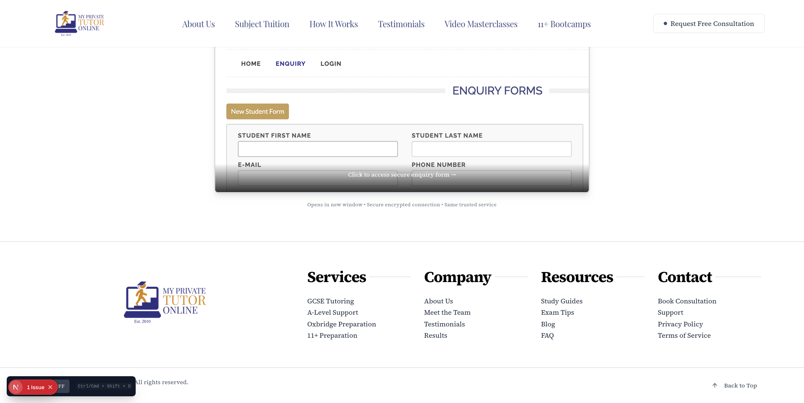
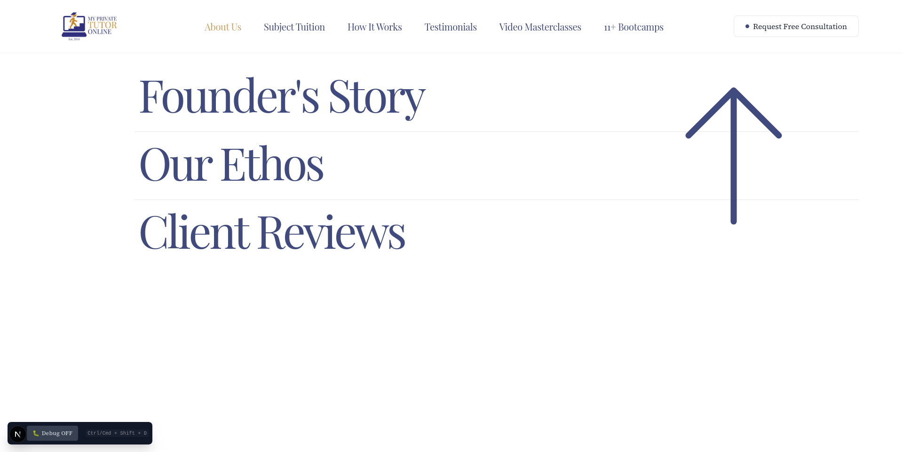
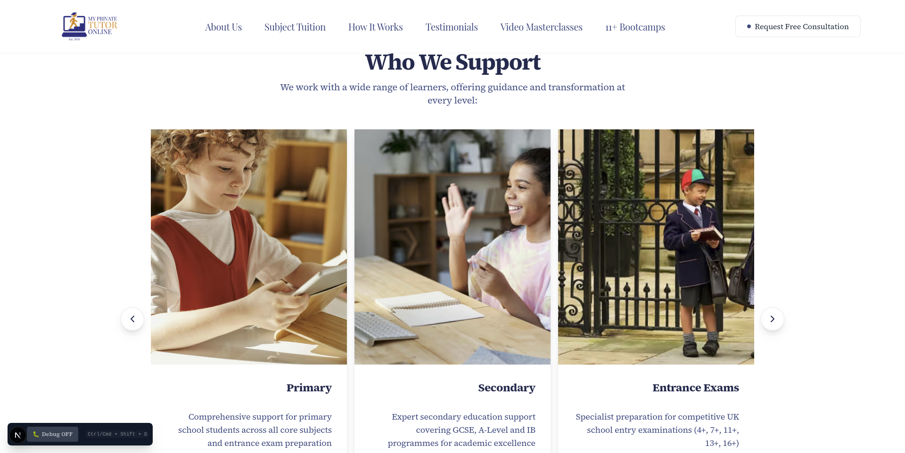
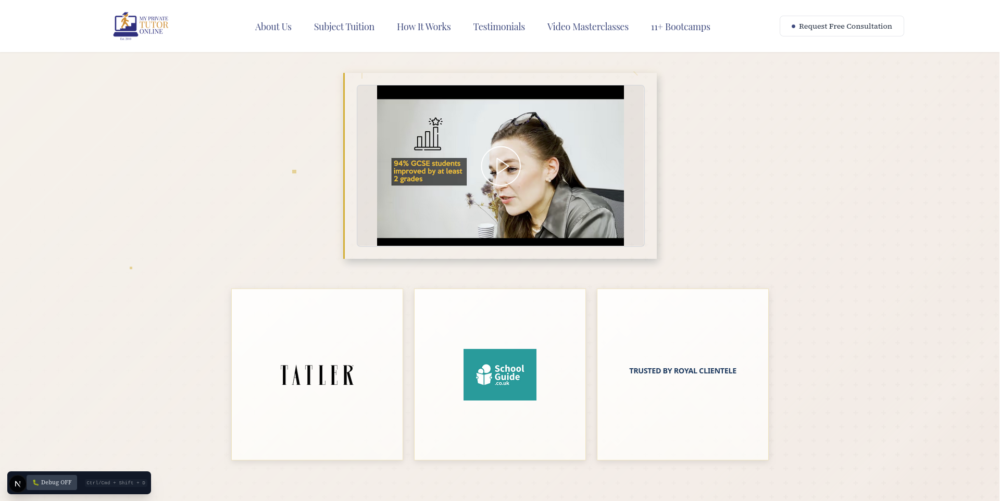
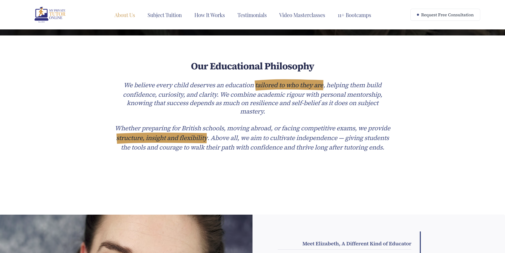
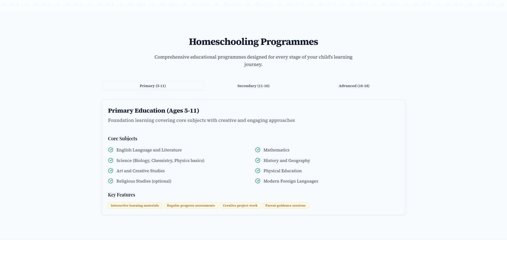
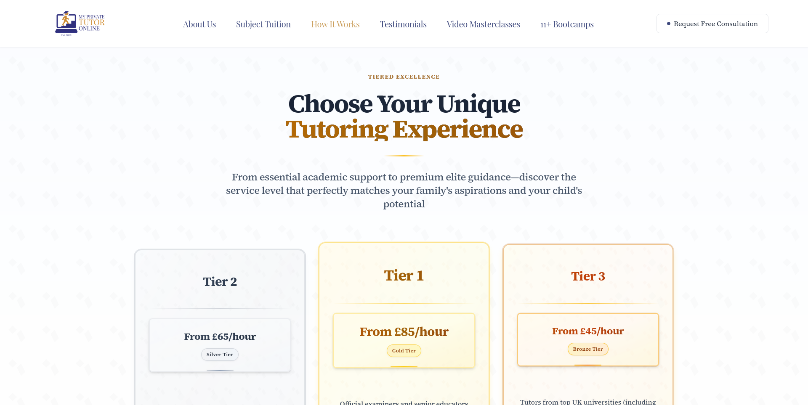
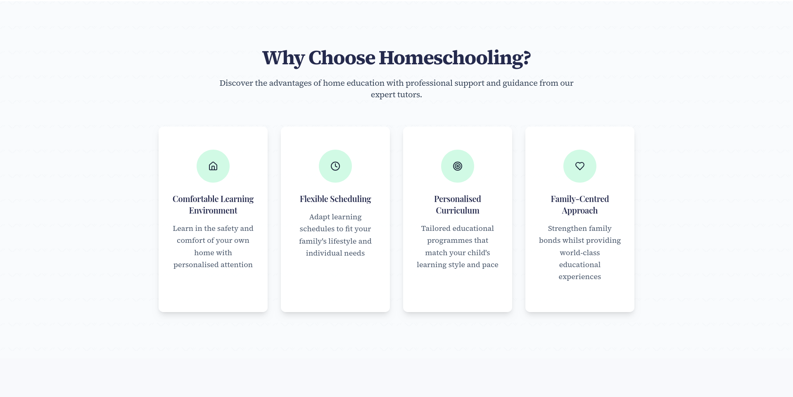

# PREVIEW LINK https://myprivatetutoronline-b8wdvgdr9-jacks-projects-cf5effed.vercel.app

# Navbar / Footer

The navigation bar could be shortened. I also suggest removing _Testimonials_ as a main heading, as most sites do not feature it this way. It would work better in the footer, e.g.:

| Services     | Resources                 | About Us / Company / (better name) | Legal (better name) |
| ------------ | ------------------------- | ---------------------------------- | ------------------- |
| All services | Links to free videos      | Request a free consultation        | Contact             |
|              | Free downloadable content | About us                           | Privacy policy      |
|              |                           | Meet the team                      | Terms of service    |
|              |                           | Testimonials                       | Cookies policy      |

  
• Need to change sub-links to be more accurate/exhaustive  
• Need to find a PNG/SVG for an arrow that you like; in my opinion, the current one looks cheap  
• Need to make the arrow a fixed position on screen so it doesn’t change relative to the number of sub-links (looks ugly when going from one drop-down to another and the arrow changes position whilst nothing else does)

---

# Landing Page

  
• Make the video smaller  
• Add white space on all sides  
• Include a scrolling school element beneath (still within the initial 100% viewport height) (still needs slight tweak)

  
Struggled to get the video anywhere in the initial section looking good

  
Will fix if you are happy with the video below (something like the new hero section if you like that)

  
• Section is slightly too large  
• Revise so the entire section fits within the screen height

  
• I need to check the most recent version of copy

---

# About Page

  
• Current layout still not effective  
• Consistent width intention understood, but the design does not look good on certain pages

  
• Do you still want this highlighter effect?  
• Unclear after the 19th September copy changes

  
• Copy appears accurate, but will triple-check when others are final  
• Added white space to left and right margins  
• Question: Should images touch the page edges?  
 • Previously they did  
 • Most content across the site is no longer full width, so added space for consistency

  
• Unclear how copy and layout should be arranged  
• Do you still want the blue sections instead of the image-based ones?  
• Or just updated images?

---

# Subject Tuition

  
• Accordion layout used for large amounts of content  
• Keeps page tidy and uncluttered  
• Images load dynamically, which prevents slow loading times on mobile (4G/5G)  
I could additionally make it as 'tabs', similar to what I implemented on the Homeschooling page (after a clean-up).

---

# How It Works

  
• Should the H1 heading appear above or below this section?  
• Copy revisions did not include this part

  
New section done; can send screenshots if needed, but have to make some CMS changes for it to build properly.

---

# Homeschooling

  
Revising to the three-tall pillar style for consistency.  
All other junk will be removed.  
Let me know if you are happy with the 'tab' style and I will improve the styling.

---

# Tutors

Need a new hero image.  
Want to make the 'pop-up' info for each tutor span the full width; low priority as it is functional now.

---

# 11+ bootcamps

Images updated.  
Slight padding/positioning fixes needed for schools.

---

# FAQ

Think this copy is fine/finished.  
Will update styles slightly when other fixes are done.
