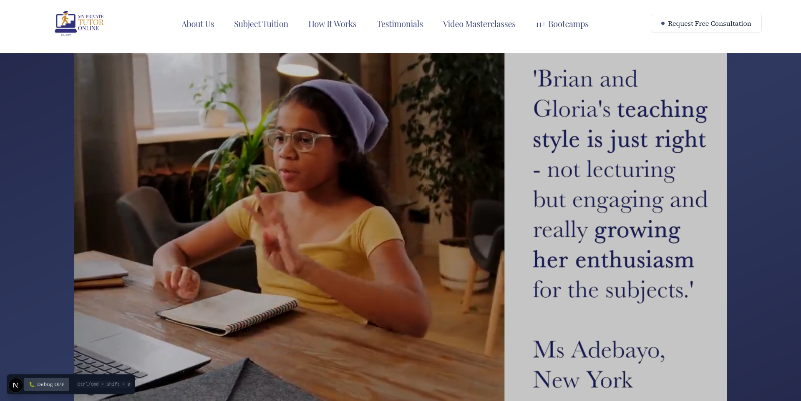
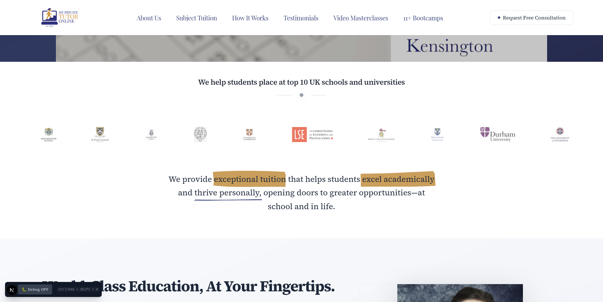
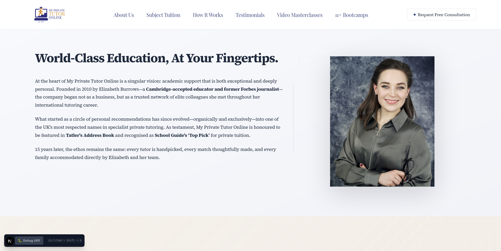
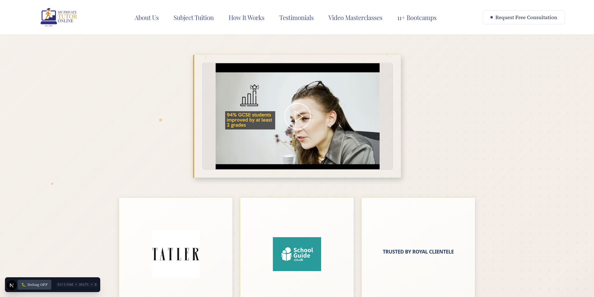
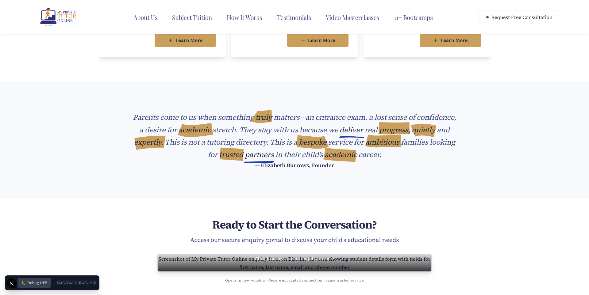
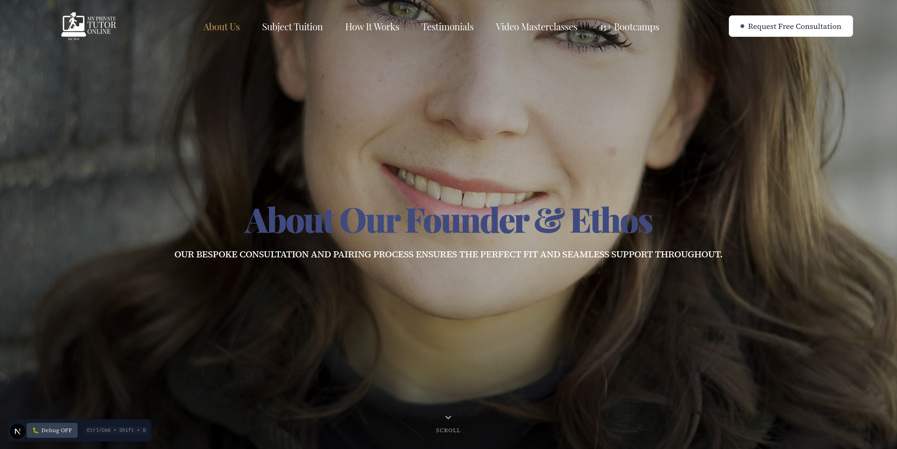
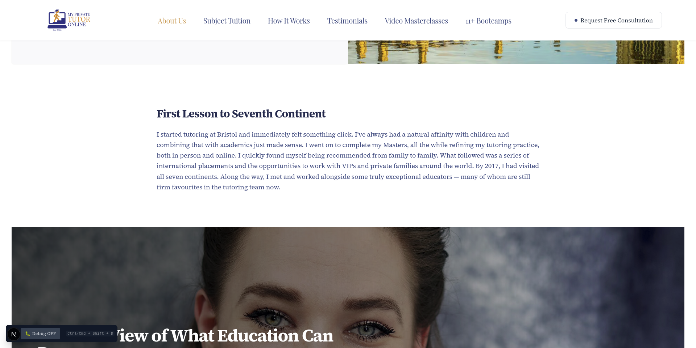
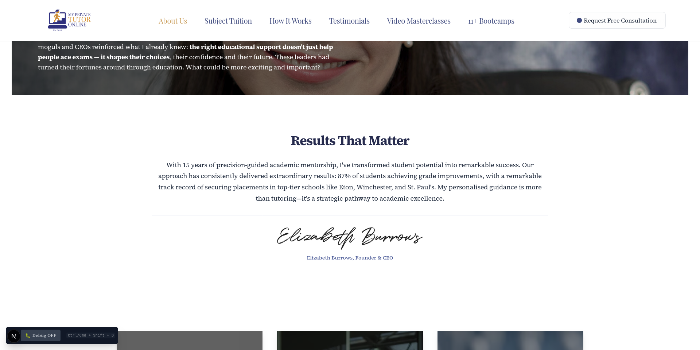
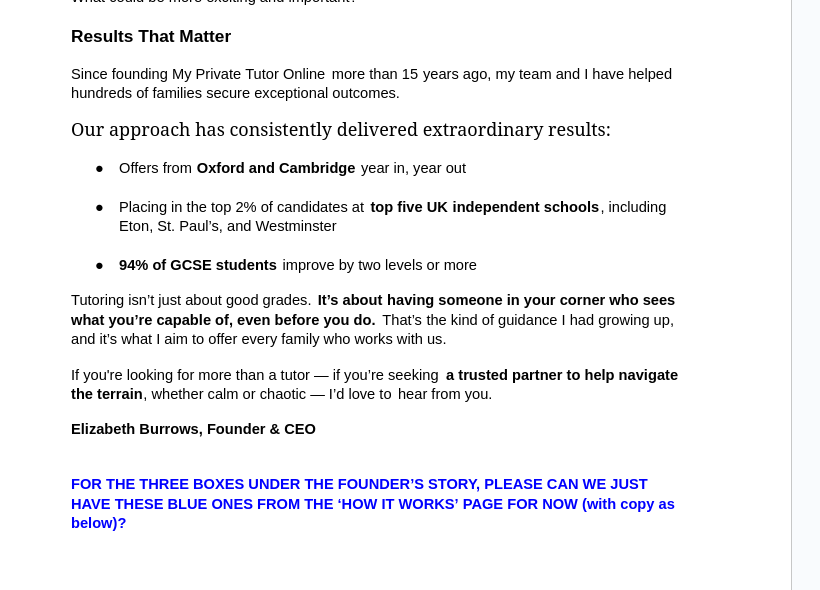
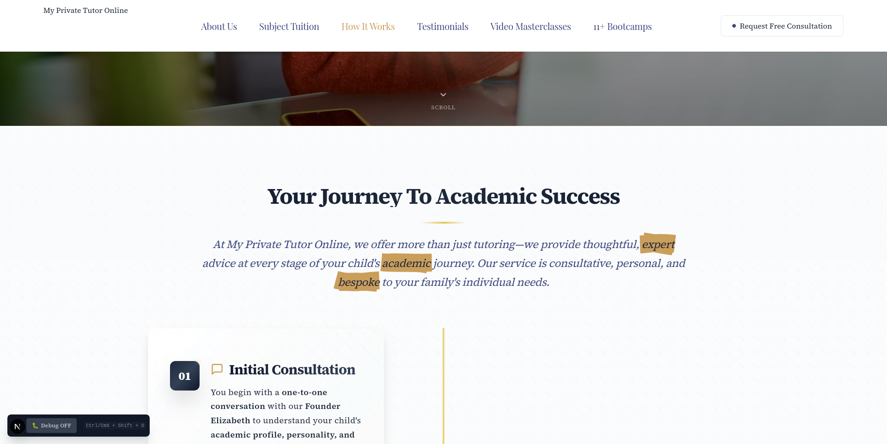

# landing page

 make video smaller, include white space on all sides, add scrolling school etc under it (still in initial 100% viewport height)

 slightly too large, revise so the full section can fit on screen height wise

 check copy

## my feedback on updates/revisions

## my questions

# about page

 still not really a fan of this at all. i knwo you wanted same width, doesnt look great on certain pages.

 did you still want this highlighter? was unsure with the sep 19th copy changes

 believe all copy updated accurately, will triple check when others are fine. small white space added to left / right of screen. do you want images touching the far sides? prior they were, but i changed slightly as most other content across site is no longer 100% width so thought bit more consistency re that might be prefered? let me know

 confused re exactly how you want the copy / positioning of sections. do you still want the blue ones instead of the ones with images? or just new images

# subject tuition

 used accordion, nice for large amount of content without being too messy. photos also load on the fly so not long loading time / processing time for mobile / 4/5g

# how it works

 do you want the h1 above or below this? copy revisions did not include this part
