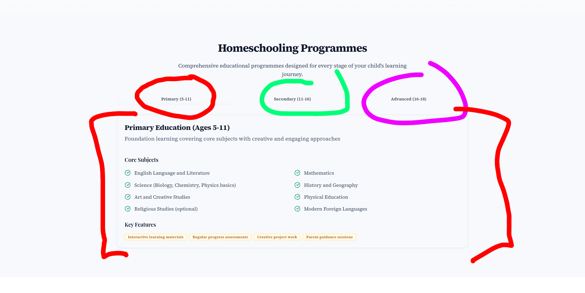

# PREVIEW LINK https://myprivatetutoronline-b8wdvgdr9-jacks-projects-cf5effed.vercel.app

# Navbar / Footer

The navigation bar could be shortened. I also suggest removing _Testimonials_ as a main heading, as most sites do not feature it this way. It would work better in the footer, e.g.:

| Services     | Resources                 | About Us / Company / (better name) | Legal (better name) |
| ------------ | ------------------------- | ---------------------------------- | ------------------- |
| All services | Links to free videos      | Request a free consultation        | Contact             |
|              | Free downloadable content | About us                           | Privacy policy      |
|              |                           | Meet the team                      | Terms of service    |
|              |                           | Testimonials                       | Cookies policy      |

Would it be possible to keep Testimonials and cut 11+ bootcamps instead please?
No problem at all, I'll do that

  
• Need to change sub-links to be more accurate/exhaustive  
• Need to find a PNG/SVG for an arrow that you like; in my opinion, the current one looks cheap  
• Need to make the arrow a fixed position on screen so it doesn’t change relative to the number of sub-links (looks ugly when going from one drop-down to another and the arrow changes position whilst nothing else does)

---

# Landing Page

  
• Make the video smaller  
• Add white space on all sides  
• Include a scrolling school element beneath (still within the initial 100% viewport height) (still needs slight tweak)

  
Struggled to get the video anywhere in the initial section looking good

  
Will fix if you are happy with the video below (something like the new hero section if you like that)

Can we add a crown vector with the text underneath for the 3rd box pls? I sent one before that may work
Will do.
  
• Section is slightly too large  
• Revise so the entire section fits within the screen height

  
• I need to check the most recent version of copy

I like the highlight but it looks a tiny bit messy. Can you use my notes on what's highlighted and perhaps make it a little more uniform?
Seen, will do.

---

# About Page

  
• Current layout still not effective  
• Consistent width intention understood, but the design does not look good on certain pages

my main issue with this is the image - if we can zoom it out that's fine.
That is the maximum I can zoom it out without having a white border on the left and right, the full width of the image is on display.
  
• Do you still want this highlighter effect?  
• Unclear after the 19th September copy changes

  
• Copy appears accurate, but will triple-check when others are final  
• Added white space to left and right margins  
• Question: Should images touch the page edges?  
 • Previously they did  
 • Most content across the site is no longer full width, so added space for consistency

  
• Unclear how copy and layout should be arranged  
• Do you still want the blue sections instead of the image-based ones?  
• Or just updated images?

Blue boxes are claer and work fine I think.
Will revise.

Cut these stats as the blue ones in boxes are better/no need to repeat.
Will revise.

---

# Subject Tuition

  
• Accordion layout used for large amounts of content  
• Keeps page tidy and uncluttered  
• Images load dynamically, which prevents slow loading times on mobile (4G/5G)  
I could additionally make it as 'tabs', similar to what I implemented on the Homeschooling page (after a clean-up).

Sure, but I'm not sure where you're suggesting to add the accordion format?
Currently it's an accordion, but I thought we could create tabs instead, as there is a considerable amount of content on this page it can get overwhelming and difficult to scroll through a large amount of text to get to whatever you want. For example if someone was specifically looking for London In-Person Tutoring they would have to scroll to the very bottom of the page, whereas with the tabs users can see all of the main sub headings at first glance.

---

# How It Works

  
• Should the H1 heading appear above or below this section?  
• Copy revisions did not include this part

Not sure what the H1 heading is? Sorry. Can lose the crossed out title though (doubles with main page title)
Perfect, will do.

  
New section done; can send screenshots if needed, but have to make some CMS changes for it to build properly.
Can't see any changes...?
Will double check and make sure they go live if not, followed the same 2:3 format for all other tall images, squared off and minimal/sleek style, removed the '3d' effect.
---

# Homeschooling

  
Revising to the three-tall pillar style for consistency.  
All other junk will be removed.  
Let me know if you are happy with the 'tab' style and I will improve the styling.
Tall boxes work well. Tab style seems okay too. Colours for this page don't fit with brand colours - can we try something else pls?
Yes, all colours will be revised to fit the branding. I didn't want to make changes to this page before we okay'd that the format was correct.
---

# Tutors

Need a new hero image.  
Want to make the 'pop-up' info for each tutor span the full width; low priority as it is functional now.

---

# 11+ bootcamps

Images updated.  
Slight padding/positioning fixes needed for schools.

Images not quite right.
Seen, updating.
---

# FAQ

Think this copy is fine/finished.  
Will update styles slightly when other fixes are done.
